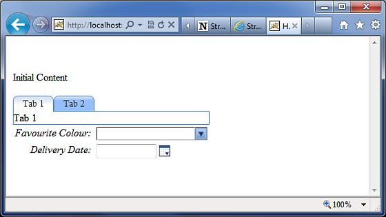

# Ajax 标签

Struts 使用 DOJO 框架实现 AJAX 标签。首先，在介绍例子之前，你需要将 struts2-dojo-plugin-2.2.3.jar 添加到你的类路径中。你可以从下载的 struts2 的 lib 文件夹中获取这个文件(C:\struts-2.2.3-all\struts-2.2.3\lib\struts2-dojo-plugin-2.2.3.jar)。

在这次实践中，让我们修改 **HelloWorld.jsp** 文件，如下所示：

<pre class="prettyprint notranslate">
&lt;%@ page contentType="text/html; charset=UTF-8"%&gt;
&lt;%@ taglib prefix="s" uri="/struts-tags"%&gt;
&lt;%@ taglib prefix="sx" uri="/struts-dojo-tags"%&gt;
&lt;html&gt;
&lt;head&gt;
&lt;title&gt;Hello World&lt;/title&gt;
&lt;s:head /&gt;
&lt;sx:head /&gt;
&lt;/head&gt;
&lt;body&gt;
   &lt;s:form&gt;
      &lt;sx:autocompleter label="Favourite Colour"
         list="{'red','green','blue'}" /&gt;
      &lt;br /&gt;
      &lt;sx:datetimepicker name="deliverydate" label="Delivery Date"
         displayFormat="dd/MM/yyyy" /&gt;
      &lt;br /&gt;
      &lt;s:url id="url" value="/hello.action" /&gt;
      &lt;sx:div href="%{#url}" delay="2000"&gt;
           Initial Content
      &lt;/sx:div&gt;
      &lt;br/&gt;
      &lt;sx:tabbedpanel id="tabContainer"&gt;
         &lt;sx:div label="Tab 1"&gt;Tab 1&lt;/sx:div&gt;
         &lt;sx:div label="Tab 2"&gt;Tab 2&lt;/sx:div&gt;
      &lt;/sx:tabbedpanel&gt;
   &lt;/s:form&gt;
&lt;/body&gt;
&lt;/html&gt;
</pre>

当我们运行上述例子时，会得到如下所示的输出：

现在让我们一步步的看这个例子。

首先需要注意的是用 prefix sx 添加的新的标签库。这(struts-dojo-tags) 是专门为 ajax 集成创建的标签库。

然后在 HTML 头信息内部，我们调用 sx:head。它会初始化 dojo 框架并为页面内的所有的 AJAX 调用做好准备。这一步是很重要的——没有 sx:head 初始化，你的 ajax 调用不会起作用。

首先我们得到 autocompleter 标签。autocompleter 标签看起来与下拉选框非常相似。它有三个常用的值 red，green 和 blue。但是它和下拉选框之间的区别是它是自动实现的。也就是说，如果你键入 gr，那么它就会用 "green" 填充。除此之外，该标签与我们之前提到的 s:select 标签就是非常相似的了。

接下来，我们有一个日期时间选择器。该标签创建了一个输入字段和一个紧挨输入字段的按钮。当按下按钮，就会弹出一个日期时间选择器。当用户选择日期后，该日期就会填充到该标签属性指定的表单的输入文本中。在我们的例子中，我们为日期指定了 dd/MM/yyyy 格式。

接下来我们为 system.action 文件创建一个 url 标签，该文件在之前的实践中已经创建过了。不一定非得是 system.action 文件——它可以是你之前创建的任何操作文件。然后我们得到一个 div，带有对 url 的超连接设置以及延迟设置为 2 秒。当你运行它的时候，"Initial Content" 会延迟 2 秒，然后 div 的内容会被 **hello.action** 执行中的内容取代。

最后我们得到一个带有两个标签的标签面板。标签是带有 Tab 1 和 Tab 2 标记的 div。

值得注意的是，在 Struts 中的 AJAX 标签集成仍然是一项有待改善的工作，该集成也随着每次发布慢慢的成熟起来。