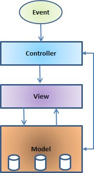

# 基本的 MVC 架构

模型-视图-控制器或通常被称为 MVC，是一种用于开发 web 应用程序的软件设计模式。模型-视图-控制器模式由以下三个部分组成：

- **Model** - 模式的最低层，负责维护数据。

- **View** - 负责显示全部或部分的数据给用户。

- **Controller** - 控制模型和视图之间的交互的软件代码。

MVC 是受欢迎的，是因为它把应用逻辑从用户接口层中分离，而且支持关注点的分离。在这里，控制器接收应用程序的所有请求，然后与模型一起工作准备好视图需要的任何数据。然后视图使用控制器准备好的数据来生成最终正式的响应。MVC 抽象可以用图形表示，如下所示。

## 模型

模型负责管理应用程序的数据。它响应来自视图的请求，而且它也响应来自控制器的指令进行更新自身。

## 视图

在一个特定格式中数据的展示由一个控制器的决定引发来呈现该数据。它们是基于模板系统的脚本，如 JSP，ASP，PHP，而且它们很容易与 AJAX 技术进行集成。

## 控制器

控制器负责响应用户的输入和执行数据模型对象的交互。控制器接收输入，验证输入，然后执行修改数据模型状态的业务操作。

Struts 2 是一个基于 MVC 的框架。在接下来的章节中，我们会看到如何使用包含 Struts 2 的 MVC 方法。
