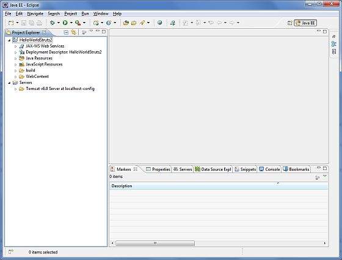
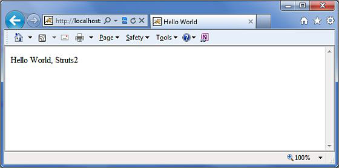

# 实例

因为你学习了 Struts 2 架构，当你在 Struts 2 web 应用程序中点击一个超链接或者提交一个 HTML 表单时，控制器会收集输入并且发送到一个称作 Actions 的 Java 类。当 Action 执行后，结果选择一个资源来显现响应。资源通常是一个 JSP，但是它也可以是一个 PDF 文件，Excel 电子表格或者 Java applet 窗口。

假设你已经建立了开发环境。现在让我们继续建立我们的第一个 **Hello World** struts2 项目。这个项目的目的是建立一个 Web 应用程序，该项目收集用户的姓名，并且在用户名后面显示 “Hello World”。为了任何的 Struct 2 项目，我们将必须创建四个组件：

<table class="table table-bordered"> 
<tr>
<th style="width:5">序号 </th><th>组件 &amp; 描述</th>
</tr> 
<tr>
<td>1</td>
<td><b>动作</b>
<p>创建一个包含完整的业务逻辑和控制用户，模型和视图之间的交互的动作类。</p>
</td>
</tr> 
<tr>
<td>2</td>
<td><b>拦截器</b>
<p>如果需要，则创建拦截器，或者使用已存在的拦截器。这是控制器的部分。</p>
</td>
</tr> 
<tr>
<td>3</td>
<td><b>视图</b>
<p>创建一个与用户交互的 JSPs，它接受输入并且显示最后的信息。</p>
</td>
</tr> 
<tr>
<td>4</td>
<td><b>配置文件</b>
<p>创建连接动作，视图和控制器的配置文件。这些文件是 struts.xml，web.xml，struts.properties。</p>
</td>
</tr> 
</table>


我将使用 Eclipse IDE，所以在一个动态 Web 项目中所有必需的组件都将会被创建。因此，让我们开始创建一个动态 Web 项目。

## 创建动态 Web 项目

启动你的 Eclipse，然后使用 **File > New > Dynamic Web Project**，并且输入项目名称为 **HelloWorldStruts2**，根据下面画面中给出的选项设置其他的选项：


在下面的画面中选择所有的默认选项，最后检查 **Generate Web.xml deployment descriptor** 选项。这将在 Eclipse 中创建一个动态 web 项目。现在使用 **Windows > Show View > Project Explorer**，你会看到一些东西在你的项目窗口中，如下所示：



现在从 struts 2 lib 文件夹 **C:\struts-2.2.3\lib** 中复制下列文件到我们项目的 **WEB-INF\lib** 文件夹中。为了做到这个，你可以简单地把所有的下列文件拖拽到 WEB-INF\lib 文件夹中。

- commons-fileupload-x.y.z.jar

- commons-io-x.y.z.jar

- commons-lang-x.y.jar

- commons-logging-x.y.z.jar

- commons-logging-api-x.y.jar

- freemarker-x.y.z.jar

- javassist-.xy.z.GA

- ognl-x.y.z.jar

- struts2-core-x.y.z.jar

- xwork-core.x.y.z.jar

## 创建 Action 类

Action 类是 Struts 2 应用程序的关键，并且我们在 action 类中实现大部分的业务逻辑。所以让我们在 **Java Resources > src** 下的包名 **com.tutorialspoint.struts2** 中创建一个java 文件 HelloWorldAction.java，下面给出它的内容。

当用户点击一个 URL 时，Action 类响应用户动作。执行一个或多个 Action 类中的方法并且返回一个字符串结果。基于结果的值，将呈现一个指定的 JSP 页面。

``` 
package com.tutorialspoint.struts2;
public class HelloWorldAction{
   private String name;
   public String execute() throws Exception {
      return "success";
   } 
   public String getName() {
      return name;
   }
   public void setName(String name) {
      this.name = name;
   }
}
```

它是一个非常简单的带有一个名为 “name” 属性的类。对于 “name” 属性，我们有标准的 getter 和 setter 方法，还有返回字符串 “success” 的执行方法。

Struts 2 框架将创建一个 HelloWorldAction 类的对象并且为了响应用户的动作调用执行方法。你把业务逻辑放在执行方法中，最后返回字符串常量。简单地说为了每个网址，你将必须实现一个动作类，你可以直接使用这个类名作为你的动作名，或者你也可以使用 struts.xml 文件映射到其他的名字，如下所示。

## 创建视图

我们需要一个 JSP 提交最后的信息，当一个预定义的动作发生时，这个页面会被 Struts 2 框架调用，这种映射将被定义在 struts.xml 文件中。所以让我们在 Eclipse 项目的 WebContent 文件夹中创建下面的 jsp 文件 **HelloWorld.jsp**。为了做到这个，在项目资源管理器的 WebContent 文件夹上单击右键，选择 **New >JSP File**。

<pre class="prettyprint notranslate">
&lt;%@ page contentType="text/html; charset=UTF-8" %&gt;
&lt;%@ taglib prefix="s" uri="/struts-tags" %&gt;
&lt;html&gt;
&lt;head&gt;
&lt;title&gt;Hello World&lt;/title&gt;
&lt;/head&gt;
&lt;body&gt;
   Hello World, &lt;s:property value="name"/&gt;
&lt;/body&gt;
&lt;/html&gt;
</pre>


标签库指令告诉 Servlet 容器这个页面将使用 Struts 2 的标签，而且这些标签将在 s 之前。 s:property 标签显示动作类属性 "name> 的值，它是由 HelloWorldAction 类的 **getName()** 方法返回的。

## 创建主页

我们还需要在 WebContent 文件夹中创建 **index.jsp**。这个文件将作为初始动作 URL，用户可以点击它来告诉 Struts 2 框架调用 HelloWorldAction 类定义的方法，并且呈现给 HelloWorld.jsp 视图。

<pre class="prettyprint notranslate">
&lt;%@ page language="java" contentType="text/html; charset=ISO-8859-1"
   pageEncoding="ISO-8859-1"%&gt;
&lt;%@ taglib prefix="s" uri="/struts-tags"%&gt;
   &lt;!DOCTYPE html PUBLIC "-//W3C//DTD HTML 4.01 Transitional//EN" 
"http://www.w3.org/TR/html4/loose.dtd"&gt;
&lt;html&gt;
&lt;head&gt;
&lt;title&gt;Hello World&lt;/title&gt;
&lt;/head&gt;
&lt;body&gt;
   &lt;h1&gt;Hello World From Struts2&lt;/h1&gt;
   &lt;form action="hello"&gt;
      &lt;label for="name"&gt;Please enter your name&lt;/label&gt;&lt;br/&gt;
      &lt;input type="text" name="name"/&gt;
      &lt;input type="submit" value="Say Hello"/&gt;
   &lt;/form&gt;
&lt;/body&gt;
&lt;/html&gt;
</pre>


使用 struts.xml 文件将把在上面的视图文件中定义的 **hello** 动作映射到 HelloWorldAction 类和它的执行方法中。当用户点击提交按钮时，将引起 Struts 2 框架运行在 HelloWorldAction 类中定义的执行方法，根据方法的返回值一个适当的视图将被作为响应进行选择和呈现。

## 配置文件

我们需要一个将 URL，HelloWorldAction 类（模型）和 HelloWorld.jsp（视图）连结在一起的映射。该映射告诉 Struts 2 框架哪个类将响应用户的动作（URL），这个类的哪个方法将被执行，根据方法返回的字符串结果将呈现什么视图。

因此，让我们创建一个名为 **struts.xml** 的文件。由于 Struts 2 需要在类文件夹下展示 struts.xml。所以在 WebContent/WEB-INF/classes 文件夹下创建 struts.xml 文件。默认的情况下，Eclipse 不会创建 “classes” 文件夹，所以需要自己创建。为了做到这个，在项目资源管理器的 WEB-INF 文件夹上点击右键，并选择 **New > Folder**。struts.xml 中应该像这样：

``` 
<?xml version="1.0" encoding="UTF-8"?>
<!DOCTYPE struts PUBLIC
   "-//Apache Software Foundation//DTD Struts Configuration 2.0//EN"
   "http://struts.apache.org/dtds/struts-2.0.dtd">
<struts>
<constant name="struts.devMode" value="true" />
   <package name="helloworld" extends="struts-default">     
      <action name="hello" 
            class="com.tutorialspoint.struts2.HelloWorldAction" 
            method="execute">
            <result name="success">/HelloWorld.jsp</result>
      </action>
   </package>
</struts>
```

关于上述配置文件有几点需要注意。在这里我们设置常量 **struts.devMode** 为 **true**，是因为我们正工作在程序开发环境中，我们需要看到一些有用的日志信息。然后，我们定义了一个名为  **helloworld** 的包。当你想要把你的动作分成一组时，创建一个包是有用的。在我们的例子中，我们命名我们的动作为 “hello”，它对应着 URL **/hello.action** 和通过 **HelloWorldAction.class** 进行备份。当 URL **/hello.action** 调用时，HelloWorldAction.class 的执行方法是运行的方法。如果**执行**方法的结果返回 “success”，然后我们把 **HelloWorld.jsp** 呈现给用户。

下一步是创建一个 **web.xml** 文件，它是一个任何对 Struts 2 请求的入口点。Struts2 应用程序的入口点将是一个在部署描述符（web.xml）中定义的过滤器。因此，我们将在 web.xml 中定义一个 oforg.apache.struts2.dispatcher.FilterDispatcher 类。 web.xml 文件需要在 WebContent的WEB-INF 文件夹下创建。当你创建项目时，Eclipse 已经创建了初始的 web.xml 文件。所以，我们只需要修改它，如下所示：

``` 
<?xml version="1.0" encoding="UTF-8"?>
<web-app xmlns:xsi="http://www.w3.org/2001/XMLSchema-instance"
   xmlns="http://java.sun.com/xml/ns/javaee" 
   xmlns:web="http://java.sun.com/xml/ns/javaee/web-app_2_5.xsd"
   xsi:schemaLocation="http://java.sun.com/xml/ns/javaee 
   http://java.sun.com/xml/ns/javaee/web-app_3_0.xsd"
   id="WebApp_ID" version="3.0"> 
   <display-name>Struts 2</display-name>
   <welcome-file-list>
      <welcome-file>index.jsp</welcome-file>
   </welcome-file-list>
   <filter>
      <filter-name>struts2</filter-name>
      <filter-class>
         org.apache.struts2.dispatcher.FilterDispatcher
      </filter-class>
   </filter>
   <filter-mapping>
      <filter-name>struts2</filter-name>
      <url-pattern>/*</url-pattern>
   </filter-mapping>
</web-app>
```

我们已经指定 index.jsp 为我们的 welcome 文件。然后我们已经配置了 Struts2 的过滤器来运行所有的 URL（即任何匹配模式 /* 的 URL）。

## 启用详细日志

你可以启用完整的日志记录功能，而通过在 **WEB-INF/classes** 文件夹下创建 **logging.properties** 文件使用 Struts 2 工作。在你的属性文件中保留下面两行语句：

``` 
org.apache.catalina.core.ContainerBase.[Catalina].level = INFO
org.apache.catalina.core.ContainerBase.[Catalina].handlers = \
                              java.util.logging.ConsoleHandler
```

默认的 logging.properties 指定一个 ConsoleHandler 用于把路由记录发送到 stdout，也指定一个 FileHandler。可以使用 SEVERE，WARNING，INFO，CONFIG，FINE，FINER，FINEST 或 ALL 设置处理程序的日志级别的阈值。

就是这样。我们已经准备好使用 Struts 2 框架来运行我们的 Hello World 应用程序。

## 执行应用程序

在项目名称上点击右键，并且单击 **Export > WAR File** 来创建一个 War 文件。然后在 Tomcat 的 webapps 目录下部署这个 WAR。最后，启动 Tomca t服务器和尝试访问 URL http://localhost:8080/HelloWorldStruts2/index.jsp. 将会给出下面的画面：


输入一个值 “Struts2”，并且提交页面。你应该看到下一个页面：



注意，你可以在 struts.xml 文件中定义**索引**作为一个动作。在这种情况下，你可以调用索引页面 http://localhost:8080/HelloWorldStruts2/index.action/ 检查下面如何定义索引作为一个动作：

``` 
<?xml version="1.0" encoding="UTF-8"?>
<!DOCTYPE struts PUBLIC
   "-//Apache Software Foundation//DTD Struts Configuration 2.0//EN"
   "http://struts.apache.org/dtds/struts-2.0.dtd">
<struts>
<constant name="struts.devMode" value="true" />
   <package name="helloworld" extends="struts-default">
      <action name="index">
            <result >/index.jsp</result>
      </action>
      <action name="hello" 
            class="com.tutorialspoint.struts2.HelloWorldAction" 
            method="execute">
            <result name="success">/HelloWorld.jsp</result>
      </action>
   </package>
</struts>
```
