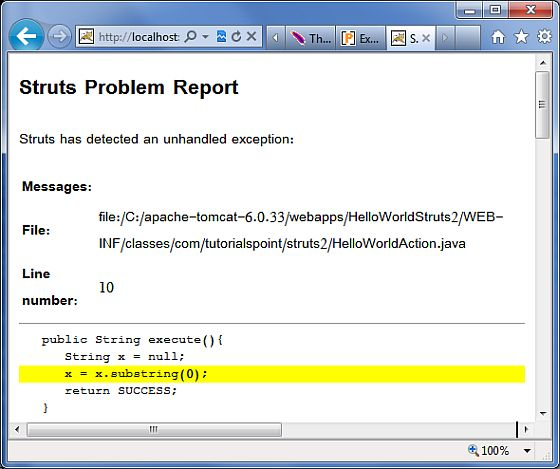
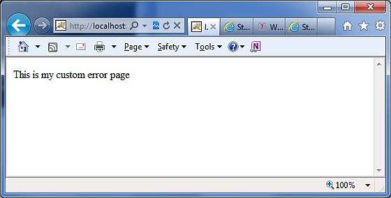

# Struts 2 - 异常处理

Struts 提供了一种简单的方式来处理未捕获的异常，并将用户重定向到一个专门的错误页面。你可以简单的配置 Struts，使得不同的异常有不同的错误页面。

Struts 通过使用“异常”拦截器来使异常处理变得简单。“异常”拦截器是默认的栈的一部分，所以配置它你不需要做额外的工作。它为你的使用已经做好了准备，开箱即用。让我们看一个简单的 Hello World 实例，在 **HelloWorldAction.java** 文件中带有一些修改。在这里我们在 **HelloWorldAction** 操作代码中有意的引入一个 **NullPointer** 异常。

``` 
package com.tutorialspoint.struts2;
import com.opensymphony.xwork2.ActionSupport;
public class HelloWorldAction extends ActionSupport{
   private String name;
   public String execute(){
      String x = null;
      x = x.substring(0);
      return SUCCESS;
   }  
   public String getName() {
      return name;
   }
   public void setName(String name) {
      this.name = name;
   }
}
```

让我们将下入内容保存到 **HelloWorld.jsp** 中：

<pre class="prettyprint notranslate"> 
&lt;%@ page contentType="text/html; charset=UTF-8" %&gt;
&lt;%@ taglib prefix="s" uri="/struts-tags" %&gt;
&lt;html&gt;
&lt;head&gt;
&lt;title&gt;Hello World&lt;/title&gt;
&lt;/head&gt;
&lt;body&gt;
   Hello World, &lt;s:property value="name"/&gt;
&lt;/body&gt;
&lt;/html&gt;
</pre> 

以下是 **index.jsp** 中的内容：

<pre class="prettyprint notranslate"> 
&lt;%@ page language="java" contentType="text/html; charset=ISO-8859-1"
   pageEncoding="ISO-8859-1"%&gt;
&lt;%@ taglib prefix="s" uri="/struts-tags"%&gt;
   &lt;!DOCTYPE html PUBLIC "-//W3C//DTD HTML 4.01 Transitional//EN" 
"http://www.w3.org/TR/html4/loose.dtd"&gt;
&lt;html&gt;
&lt;head&gt;
&lt;title&gt;Hello World&lt;/title&gt;
&lt;/head&gt;
&lt;body&gt;
   &lt;h1&gt;Hello World From Struts2&lt;/h1&gt;
   &lt;form action="hello"&gt;
      &lt;label for="name"&gt;Please enter your name&lt;/label&gt;&lt;br/&gt;
      &lt;input type="text" name="name"/&gt;
      &lt;input type="submit" value="Say Hello"/&gt;
   &lt;/form&gt;
&lt;/body&gt;
&lt;/html&gt;
</pre> 

你的 **struts.xml** 文件看起来应该如下所示：

``` 
<?xml version="1.0" encoding="UTF-8"?>
<!DOCTYPE struts PUBLIC
   "-//Apache Software Foundation//DTD Struts Configuration 2.0//EN"
   "http://struts.apache.org/dtds/struts-2.0.dtd">
<struts>
<constant name="struts.devMode" value="true" />
   <package name="helloworld" extends="struts-default">     
      <action name="hello" 
         class="com.tutorialspoint.struts2.HelloWorldAction" 
         method="execute">
         <result name="success">/HelloWorld.jsp</result>
      </action>
   </package>
</struts>
```

现在鼠标右键单击项目名并点击 **Export > WAR File** 来创建一个 War 文件。然后把这个 WAR 部署到 Tomcat 的 web 应用程序目录中。最后，启动 Tomcat 服务器并尝试访问 URL http://localhost:8080/HelloWorldStruts2/index.jsp. 这将呈现如下所示的画面：


输入值 "Struts2" 并提交页面。你应该能看到如下所示的页面：



正如上述例子显示的一样，默认的异常拦截器做了许多处理异常的工作。现在让我们为我们的异常创建一个专门的错误页面。创建一个名为 **Error.jsp** 的文件，其内容如下所示：

<pre class="prettyprint notranslate">
&lt;%@ page language="java" contentType="text/html; charset=ISO-8859-1"
	pageEncoding="ISO-8859-1"%&gt;
&lt;%@ taglib prefix="s" uri="/struts-tags"%&gt;
&lt;!DOCTYPE html PUBLIC "-//W3C//DTD HTML 4.01 Transitional//EN" 
"http://www.w3.org/TR/html4/loose.dtd"&gt;
&lt;html&gt;
&lt;head&gt;
&lt;title&gt;&lt;/title&gt;
&lt;/head&gt;
&lt;body&gt;
   This is my custom error page
&lt;/body&gt;
&lt;/html&gt;
</pre>

现在让我们配置 Struts 来在异常的情况下使用这个错误页面。让我们修改 **struts.xml** 文件，如下所示：

``` 
<?xml version="1.0" encoding="UTF-8"?>
<!DOCTYPE struts PUBLIC
   "-//Apache Software Foundation//DTD Struts Configuration 2.0//EN"
   "http://struts.apache.org/dtds/struts-2.0.dtd">
<struts>
<constant name="struts.devMode" value="true" />
   <package name="helloworld" extends="struts-default">  
      <action name="hello" 
         class="com.tutorialspoint.struts2.HelloWorldAction" 
         method="execute">
         <exception-mapping exception="java.lang.NullPointerException"
         result="error" />
         <result name="success">/HelloWorld.jsp</result>
         <result name="error">/Error.jsp</result>
      </action>
   </package>
</struts>
```

正如上述例子显示的一样，现在我们已经配置了 Struts 来为 NullPointerException 使用专门的 Error.jsp. 如果现在你重新运行这个程序，你应该能看到如下所示的输出：


 
此外，Struts2 框架会生成一个 "logging" 拦截器来记录异常。通过使记录器记录未捕获的异常，我们可以很容易的查看栈跟踪并找到哪里出现了错误。

## 全局异常映射

我们已经了解了如何处理操作指定的异常。我们可以设置一个全局异常，能够应用带所有的操作中。例如，为了捕获相同的 NullPointerException 异常，我们可以在 <package...> 标签内部添加 **<global-exception-mappings...>** 标签且它的 <result...> 标签应该被添加到 struts.xml 文件的 <action...> 标签内，如下所示：

``` 
<?xml version="1.0" encoding="UTF-8"?>
<!DOCTYPE struts PUBLIC
   "-//Apache Software Foundation//DTD Struts Configuration 2.0//EN"
   "http://struts.apache.org/dtds/struts-2.0.dtd">
<struts>
<constant name="struts.devMode" value="true" />
   <package name="helloworld" extends="struts-default">
      <global-exception-mappings>
         <exception-mapping exception="java.lang.NullPointerException"
         result="error" />
      </global-exception-mappings>
      <action name="hello" 
         class="com.tutorialspoint.struts2.HelloWorldAction" 
         method="execute">
         <result name="success">/HelloWorld.jsp</result>
         <result name="error">/Error.jsp</result>
      </action>
   </package>
</struts>
```
