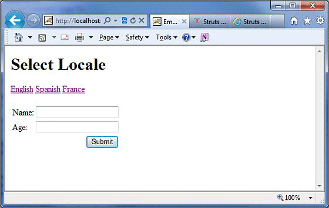
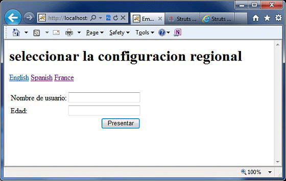
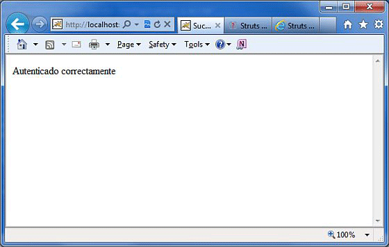

# 本地化，国际化（i18n）

国际化（i18n）是规划和实施产品和服务，以便他们可以很容易地适应特定的本地语言和文化的过程，这个过程被称为本地化。国际化过程有时被称为翻译或本地化启用。国际化缩写为 **i18n**，因为这个单词以 i 开始，以 n 结束，而且第一个 i 和最后的 n 之间有 18 个字符。

Struts2 提供本地化，即国际化（i18n）支持，通过使用下面的资源包，拦截器和标签库：

- UI标签

- 消息和错误

- 动作类内

##　资源包　

Struts2 使用资源包来给 Web 应用程序的用户提供多种语言和本地化选项。你不必担心用不同的语言编写网页。你所要做的是为每个你想要的语言创建一个资源包。这个资源包将包含你的用户语言的标题，消息和其他文本。资源包是包含使用你的应用程序的默认语言的键/值对的文件。

对资源文件最简单的命名格式是：

```
bundlename_language_country.properties
```

这里，**bundlename** 可以是动作类，接口，超类，模型，包，全局资源属性。接下来的部分**语言****_****国家**代表国家地区，例如 Spanish (Spain) 地区用 es_ES 代表，English (United States) 地区用 en_US 代表等等。这里你可以跳过可选的国家部分。

当你用它的键引用消息元素时，Struts 框架按照下列顺序进行检索相应的消息：

- ActionClass.properties
- Interface.properties
- SuperClass.properties
- model.properties
- package.properties
- struts.properties
- global.properties

为了用多种语言开发你的应用程序，你将不得不保留多个对应于这些语言/地区的属性文件相，并且根据键/值对定义所有的内容。例如，如果你要为美国英语（默认），西班牙语，和法语开发应用程序，你就必须创建三个属性文件。这里，我将只使用 **global.properties** 文件，你可以利用不同的属性文件来隔离不同类型的消息。

- **global.properties**：默认情况下，英语（美国）将被应用
- **global_fr.properties**：这将用于法语环境。
- **global_es.properties**：这将被用于西班牙语言环境。

## 访问信息

有几种方法可以访问信息资源，包括 getText，文本标签，UI 标签的键属性和国际化标签。让我们来看看他们，如下简单地说：

为了显示 **i18n** 的文本，在属性标签或其他任何标签中调用 **getText**，例如 UI 标签，如下所示：

```
<s:property value="getText('some.key')" />
``` 

**文本标签**检索默认的资源包的信息，即 struts.properties

```
<s:text name="some.key" />
```

**i18n 标签**把任意资源包放进值栈中。i18n 标签范围内的其他标签可以显示该资源包的信息：

```
<s:i18n name="some.package.bundle">
     <s:text name="some.key" />
</s:i18n>
```

大多数 UI 标签的**键**属性，可以用来检索一个资源包的消息：

```
<s:textfield key="some.key" name="textfieldName"/>
```

## 本地化例子

让我们把前一章中用多种语言创建的 **index.jsp** 作为目标。相同的文件将被编写，如下所示：

<pre class="prettyprint notranslate">
&lt;%@ page language="java" contentType="text/html; charset=ISO-8859-1"
   pageEncoding="ISO-8859-1"%&gt;
&lt;%@ taglib prefix="s" uri="/struts-tags"%&gt;
&lt;!DOCTYPE html PUBLIC "-//W3C//DTD HTML 4.01 Transitional//EN" 
"http://www.w3.org/TR/html4/loose.dtd"&gt;
&lt;html&gt;
&lt;head&gt;
&lt;title&gt;Employee Form with Multilingual Support&lt;/title&gt;
&lt;/head&gt;

&lt;body&gt;
   &lt;h1&gt;&lt;s:text name="global.heading"/&gt;&lt;/h1&gt;

   &lt;s:url id="indexEN" namespace="/" action="locale" &gt;
      &lt;s:param name="request_locale" &gt;en&lt;/s:param&gt;
   &lt;/s:url&gt;
   &lt;s:url id="indexES" namespace="/" action="locale" &gt;
      &lt;s:param name="request_locale" &gt;es&lt;/s:param&gt;
   &lt;/s:url&gt;
   &lt;s:url id="indexFR" namespace="/" action="locale" &gt;
      &lt;s:param name="request_locale" &gt;fr&lt;/s:param&gt;
   &lt;/s:url&gt;

   &lt;s:a href="%{indexEN}" &gt;English&lt;/s:a&gt;
   &lt;s:a href="%{indexES}" &gt;Spanish&lt;/s:a&gt;
   &lt;s:a href="%{indexFR}" &gt;France&lt;/s:a&gt;

   &lt;s:form action="empinfo" method="post" namespace="/"&gt;
      &lt;s:textfield name="name" key="global.name" size="20" /&gt;
      &lt;s:textfield name="age" key="global.age" size="20" /&gt;
      &lt;s:submit name="submit" key="global.submit" /&gt;
   &lt;/s:form&gt;

&lt;/body&gt;
&lt;/html&gt;
</pre>

我们将创建 **success.jsp** 文件，假如动作返回 SUCCESS，该文件将被调用。

<pre class="prettyprint notranslate">
&lt;%@ page language="java" contentType="text/html; charset=ISO-8859-1"
	pageEncoding="ISO-8859-1"%&gt;
&lt;%@ taglib prefix="s" uri="/struts-tags"%&gt;
&lt;!DOCTYPE html PUBLIC "-//W3C//DTD HTML 4.01 Transitional//EN" 
"http://www.w3.org/TR/html4/loose.dtd"&gt;
&lt;html&gt;
&lt;head&gt;
&lt;title&gt;Success&lt;/title&gt;
&lt;/head&gt;
&lt;body&gt;
   &lt;s:property value="getText('global.success')" /&gt;
&lt;/body&gt;
&lt;/html&gt;
</pre>

这里，我们需要创建下面的两个动作。（a）第一个动作监督区域，显示相同的用不同的语言编写的 index.jsp 文件（b）另一个行动是为了监督提交表单本身。动作都将返回 SUCCESS，但根据返回值，我们会采取不同的动作，因为对两个动作来说我们的目的是不同的：

### 监督区域的动作

```
package com.tutorialspoint.struts2;
import com.opensymphony.xwork2.ActionSupport;
public class Locale extends ActionSupport{
   public String execute() 
   {
       return SUCCESS;
   }
}
```

### 提交表单的动作

```
package com.tutorialspoint.struts2;
import com.opensymphony.xwork2.ActionSupport;
public class Employee extends ActionSupport{
   private String name;
   private int age;  
   public String execute() 
   {
       return SUCCESS;
   }   
   public String getName() {
       return name;
   }
   public void setName(String name) {
       this.name = name;
   }
   public int getAge() {
       return age;
   }
   public void setAge(int age) {
       this.age = age;
   }
}
```

现在，让我们创建下面三个 **global.properties** 文件，并且把它们放在 CLASSPATH 中：

### global.properties

```
global.name = Name
global.age = Age
global.submit = Submit
global.heading = Select Locale
global.success = Successfully authenticated
```

### global_fr.properties

```
global.name = Nom d'utilisateur 
global.age = l'âge
global.submit = Soumettre des
global.heading = Sé lectionnez Local
global.success = Authentifi	é  avec succès
```

### global_es.properties

```
global.name = Nombre de usuario
global.age = Edad
global.submit = Presentar
global.heading = seleccionar la configuracion regional
global.success = Autenticado correctamente
```

我们将创建带有两个动作的 **struts.xml**，如下所示：

```
<?xml version="1.0" encoding="UTF-8"?>
<!DOCTYPE struts PUBLIC
   "-//Apache Software Foundation//DTD Struts Configuration 2.0//EN"
   "http://struts.apache.org/dtds/struts-2.0.dtd">
<struts>
   <constant name="struts.devMode" value="true" />
   <constant name="struts.custom.i18n.resources" value="global" />
   <package name="helloworld" extends="struts-default" namespace="/">
      <action name="empinfo" 
         class="com.tutorialspoint.struts2.Employee"
         method="execute">
         <result name="input">/index.jsp</result>
         <result name="success">/success.jsp</result>
      </action>     
      <action name="locale" 
         class="com.tutorialspoint.struts2.Locale"
         method="execute">
         <result name="success">/index.jsp</result>
      </action>
   </package>
</struts>
```

下面是 **web.xml** 文件中的内容：

```
<?xml version="1.0" encoding="UTF-8"?>
<web-app xmlns:xsi="http://www.w3.org/2001/XMLSchema-instance"
   xmlns="http://java.sun.com/xml/ns/javaee"
   xmlns:web="http://java.sun.com/xml/ns/javaee/web-app_2_5.xsd"
   xsi:schemaLocation="http://java.sun.com/xml/ns/javaee
   http://java.sun.com/xml/ns/javaee/web-app_3_0.xsd"
   id="WebApp_ID" version="3.0">
   <display-name>Struts 2</display-name>
   <welcome-file-list>
      <welcome-file>index.jsp</welcome-file>
   </welcome-file-list>
   <filter>
      <filter-name>struts2</filter-name>
      <filter-class>
         org.apache.struts2.dispatcher.FilterDispatcher
      </filter-class>
   </filter>
   <filter-mapping>
      <filter-name>struts2</filter-name>
      <url-pattern>/*</url-pattern>
   </filter-mapping>
</web-app>
```

现在，右键点击项目名称，并单击 **Export > WAR File** 创建一个 WAR 文件。然后部署此 WAR 在 Tomcat 的 webapps 目录下。最后，启动 Tomcat 服务器和尝试访问 URL http://localhost:8080/HelloWorldStruts2/index.jsp. 这会给出以下画面：



现在选择任何一种语言，假如说我们选择**西班牙语**，它将显示下面的结果：



同样，你可以尝试用法语。最后，当我们使用西班牙语言时，让我们尝试单击 **Submit** 按钮，它会显示下面的画面：



恭喜你，现在你有一个多语言的网页，你可以在全局范围内启动你的网站。