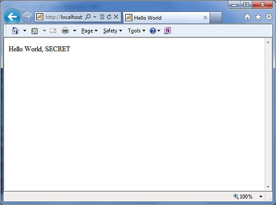

# Struts 2 – 动作

动作是 Struts2 框架的核心，因为它们是服务于任何 MVC（模型-视图-控制器）的框架。每个 URL 被映射到一个指定的动作中，它提供了必要的处理逻辑来服务用户的请求。

但是动作也在其他两个重要的能力上起作用。首先，动作在从请求到视图传输数据中起着重要的作用，无论它是一个 JSP 还是其它的结果类型。第二，动作必须协助框架来确定哪些结果应该呈现给视图，该视图在响应中返回给请求。

## 创建动作

对 Struts2 中动作的唯一要求是必须有一个无参数方法，该方法返回 String 或结果对象，而且必须是一个 POJO。如果无参数方法没有被指定，那么默认的动作是使用 execute() 方法。

你可以选择扩展 **ActionSupport** 类，它实现了包括**动作**接口的 6 个接口。动作接口如下所示：

``` 
public interface Action {
   public static final String SUCCESS = "success";
   public static final String NONE = "none";
   public static final String ERROR = "error";
   public static final String INPUT = "input";
   public static final String LOGIN = "login";
   public String execute() throws Exception;
}
```

让我们来看看 Hello World 例子中的动作方法：

``` 
package com.tutorialspoint.struts2;
public class HelloWorldAction{
   private String name;
   public String execute() throws Exception {
      return "success";
   }  
   public String getName() {
      return name;
   }
   public void setName(String name) {
      this.name = name;
   }
}
```

为了举例说明动作方法控制着视图，让我们对 **execute** 方法做下面的修改，并且扩展 ActionSupport 类，如下所示：

``` 
package com.tutorialspoint.struts2;
import com.opensymphony.xwork2.ActionSupport;
public class HelloWorldAction extends ActionSupport{
   private String name;
   public String execute() throws Exception {
      if ("SECRET".equals(name))
      {
         return SUCCESS;
      }else{
         return ERROR;  
      }
   }   
   public String getName() {
      return name;
   }
   public void setName(String name) {
      this.name = name;
   }
}
```

在这个例子中，我们在 execute 方法中有一些逻辑，这些逻辑着眼于 name 属性。如果属性等于字符串 “SECRET”，我们就返回 SUCCESS 作为结果，否则我们就返回 ERROR 作为结果。因为我们已经扩展了 ActionSupport，所以我们可以使用字符串常量 SUCCESS 和 ERROR。现在，让我们修改我们的 struts.xml 文件，如下所示：

``` 
<?xml version="1.0" encoding="UTF-8"?>
<!DOCTYPE struts PUBLIC
   "-//Apache Software Foundation//DTD Struts Configuration 2.0//EN"
   "http://struts.apache.org/dtds/struts-2.0.dtd">
   <struts>
      <constant name="struts.devMode" value="true" />
      <package name="helloworld" extends="struts-default">
         <action name="hello" 
            class="com.tutorialspoint.struts2.HelloWorldAction"
            method="execute">
            <result name="success">/HelloWorld.jsp</result>
            <result name="error">/AccessDenied.jsp</result>
         </action>
      </package>
</struts>
```

## 创建视图

让我们在 eclipse 项目的 WebContent 文件夹下创建下面的 jsp 文件 **HelloWorld.jsp**。为了做到这个，在项目资源管理器的 WebContent 文件夹上点击右键，并选择 **New >JSP File**。假如返回的结果是 SUCCESS，则这个文件将被调用，SUCCESS 是定义在动作接口中的一个字符串常量 “success”：

<pre class="prettyprint notranslate">
&lt;%@ page contentType="text/html; charset=UTF-8" %&gt;
&lt;%@ taglib prefix="s" uri="/struts-tags" %&gt;
&lt;html&gt;
&lt;head&gt;
&lt;title&gt;Hello World&lt;/title&gt;
&lt;/head&gt;
&lt;body&gt;
   Hello World, &lt;s:property value="name"/&gt;
&lt;/body&gt;
&lt;/html&gt;
</pre>


假如返回的结果是 ERROR，则下面的文件将被框架调用，ERROR等于一个字符串常量 “error”。下面是 **AccessDenied.jsp** 的内容。

<pre class="prettyprint notranslate">
&lt;%@ page contentType="text/html; charset=UTF-8" %&gt;
&lt;%@ taglib prefix="s" uri="/struts-tags" %&gt;
&lt;html&gt;
&lt;head&gt;
&lt;title&gt;Access Denied&lt;/title&gt;
&lt;/head&gt;
&lt;body&gt;
   You are not authorized to view this page.
&lt;/body&gt;
&lt;/html&gt;
</pre>


我们还需要在 WebContent 文件夹中创建 **index.jsp**。这个文件将作为初始动作 URL，用户可以点击它来告诉 Struts 2 框架调用 HelloWorldAction 类的 **execute** 方法，并且呈现 HelloWorld.jsp 视图。

<pre class="prettyprint notranslate">
&lt;%@ page language="java" contentType="text/html; charset=ISO-8859-1"
   pageEncoding="ISO-8859-1"%&gt;
&lt;%@ taglib prefix="s" uri="/struts-tags"%&gt;
   &lt;!DOCTYPE html PUBLIC "-//W3C//DTD HTML 4.01 Transitional//EN" 
"http://www.w3.org/TR/html4/loose.dtd"&gt;
&lt;html&gt;
&lt;head&gt;
&lt;title&gt;Hello World&lt;/title&gt;
&lt;/head&gt;
&lt;body&gt;
   &lt;h1&gt;Hello World From Struts2&lt;/h1&gt;
   &lt;form action="hello"&gt;
      &lt;label for="name"&gt;Please enter your name&lt;/label&gt;&lt;br/&gt;
      &lt;input type="text" name="name"/&gt;
      &lt;input type="submit" value="Say Hello"/&gt;
   &lt;/form&gt;
&lt;/body&gt;
&lt;/html&gt;
</pre>


就是这样，不需要改变 web.xml 文件，所以我们使用 Examples 章节中已经创建的同一个 web.xml。现在，我们已经准备好使用 Struts 2 框架来运行我们的 Hello World 应用程序。

## 执行应用程序

在项目名称上点击右键，并且单击 **Export > WAR File** 来创建一个 War 文件。然后在 Tomcat 的 webapps 目录中部署这个 WAR。最后，启动 Tomcat 服务器，并且尝试访问 URL http://localhost:8080/HelloWorldStruts2/index.jsp. 它将会给出下面的画面：


让我们输入一个单词 “SECRET”，你应该可以看到下面的页面： 



现在输入除了 “SECRET” 以外的任何单词，你应该可以看到下面的页面：


##创建多个动作

你将经常定义一个以上的动作来处理不同的请求，并且给用户提供不同的 URL，因此你可以定义不同的类，定义如下所示：

``` 
package com.tutorialspoint.struts2;
import com.opensymphony.xwork2.ActionSupport;
   class MyAction extends ActionSupport{
      public static String GOOD = SUCCESS;
      public static String BAD = ERROR;
   }
   public class HelloWorld extends ActionSupport{
      ...
      public String execute()
      {
         if ("SECRET".equals(name)) return MyAction.GOOD;
         return MyAction.BAD;
      }
      ...
   }
   public class SomeOtherClass extends ActionSupport{
      ...
      public String execute()
      {
         return MyAction.GOOD;
      }
      ...
   }
```

你将在 struts.xml 文件中配置这些动作，如下所示：

``` 
<?xml version="1.0" encoding="UTF-8"?>
<!DOCTYPE struts PUBLIC
    "-//Apache Software Foundation//DTD Struts Configuration 2.0//EN"
    "http://struts.apache.org/dtds/struts-2.0.dtd">
struts>
 <constant name="struts.devMode" value="true" />
   <package name="helloworld" extends="struts-default">
      <action name="hello" 
         class="com.tutorialspoint.struts2.HelloWorld" 
         method="execute">
         <result name="success">/HelloWorld.jsp</result>
         <result name="error">/AccessDenied.jsp</result>
      </action>
      <action name="something" 
         class="com.tutorialspoint.struts2.SomeOtherClass" 
         method="execute">
         <result name="success">/Something.jsp</result>
         <result name="error">/AccessDenied.jsp</result>
      </action>
   </package>
</struts>
```

正如你在上述假设的例子中看到的，动作的结果 SUCCESS 和 ERROR 是重复的。为了解决这个问题，建议你创建一个包含输出结果的类。

