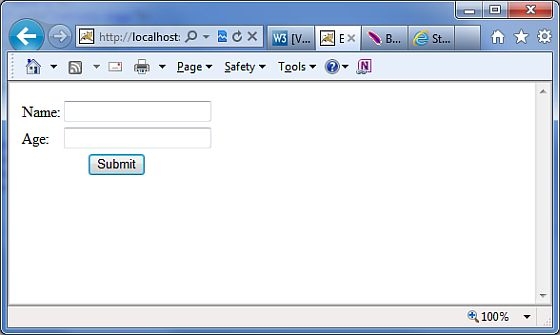
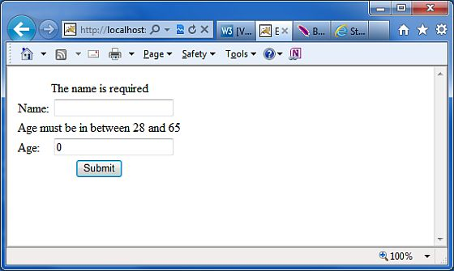
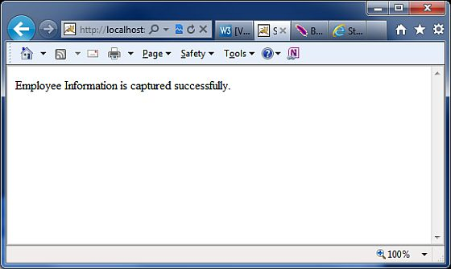

# Struts 2 - 注释

正如前面所提到的，Struts 提供了两种形式的配置。传统的方式是为所有的配置使用 **struts.xml** 文件。目前为止，在本教程中我们已经见过了太多这样的例子。另一种配置 Struts 的方式是使用 Java 5 注释功能。使用 struts 注释，我们可以实现 **零配置**。

在你的项目中开始使用注释之前，请确保在你的 **WebContent/WEB-INF/lib** 文件夹中包含下述 jar 文件：

- struts2-convention-plugin-x.y.z.jar

- asm-x.y.jar

- antlr-x.y.z.jar

- commons-fileupload-x.y.z.jar

- commons-io-x.y.z.jar

- commons-lang-x.y.jar

- commons-logging-x.y.z.jar

- commons-logging-api-x.y.jar

- freemarker-x.y.z.jar

- javassist-.xy.z.GA

- ognl-x.y.z.jar

- struts2-core-x.y.z.jar

- xwork-core.x.y.z.jar

现在让我们看看不用 **struts.xml** 文件中的可用的配置而是用注释代替，应该怎么做。

为了解释 Struts2 中只是的概念，我们应该重新考虑在 [Struts2 Validations](http://www.tutorialspoint.com/struts_2/struts_validations.htm) 章节中解释的验证示例。

这里我们采用 **Employee** 的例子，它使用一个简单的页面来获取姓名和年龄，并且我们会设置两个验证来确保用户会输入姓名以及年龄在 28-65 之间。所以让我们从例子中的主 JSP 页面开始。

## 创建主页面

让我们编写主页面 JSP 文件 **index.jsp**，用于与上述信息相关的 Employee。

<pre class="prettyprint notranslate">
&lt;%@ page language="java" contentType="text/html; charset=ISO-8859-1"
   pageEncoding="ISO-8859-1"%&gt;
&lt;%@ taglib prefix="s" uri="/struts-tags"%&gt;
&lt;!DOCTYPE html PUBLIC "-//W3C//DTD HTML 4.01 Transitional//EN" 
"http://www.w3.org/TR/html4/loose.dtd"&gt;
&lt;html&gt;
&lt;head&gt;
&lt;title&gt;Employee Form&lt;/title&gt;
&lt;/head&gt;

&lt;body&gt;

   &lt;s:form action="empinfo" method="post"&gt;
      &lt;s:textfield name="name" label="Name" size="20" /&gt;
      &lt;s:textfield name="age" label="Age" size="20" /&gt;
      &lt;s:submit name="submit" label="Submit" align="center" /&gt;
   &lt;/s:form&gt;

&lt;/body&gt;
&lt;/html&gt;
</pre>

index.jsp 使用 Struts 标签，Struts 标签我们还没有涉及到，但是在标签相关的章节中我们会学习到。但是现在，只能假设 s:textfield 标签产生一个输入字段，s:submit 标签产生一个提交按钮。我们已经为每个标签使用了标记属性，会为每个标签创建标记。

## 创建视图

我们使用 JSP 文件 **success.jsp**，当定义的操作返回 SUCCESS 时，该文件会被调用。

<pre class="prettyprint notranslate">
&lt;%@ page language="java" contentType="text/html; charset=ISO-8859-1"
	pageEncoding="ISO-8859-1"%&gt;
&lt;%@ taglib prefix="s" uri="/struts-tags"%&gt;
&lt;!DOCTYPE html PUBLIC "-//W3C//DTD HTML 4.01 Transitional//EN" 
"http://www.w3.org/TR/html4/loose.dtd"&gt;
&lt;html&gt;
&lt;head&gt;
&lt;title&gt;Success&lt;/title&gt;
&lt;/head&gt;
&lt;body&gt;
   Employee Information is captured successfully.
&lt;/body&gt;
&lt;/html&gt;
</pre>

## 创建操作

这是注释会被用到的地方。让我们用注释重新定义操作类 **Employee**，然后将如下所示的 **validate()** 方法添加到 **Employee.java** 文件中。确保你的操作类扩展了 **ActionSupport** 类，否则你的验证方法不会被执行。

``` 
package com.tutorialspoint.struts2;
import com.opensymphony.xwork2.ActionSupport;
import org.apache.struts2.convention.annotation.Action;
import org.apache.struts2.convention.annotation.Result;
import org.apache.struts2.convention.annotation.Results;
import com.opensymphony.xwork2.validator.annotations.*;
@Results({
   @Result(name="success", location="/success.jsp"),
   @Result(name="input", location="/index.jsp")
})
public class Employee extends ActionSupport{
   private String name;
   private int age;
   @Action(value="/empinfo")
   public String execute() 
   {
       return SUCCESS;
   }
   @RequiredFieldValidator( message = "The name is required" )
   public String getName() {
       return name;
   }
   public void setName(String name) {
       this.name = name;
   }
   @IntRangeFieldValidator(message = "Age must be in between 28 and 65",
                                      min = "29", max = "65")
   public int getAge() {
       return age;
   }
   public void setAge(int age) {
       this.age = age;
   }
}
```

在这个例子中我们已经使用了几个注释。让我们一个一个的仔细浏览一下：

- 首先，我们包含了 **Results** 注释。Results 注释时结果的集合。在结果注释下，我们有两个结果注释。结果注释有**名字**，对应于该执行方法的输出。它们还包括视图被服务的位置，对应于从 execute() 返回的值。

- 下一个注释是 **Action** 注释。这是用于装饰 execute() 方法的。操作方法带有一个值，该值是这个操作被调用的 URL。

- 最后，我使用了两个 **validation** 注释。我已经在 **name** 字段配置了必需的字段验证器，并且在 **age** 字段配置了整数范围验证器。我还为验证指定了一个自定义的消息。

## 配置字段

我们实在不需要 **struts.xml** 配置文件，所以让我们删除这个文件并查看 ** web.xml** 文件中的内容：

``` 
<?xml version="1.0" encoding="UTF-8"?>
<web-app xmlns:xsi="http://www.w3.org/2001/XMLSchema-instance"
   xmlns="http://java.sun.com/xml/ns/javaee"
   xmlns:web="http://java.sun.com/xml/ns/javaee/web-app_2_5.xsd"
   xsi:schemaLocation="http://java.sun.com/xml/ns/javaee
   http://java.sun.com/xml/ns/javaee/web-app_3_0.xsd"
   id="WebApp_ID" version="3.0">
   <display-name>Struts 2</display-name>
   <welcome-file-list>
      <welcome-file>index.jsp</welcome-file>
   </welcome-file-list>
   <filter>
      <filter-name>struts2</filter-name>
      <filter-class>
         org.apache.struts2.dispatcher.FilterDispatcher
      </filter-class>
      <init-param>
         <param-name>struts.devMode</param-name>
         <param-value>true</param-value>
      </init-param>
   </filter>
   <filter-mapping>
      <filter-name>struts2</filter-name>
      <url-pattern>/*</url-pattern>
   </filter-mapping>
</web-app>
```

现在，鼠标右键单击项目名，点击 **Export > WAR File** 来创建一个 War 文件。然后将这个 WAR 文件部署到 Tomcat 的 web 应用程序的目录中。最后，启动 Tomcat 服务器并尝试访问 URL http://localhost:8080/HelloWorldStruts2/index.jsp。这将为你呈现如下所示的画面：



现在不要键入任何必需的信息，只是点击**提交**按钮。你会看到如下所示的结果：



键入必需的信息，但是输入一个错误的表单字段，如姓名输入为 "test"，年龄输入为 30，然后点击 **提交**按钮。你会看到如下所示的结果：



## Struts 2 注释类型

Struts 2 应用程序可以使用 Java 5 注释作为 XML 和 Java 属性配置的可选项。你可以查看与不同类别相关的最重要的注释列表：

[Struts 2 注释类型](http://www.tutorialspoint.com/struts_2/struts_annotations_types.htm)


