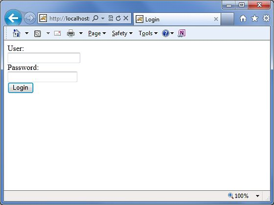
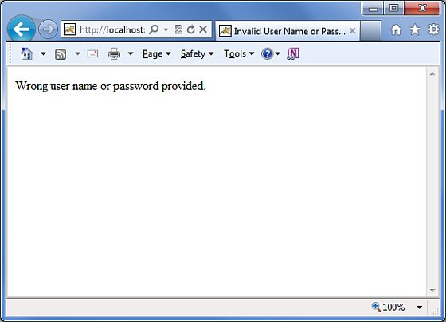
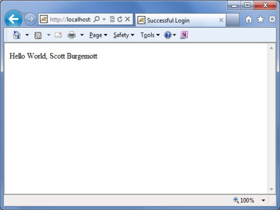

# Struts 2 - 数据库访问

本章将用简单的步骤教你如何使用 Struts 2 来访问数据库。Struts 是一个 MVC 框架，而不是一个数据库框架，但它为 JPA/Hibernate 集成提供了很好的支持。我们将在后面的章节中看到 Hibernate 集成，但时在本章中我们将使用普通的 JDBC 来访问数据库。

本章中的第一步是设置和准备我们的数据库。在这个例子中，我使用 MySQL 作为我的数据库。我已经在我的机器上安装了 MySQL，并且创建了一个新的数据库，称为 “struts_tutorial”。我创建了一个表，称为 **login**，并且用一些值填充它。下面是用来创建和填充表的脚本。

MYSQL 数据库默认的用户名是 “root”，密码为 “root123”。

``` 
CREATE TABLE `struts_tutorial`.`login` (
   `user` VARCHAR( 10 ) NOT NULL ,
   `password` VARCHAR( 10 ) NOT NULL ,
   `name` VARCHAR( 20 ) NOT NULL ,
   PRIMARY KEY ( `user` )
) ENGINE = InnoDB;
INSERT INTO `struts_tutorial`.`login` (`user`, `password`, `name`)
 VALUES ('scott', 'navy', 'Scott Burgemott');
```

下一步是下载 [**MySQL Connector jar**](http://dev.mysql.com/downloads/connector/j/5.1.html) 文件，并把这个文件放在你的项目的 WEB-INF\lib 文件夹下。在我们已经做到了这个之后，现在就可以准备创建动作类。 

## 创建动作

动作类有对应于数据库表中的列的属性。我们把 **user**，**password** 和 **name** 作为字符串属性。在动作方法中，我们使用 user 和 password 参数来检查用户是否存在，如果存在，我们在下一个画面中显示用户名。如果用户输入了错误的信息，我们再次把他们发送到登录画面。下面是 **LoginAction.java** 文件的内容：

``` 
package com.tutorialspoint.struts2;
import java.sql.Connection;
import java.sql.DriverManager;
import java.sql.PreparedStatement;
import java.sql.ResultSet;
import com.opensymphony.xwork2.ActionSupport;
public class LoginAction extends ActionSupport {
   private String user;
   private String password;
   private String name;
   public String execute() {
      String ret = ERROR;
      Connection conn = null;
      try {
         String URL = "jdbc:mysql://localhost/struts_tutorial";
         Class.forName("com.mysql.jdbc.Driver");
         conn = DriverManager.getConnection(URL, "root", "root123");
         String sql = "SELECT name FROM login WHERE";
         sql+=" user = ? AND password = ?";
         PreparedStatement ps = conn.prepareStatement(sql);
         ps.setString(1, user);
         ps.setString(2, password);
         ResultSet rs = ps.executeQuery();
         while (rs.next()) {
            name = rs.getString(1);
            ret = SUCCESS;
         }
      } catch (Exception e) {
         ret = ERROR;
      } finally {
         if (conn != null) {
            try {
               conn.close();
            } catch (Exception e) {
            }
         }
      }
      return ret;
   }
   public String getUser() {
      return user;
   }
   public void setUser(String user) {
      this.user = user;
   }
   public String getPassword() {
      return password;
   }
   public void setPassword(String password) {
      this.password = password;
   }
   public String getName() {
      return name;
   }
   public void setName(String name) {
      this.name = name;
   }
}
```

## 创建主页面

现在，让我们创建一个 JSP 文件 **index.jsp**，用来收集用户名和密码。将对数据库进行检查这个用户名和密码。

<pre class="prettyprint notranslate">
&lt;%@ page language="java" contentType="text/html; charset=ISO-8859-1"
pageEncoding="ISO-8859-1"%&gt;
&lt;%@ taglib prefix="s" uri="/struts-tags"%&gt;
&lt;!DOCTYPE html PUBLIC "-//W3C//DTD HTML 4.01 Transitional//EN" 
"http://www.w3.org/TR/html4/loose.dtd"&gt;
&lt;html&gt;
&lt;head&gt;
&lt;title&gt;Login&lt;/title&gt;
&lt;/head&gt;
&lt;body&gt;
   &lt;form action="loginaction" method="post"&gt;
      User:&lt;br/&gt;&lt;input type="text" name="user"/&gt;&lt;br/&gt;
      Password:&lt;br/&gt;&lt;input type="password" name="password"/&gt;&lt;br/&gt;
      &lt;input type="submit" value="Login"/&gt;		
   &lt;/form&gt;
&lt;/body&gt;
&lt;/html&gt;
</pre>


## 创建视图

现在，让我们创建 **success.jsp** 文件，假如动作返回 SUCCESS，该文件将被调用，但是假如动作返回 ERROR，我们将有另一个视图。

<pre class="prettyprint notranslate">
&lt;%@ page contentType="text/html; charset=UTF-8" %&gt;
&lt;%@ taglib prefix="s" uri="/struts-tags" %&gt;
&lt;html&gt;
&lt;head&gt;
&lt;title&gt;Successful Login&lt;/title&gt;
&lt;/head&gt;
&lt;body&gt;
   Hello World, &lt;s:property value="name"/&gt;
&lt;/body&gt;
&lt;/html&gt;
</pre>


下面将是一个视图文件 **error.jsp**，假如动作返回 ERROR。

<pre class="prettyprint notranslate">
&lt;%@ page contentType="text/html; charset=UTF-8" %&gt;
&lt;%@ taglib prefix="s" uri="/struts-tags" %&gt;
&lt;html&gt;
&lt;head&gt;
&lt;title&gt;Invalid User Name or Password&lt;/title&gt;
&lt;/head&gt;
&lt;body&gt;
   Wrong user name or password provided.
&lt;/body&gt;
&lt;/html&gt;
</pre>


## 配置文件

最后，让我们使用 struts.xml 配置文件把一切都综合起来，如下所示：

``` 
<?xml version="1.0" encoding="UTF-8"?>
<!DOCTYPE struts PUBLIC
"-//Apache Software Foundation//DTD Struts Configuration 2.0//EN"
"http://struts.apache.org/dtds/struts-2.0.dtd">
<struts>
   <constant name="struts.devMode" value="true" />
   <package name="helloworld" extends="struts-default"> 
      <action name="loginaction" 
         class="com.tutorialspoint.struts2.LoginAction"
         method="execute">
         <result name="success">/success.jsp</result>
         <result name="error">/error.jsp</result>
      </action>  
   </package>
</struts>
```

下面是 **web.xml** 文件的内容：

``` 
<?xml version="1.0" encoding="UTF-8"?>
<web-app xmlns:xsi="http://www.w3.org/2001/XMLSchema-instance"
   xmlns="http://java.sun.com/xml/ns/javaee" 
   xmlns:web="http://java.sun.com/xml/ns/javaee/web-app_2_5.xsd"
   xsi:schemaLocation="http://java.sun.com/xml/ns/javaee 
   http://java.sun.com/xml/ns/javaee/web-app_3_0.xsd"
   id="WebApp_ID" version="3.0">  
   <display-name>Struts 2</display-name>
   <welcome-file-list>
      <welcome-file>index.jsp</welcome-file>
   </welcome-file-list>
   <filter>
      <filter-name>struts2</filter-name>
      <filter-class>
         org.apache.struts2.dispatcher.FilterDispatcher
      </filter-class>
   </filter>
   <filter-mapping>
      <filter-name>struts2</filter-name>
      <url-pattern>/*</url-pattern>
   </filter-mapping>
</web-app>
```

现在，在项目名称上点击右键，并且单击 **Export > WAR File** 来创建一个 War 文件。然后在 Tomcat 的 webapps 目录下部署这个 WAR。最后，启动 Tomcat 服务器并尝试访问 URL http://localhost:8080/HelloWorldStruts2/index.jsp。将会给出下面的画面：



输入了错误的用户名和密码。你应该看到下面的页面：



现在输入用户名为 **scott** 和密码为 **navy**。你应该看到下面的页面：

