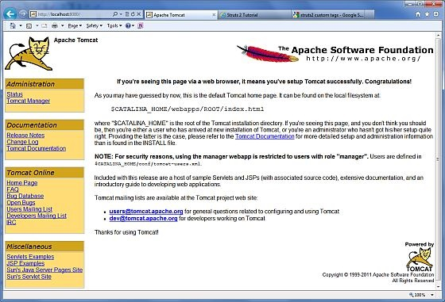

# Struts 2 - 环境配置

我们的首要任务是让最小的 Struts2 应用程序运行。本章将指导你如何准备开发环境来使用 Struts 2 开始你的工作。假设你已经在你的机器上安装了 JDK（5 +），Tomcat 和 Eclipse。如果你还没有安装这些组件，然后按照快速通道上给出的步骤：

## Step 1 - 安装 Java 开发工具包（JDK）：

你可以从 Oracle 的 Java 网站：[**Java SE Downloads**](http://www.oracle.com/technetwork/java/javase/downloads/index.html) 下载 SDK 的最新版本。你会在下载的文件中找到教你如何安装 JDK 的说明，按照给出的说明安装和配置 JDK 的设置。最后，设置 PATH 和 JAVA_HOME 环境变量，引入包含 java 和 javac 的目录，通常分别为 java _ install _ dir/bin 和 java _ install _ dir。

如果你运行的是 Windows，并在 C:\jdk1.5.0_20 上安装了 SDK，你就可以把下面这行写入 C:\autoexec.bat 文件中。

``` 
set PATH=C:\jdk1.5.0_20\bin;%PATH%
set JAVA_HOME=C:\jdk1.5.0_20
```

或者，在 Windows NT/2000/XP 中，你也可以右键单击“我的电脑”，选择“属性”，然后是“高级”，然后是“环境变量”。接下来，你将更新 PATH 值，并且按下 OK 按钮。

在 Unix(Solaris、Linux 等等)上，如果在 /usr/local/jdk1.5.0_20 上安装 SDK，并且使用 C shell 命令，你将把下面的内容添加到 .cshrc 文件中。

``` 
setenv PATH /usr/local/jdk1.5.0_20/bin:$PATH
setenv JAVA_HOME /usr/local/jdk1.5.0_20
```

或者，如果你使用集成开发环境（IDE），如 Borland JBuilder，Eclipse，IntelliJ IDEA 或者 Sun ONE Studio，编译和运行一个简单的程序，用来确认 IDE 知道你安装了 Java，否则应该根据 IDE 给定的文档做正确的设置。

## Step 2 - 安装 Apache Tomcat：

你可以从 [**http://tomcat.apache.org/**](http://tomcat.apache.org/) 下载 Tomcat 最新的版本。一旦你下载完安装包，并且解压二进制的发行版本到一个方便的位置。例如在 windows 上的 C:\apache-tomcat-6.0.33 中，或在 Linux/Unix 上的 /usr/local/apache-tomcat-6.0.33 中，并且创建 CATALINA_HOME 的环境变量指向这些位置。

在 windows 机器上，可以通过执行下列命令启动 Tomcat，或者你可以简单地双击 startup.bat：

``` 
%CATALINA_HOME%\bin\startup.bat
 or
 C:\apache-tomcat-6.0.33\bin\startup.bat
```

在 Unix (Solaris、Linux 等等)机器上，可以通过执行下列命令启动 Tomcat：

``` 
$CATALINA_HOME/bin/startup.sh
or
/usr/local/apache-tomcat-6.0.33/bin/startup.sh
```

成功启动后，可以通过访问 **http://localhost:8080/** 来使用包含 Tomcat 的默认的 web 应用程序。如果一切都正常，它应该显示下面的结果：



关于配置和运行 Tomcat 的更多信息可以在这里包含的文档中找到，也可以在 Tomcat 网站：http://tomcat.apache.org 中找到。

在 windows 机器上，可以通过执行下列命令停止 Tomcat：

``` 
%CATALINA_HOME%\bin\shutdown
or
C:\apache-tomcat-5.5.29\bin\shutdown`
```

在 Unix(Solaris、Linux 等等)机器上，可以通过执行下列命令停止 Tomcat：

``` 
$CATALINA_HOME/bin/shutdown.sh
or
/usr/local/apache-tomcat-5.5.29/bin/shutdown.sh
```

## Step 3 - 安装 Eclipse（IDE）

本教程中的所有例子使用 Eclipse IDE 编写。所以我建议你应该在你的机器上安装 Eclipse 的最新版本。

为了安装 Eclipse，从 [**http://www.eclipse.org/downloads/**](http://www.eclipse.org/downloads/) 下载最新的 Eclipse 二进制文件。一旦你下载完安装包，并且解压二进制的发行版本到一个方便的位置。例如在 windows 上的 C:\eclipse 中，或在 Linux/Unix 上的 /usr/local/eclipse 中，最后恰当的设置 PATH 变量。

在 windows 机器上，可以通过执行以下命令启动 Eclipse，或者你可以简单地双击 eclipse.exe。

``` 
 %C:\eclipse\eclipse.exe
```

在 Unix（Solaris 和 Linux 等）上，可以通过执行下面的命令启动 Eclipse：

``` 
$/usr/local/eclipse/eclipse
```

启动成功后，如果一切正常，它应该显示下面的结果：


## Step 4 – 安装 Struts2 库

现在如果一切正常，你就可以继续安装你的 Struts 2 框架。下面是在你的机器上下载并安装 Struts2 的简单步骤。

- 选择是要在 Windows 还是在 UNIX 上安装 Struts2，然后继续进行下一个步骤，在 windows 上下载 .zip 文件,而在 Unix 上下载 .tz 文件。

- 从 [http://struts.apache.org/download.cgi](http://struts.apache.org/download.cgi) 下载最新版本的 Struts2 框架的二进制文件。

- 在写本教程的时候，我下载了 **struts-2.0.14-all.zip**，当你解压缩下载的文件时，它内置的目录结构为 C:\struts-2.2.3，如下所示。


第二步是在任何位置中解压 zip 文件，我在 Windows 7 机器上的 c:\ 文件夹中下载并解压 **struts-2.2.3-all.zip**，因此我把所有的 jar 文件放到了 **C:\struts-2.2.3\lib** 中。确保你正确地设置了 CLASSPATH 变量，否则你将会在运行应用程序时遇到问题。
