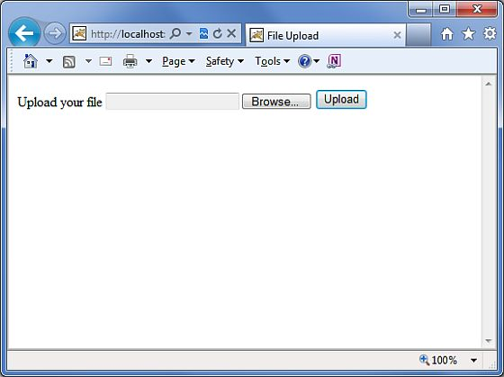

# Struts 2 - 文件上传

Struts 2 框架为处理文件上传提供了内置支持，它使用“在 HTML 中基于表单的文件上传”。当上传一个文件时，它通常会被存储在一个临时目录中，而且它们应该由 Action 类进行处理或移动到一个永久的目录，用来确保数据不丢失。

**注意服务器在恰当的位置可能有一个安全策略，它会禁止你写到除了临时目录以外的目录，而且这个目录属于你的web应用应用程序。**

通过预定义的名为**文件上传**的拦截器，Struts 的文件上传是可能的，这个拦截器在 org.apache.struts2.interceptor.FileUploadInterceptor 类是可用的，而且是 defaultStack 的一部分。你仍然可以使用在 struts.xml 中设置各种参数，我们将在下面看到。

## 创建视图文件

让我们开始创建需要浏览和上传选定的文件的视图。因此，让我们创建一个带有简单的 HTML 上传表单的 index.jsp，它允许用户上传文件：

<pre class="prettyprint notranslate">
&lt;%@ page language="java" contentType="text/html; charset=ISO-8859-1"
pageEncoding="ISO-8859-1"%&gt;
&lt;%@ taglib prefix="s" uri="/struts-tags"%&gt;
&lt;!DOCTYPE html PUBLIC "-//W3C//DTD HTML 4.01 Transitional//EN" 
"http://www.w3.org/TR/html4/loose.dtd"&gt;
&lt;html&gt;
&lt;head&gt;
&lt;title&gt;File Upload&lt;/title&gt;
&lt;/head&gt;
&lt;body&gt;
   &lt;form action="upload" method="post" enctype="multipart/form-data"&gt;
      &lt;label for="myFile"&gt;Upload your file&lt;/label&gt;
      &lt;input type="file" name="myFile" /&gt;
      &lt;input type="submit" value="Upload"/&gt;
   &lt;/form&gt;
&lt;/body&gt;
&lt;/html&gt;
</pre>


在上面的例子中有几点值得注意。首先，表单的编码类型设置为 **multipart/form-data**。为了使用文件上传拦截器来成功地处理文件上传，它应该被设置。下一个注意点是表单的动作方法 **upload** 和文件上传字段的名称是 **myFile**。我们需要这些信息来创建动作方法和 struts 配置。

接下来让我们创建一个简单的 jsp 文件 **success.jsp** 来显示我们的文件上传的结果，假使它成功地执行。

<pre class="prettyprint notranslate">
&lt;%@ page contentType="text/html; charset=UTF-8" %&gt;
&lt;%@ taglib prefix="s" uri="/struts-tags" %&gt;
&lt;html&gt;
&lt;head&gt;
&lt;title&gt;File Upload Success&lt;/title&gt;
&lt;/head&gt;
&lt;body&gt;
You have successfully uploaded &lt;s:property value="myFileFileName"/&gt;
&lt;/body&gt;
&lt;/html&gt;
</pre>


下面是结果文件 error.jsp，假使在上传文件过程中有一些错误：

<pre class="prettyprint notranslate">
&lt;%@ page contentType="text/html; charset=UTF-8" %&gt;
&lt;%@ taglib prefix="s" uri="/struts-tags" %&gt;
&lt;html&gt;
&lt;head&gt;
&lt;title&gt;File Upload Error&lt;/title&gt;
&lt;/head&gt;
&lt;body&gt;
There has been an error in uploading the file.
&lt;/body&gt;
&lt;/html&gt;
</pre>


## 创建 action 类

接下来让我们创建一个称为 **uploadFile.java** 的 Java 类，它负责上传文件，并且把这个文件存储在一个安全的位置：

``` 
package com.tutorialspoint.struts2;
import java.io.File;
import org.apache.commons.io.FileUtils;
import java.io.IOException; 
import com.opensymphony.xwork2.ActionSupport;
public class uploadFile extends ActionSupport{
   private File myFile;
   private String myFileContentType;
   private String myFileFileName;
   private String destPath;
   public String execute()
   {
      /* Copy file to a safe location */
      destPath = "C:/apache-tomcat-6.0.33/work/";
      try{
     	 System.out.println("Src File name: " + myFile);
     	 System.out.println("Dst File name: " + myFileFileName);   	    	 
     	 File destFile  = new File(destPath, myFileFileName);
    	 FileUtils.copyFile(myFile, destFile);  
      }catch(IOException e){
         e.printStackTrace();
         return ERROR;
      }
      return SUCCESS;
   }
   public File getMyFile() {
      return myFile;
   }
   public void setMyFile(File myFile) {
      this.myFile = myFile;
   }
   public String getMyFileContentType() {
      return myFileContentType;
   }
   public void setMyFileContentType(String myFileContentType) {
      this.myFileContentType = myFileContentType;
   }
   public String getMyFileFileName() {
      return myFileFileName;
   }
   public void setMyFileFileName(String myFileFileName) {
      this.myFileFileName = myFileFileName;
   }
}
```

**uploadFile.java** 是一个非常简单的类。值得注意的一件重要的事情是文件上传拦截器和参数拦截器为我们处理所有繁重的工作。文件上传拦截器在默认情况下有三个可用的参数。它们被命名为下列模式：

- **[your file name parameter]** –这是实际的用户已经上传的文件。在这个例子中它是 “myFile”。

- **[your file name parameter]ContentType** - 这是被上传的文件的内容类型。在这个例子中它是 “myFileContentType”。

- **[your file name parameter]FileName** - 这是被上传的文件的名称。在这个例子中它是 “myFileFileName”。

对我们来说，这三个参数是可用的，这要归功于 Struts 的拦截器。我们要做的是在我们的动作类中用正确的名称创建三个参数，而且这些变量是为我们自动连线的。所以，在上面的例子中，我们有三个参数和一个动作方法，如果一切正常，则简单地返回 “success”，否则返回 “error”。

## 配置文件

下面是可以控制文件上传过程的 Struts2 的配置属性：

<table class="table table-bordered"> 
<tr>
<th style="width:5">序号 </th>
<th>属性 &amp; 描述</th>
</tr> 
<tr>
<td>1</td>
<td><b>struts.multipart.maxSize</b>
<p>当一个文件上传时，可以接受的最大的文件大小(以字节为单位)。默认设置是 250 M。</p>
</td>
</tr> 
<tr>
<td>2</td>
<td><b>struts.multipart.parser</b>
<p>用于上传多个表单的库。默认情况下是 <b>jakarta</b>。</p>
</td>
</tr> 
<tr>
<td>3</td>
<td><b>struts.multipart.saveDir</b>
<p>存储临时文件的位置。默认情况下是 javax.servlet.context.tempdir。</p>
</td>
</tr> 
</table>


为了改变这些设置，你可以使用在你的应用程序 struts.xml 文件中 **constant** 标签，就像我改变上传文件的最大大小的操作。让我们有如下所示的 **struts.xml**：

``` 
<?xml version="1.0" encoding="UTF-8"?>
<!DOCTYPE struts PUBLIC
"-//Apache Software Foundation//DTD Struts Configuration 2.0//EN"
"http://struts.apache.org/dtds/struts-2.0.dtd">
<struts>
   <constant name="struts.devMode" value="true" />
   <constant name="struts.multipart.maxSize" value="1000000" />
   <package name="helloworld" extends="struts-default">
   <action name="upload" class="com.tutorialspoint.struts2.uploadFile">
       <result name="success">/success.jsp</result>
       <result name="error">/error.jsp</result>
   </action>
   </package>
</struts>
```

由于拦截器是拦截器 defaultStack 的一部分，我们并不需要明确地配置它。但是你可以在 <action> 里面添加 <interceptor-ref> 标签。文件上传拦截器需要两个参数：（**a）maximumSize（b）allowedTypes**。maximumSize 参数设置允许的最大文件大小（默认为约 2 MB）。allowedTypes 参数是一个逗号分隔的公认的内容（MIME）类型列表，如下所示：

``` 
<action name="upload" class="com.tutorialspoint.struts2.uploadFile">
       <interceptor-ref name="basicStack">
       <interceptor-ref name="fileUpload">
           <param name="allowedTypes">image/jpeg,image/gif</param>
       </interceptor-ref>
       <result name="success">/success.jsp</result>
       <result name="error">/error.jsp</result>
   </action>
```

下面是 **web.xml** 文件的内容：

``` 
<?xml version="1.0" encoding="UTF-8"?>
<web-app xmlns:xsi="http://www.w3.org/2001/XMLSchema-instance"
   xmlns="http://java.sun.com/xml/ns/javaee" 
   xmlns:web="http://java.sun.com/xml/ns/javaee/web-app_2_5.xsd"
   xsi:schemaLocation="http://java.sun.com/xml/ns/javaee 
   http://java.sun.com/xml/ns/javaee/web-app_3_0.xsd"
   id="WebApp_ID" version="3.0">   
   <display-name>Struts 2</display-name>
   <welcome-file-list>
      <welcome-file>index.jsp</welcome-file>
   </welcome-file-list>
   <filter>
      <filter-name>struts2</filter-name>
      <filter-class>
         org.apache.struts2.dispatcher.FilterDispatcher
      </filter-class>
   </filter>
   <filter-mapping>
      <filter-name>struts2</filter-name>
      <url-pattern>/*</url-pattern>
   </filter-mapping>
</web-app>
```

现在，在项目名称上点击右键，并且单击 **Export > WAR File** 来创建一个 War 文件。然后在 Tomcat 的 webapps 目录下部署这个 WAR。最后，启动 Tomcat 服务器和尝试访问 URL http://localhost:8080/HelloWorldStruts2/upload.jsp。将会给出下面的画面：



现在使用浏览按钮选择一个文件 “Contacts.txt”，而且单击上传按钮，它将在你的服务器上上传文件，然后你应该看到页面。你可以查看保存在 C:\apache-tomcat-6.0.33\work 中上传的文件。


注意文件上传拦截器自动删除上传的文件，所以你需要通过编程在某个位置上保存上传的文件，在它被删除之前。

## 错误消息

文件上传拦截器使用几个默认的错误消息键：

<table class="table table-bordered"> 
<tr>
<th style="width:5">序号 </th>
<th>错误消息键 &amp; 描述</th>
</tr> 
<tr>
<td>1</td>
<td><b>struts.messages.error.uploading</b>
<p>一个发生在文件无法上传时的通常的错误。</p>
</td>
</tr> 
<tr>
<td>2</td>
<td><b>struts.messages.error.file.too.large</b>
<p>发生在上传文件比指定的 maximumSize 大时。</p>
</td>
</tr> 
<tr>
<td>3</td>
<td><b>struts.messages.error.content.type.not.allowed</b>
<p>发生在上传文件不匹配指定的预期内容类型。</p>
</td>
</tr> 
</table>


你可以重写在 **WebContent/WEB-INF/classes/messages.properties** 源文件中消息的内容。
