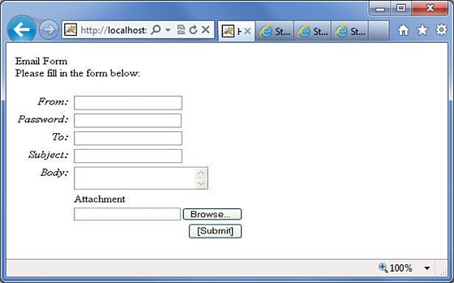
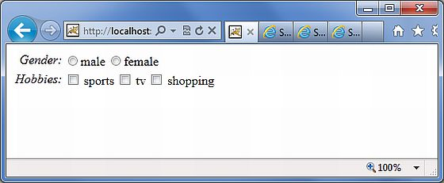
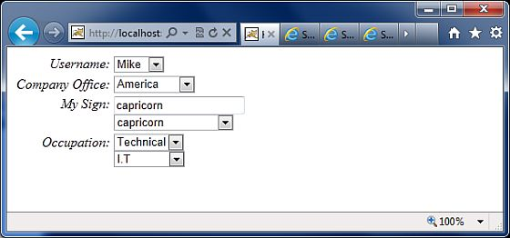

# Struts 2 - The Form 标签

**form** 标签的列表是 Struts UI 标签的子集。这些标签帮助呈现 Struts web 应用程序必需的用户接口，并且能够被划分为三种类别。本章将会带你浏览 UI 标签的这三种类别。

## 简单的 UI 标签

我们已经在我们的示例中使用过这些标签了，在本章中我们将一带而过。让我们看看带有几个简单的 UI 标签的简单的视图页面 **email.jsp**：

<pre class="prettyprint notranslate">
&lt;%@ page language="java" contentType="text/html; charset=ISO-8859-1"
	pageEncoding="ISO-8859-1"%&gt;
&lt;%@ taglib prefix="s" uri="/struts-tags"%&gt;
&lt;!DOCTYPE html PUBLIC "-//W3C//DTD HTML 4.01 Transitional//EN" 
"http://www.w3.org/TR/html4/loose.dtd"&gt;
&lt;html&gt;
&lt;head&gt;
&lt;s:head/&gt;
&lt;title&gt;Hello World&lt;/title&gt;
&lt;/head&gt;
&lt;body&gt;
   &lt;s:div&gt;Email Form&lt;/s:div&gt;
   &lt;s:text name="Please fill in the form below:" /&gt;
   &lt;s:form action="hello" method="post" enctype="multipart/form-data"&gt;
   &lt;s:hidden name="secret" value="abracadabra"/&gt;
   &lt;s:textfield key="email.from" name="from" /&gt;
   &lt;s:password key="email.password" name="password" /&gt;
   &lt;s:textfield key="email.to" name="to" /&gt;
   &lt;s:textfield key="email.subject" name="subject" /&gt;
   &lt;s:textarea key="email.body" name="email.body" /&gt;
   &lt;s:label for="attachment" value="Attachment"/&gt;
   &lt;s:file name="attachment" accept="text/html,text/plain" /&gt;
   &lt;s:token /&gt;
   &lt;s:submit key="submit" /&gt;
   &lt;/s:form&gt;
&lt;/body&gt;
&lt;/html&gt;
</pre>

如果你了解 HTML，那么所有的标签都是非常普通的 HTML 标签，只不过在每个标签和不同的属性中带有一个额外的前缀 **s:**。当我们执行上述程序时，我们会得到如下所示的用户接口，前提是你已经为所有用到的键设置了合适的映射。

正如显示的一样，s:head 生成了 Struts2应用程序必需的 javascript 和 stylesheet。

接下来，我们有 s:div 和 s:text 元素。s:div 元素用于呈现 HTML Div 元素。这对不想把 HTML 和 Struts 标签混合到一起的用户来说是非常有用的。对于这些人，他们必须选择使用 s:div 元素来呈现 div。

s:text 元素用于在屏幕上呈现一个文本。

接下来，我们有类似的 s:form 标签。s:form 标签有一个操作属性，决定了表单提交的位置。因为在表单中有一个文件上传元素，我们必须把 enctype 设置为 multipart。否则，我们可以离开这个空白。

在表单标签的结尾，我们有 s:submit 标签。这是用于提交表单的。当表单被提交时，所有的表单的值都会提交给 s:form 标签中指定的操作。

在 s:form 标签内部，有一个隐藏的属性称为 secret。这会呈现在 HTML 中隐藏的元素。在我们的例子中， "secret" 元素有 "abracadabra" 值。这个元素对终端用户是不可见的且它用于将状态从一个视图传递给另一个视图。

接下来，我们有 s:label，s:textfield，s:password 和 s:textarea 标签。这是分别用于呈现标记、输入字段、密码和文本域的。我们已经在 "Struts - Sending Email" 例子中的操作中了解了这些标签的使用方法。在这里需要注意的很重要的一点是 "key"  属性的使用。"key"  属性是用于从属性文件中为这些控制提取标记的。在 Struts2 本地化，国际化章节中，我们已经介绍了这个特征。

然后，我们有 s:file 标签，用于呈现输入文件上传组件。这个组件允许用户上传文件。在这个例子中，我们使用的是 s:file 标签的 "accept" 属性来指定哪个文件类型是允许上传的。

最后我们有 s:token 标签。 token 标签生成了一个唯一的  token，用于确认一个表单是否被提交了两次。

当呈现表单时，一个隐藏的变量就会被替换成 token 值。比如，token 是 "ABC"。当表单被提交时，Struts 过滤器检查与会话中存储的 token 不一致的 token。如果相匹配的话，它会把这个 token 从会话中移除出去。现在，如果表单被意外的重复提交了（或通过刷新或点击了浏览器的后退按钮），表单就会被重提交，其中 token 为 "ABC"。在这种情况下，过滤器会再次检查会话中与这个 token 不一致的 token。但是由于 token "ABC" 已经从从会话中被删除了，它不会再次匹配，Struts 过滤器就会拒绝这个请求。

## 组 UI 标签

组 UI 标签是用于创建单选按钮和复选框的。让我们看一个带有复选框和单选按钮标签的简单的视图页面 **HelloWorld.jsp**：

<pre class="prettyprint notranslate">
&lt;%@ page contentType="text/html; charset=UTF-8"%&gt;
&lt;%@ taglib prefix="s" uri="/struts-tags"%&gt;
&lt;html&gt;
&lt;head&gt;
&lt;title&gt;Hello World&lt;/title&gt;
&lt;s:head /&gt;
&lt;/head&gt;
&lt;body&gt;
   &lt;s:form action="hello.action"&gt;
   &lt;s:radio label="Gender" name="gender" list="{'male','female'}" /&gt;
   &lt;s:checkboxlist label="Hobbies" name="hobbies"
   list="{'sports','tv','shopping'}" /&gt;
   &lt;/s:form&gt;
&lt;/body&gt;
&lt;/html&gt;
</pre>

当我们执行上述程序时，会得到类似如下所示的输出：

现在让我们看看这个例子。在第一个例子中，我们创建的是一个简单的带有标记 "Gender" 的单选按钮。单选按钮的名字属性是强制性的，所以我们指定了名字为 "Gender"。然后我们给这个 gender 提供了一个列表。列表用值 "male" 和 "female" 填充。因此，在输出中，我们得到了带有两个值的单选按钮。

在第二个例子中，我们创建的是复选框列表。这是用来收集用户爱好的。用户可能有多个爱好，因此我们使用的是复选框而不是单选按钮。复选框用列表 "sports"，"Tv" 和 "Shopping" 填充。这把爱好以复选框列表的形式展现出来。

## 选择 UI 标签

让我们展示 Struts 提供的选择标签的不同的变量。请看如下所示的带有选择标签的简单的视图页面 **HelloWorld.jsp**：

<pre class="prettyprint notranslate">
&lt;%@ page contentType="text/html; charset=UTF-8"%&gt;
&lt;%@ taglib prefix="s" uri="/struts-tags"%&gt;
&lt;html&gt;
&lt;head&gt;
&lt;title&gt;Hello World&lt;/title&gt;
&lt;s:head /&gt;
&lt;/head&gt;
&lt;body&gt;
   &lt;s:form action="login.action"&gt;
      &lt;s:select name="username" label="Username"
         list="{'Mike','John','Smith'}" /&gt;

      &lt;s:select label="Company Office" name="mySelection"
         value="%{'America'}"
         list="%{#{'America':'America'}}"&gt;
      &lt;s:optgroup label="Asia" 
         list="%{#{'India':'India','China':'China'}}" /&gt;
      &lt;s:optgroup label="Europe"
         list="%{#{'UK':'UK','Sweden':'Sweden','Italy':'Italy'}}" /&gt;
      &lt;/s:select&gt;

      &lt;s:combobox label="My Sign" name="mySign"
         list="#{'aries':'aries','capricorn':'capricorn'}"
         headerKey="-1" 
         headerValue="--- Please Select ---" emptyOption="true"
         value="capricorn" /&gt;
      &lt;s:doubleselect label="Occupation" name="occupation"
         list="{'Technical','Other'}" doubleName="occupations2"
         doubleList="top == 'Technical' ? 
         {'I.T', 'Hardware'} : {'Accounting', 'H.R'}" /&gt;

   &lt;/s:form&gt;
&lt;/body&gt;
&lt;/html&gt;
</pre>

当我们执行上述程序时，我们会得到类似于如下所示的输出：

现在让我们仔细浏览上述情况

- 首先，选择标签用于呈现 HTML 选择框。在第一个例子中，我们创建的是一个简单的选择框，带有名字 "username" 和标记 "username"。该选择框会由包含 Mike，John 和 Smith 名字的列表填充。

- 在第二个例子中，我们的公司总部在美国。它也在亚洲和欧洲拥有全球办公室。我们想在选择框中显示办公室，但是我们想把全球办公室按照洲名分组。这就是 optgroup 的方便之处。我们使用 s:optgroup 标签来创建一个新组。给这个组一个标记和一个单独的列表。

- 在第三个例子中，用到了组合框。组合框是输入字段和选择框的组合。用户可以从选择框中选择一个值，然后输入字段就会用用户选取的值自动填充。或者用户也可以直接输入一个值，那么选择框中的值就不会被选中。

- 在我们的例子中有一个列出了星座的组合框。组合框只列出了四个星座，如果用户的星座不在组合框中，用户可以自己键入他自己的星座。我们还在选择框中添加了一个标题入口。标题入口显现在选择框的顶部。在我们的例子中我们想显示“请选择”。如果用户没有做出任何选择，那么我们假定值为 -1。在一些情况下，我们不希望用户选取空值。在这种情况下，设置 "emptyOption" 属性为 false。最后，在我们的例子中，我们提供了 "capricorn" 作为组合框的默认值。

- 在第四个例子中，我们有一个双选。双选用于你想显示两个选择框的情况。在第一个选择框中选择的值决定了第二个选择框中出现的内容。在我们的例子中，第一个选择框显示 "Technical" 和 "Other"。如果用户选择 Technical，我们会在第二个选择框中显示 IT 和 Hardware。否则我们会显示 Accounting 和 HR。使用例子中展示的 "list" 和 "doubleList" 属性也有可能会实现这一功能。

在上述例子中，我们做了一个比较来看顶部选择框是否就是 Techical。如果是的话，那么会显示 IT 和 Hardware。我们也需要给顶部框("name='Occupations')和底部框(doubleName='occupations2')设置名称。
