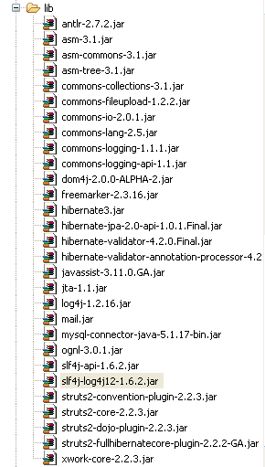
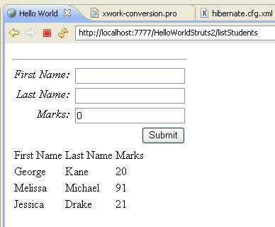

# Struts 2 & Hibernate 集成

Hibernate 是一个高性能的对象/关系持久性，能够查询在开源 GNU Lesser General Public License(LGPL) 下的服务较小，并且是免费下载的。在这一章，我们要学习如何用 Hibernate 集成实现 Struts 2 。如果你不熟悉 Hibernate，你可以查看我们的 [**Hibernate 教程**](http://www.tutorialspoint.com/hibernate/index.htm)。

## 数据库设置

在本教程中，我将使用 “struts2_tutoria” MySQL 数据库。我使用用户名 “root”、无密码来连接到我计算机中的数据库。首先，你需要运行以下脚本。这个脚本创建一个新表，名为 **student**，并在表中创建几条记录：

<pre class="prettyprint notranslate">
CREATE TABLE IF NOT EXISTS `student` (
  `id` int(11) NOT NULL AUTO_INCREMENT,
  `first_name` varchar(40) NOT NULL,
  `last_name` varchar(40) NOT NULL,
  `marks` int(11) NOT NULL,
  PRIMARY KEY (`id`)
);

--
-- Dumping data for table `student`
--

INSERT INTO `student` (`id`, `first_name`, `last_name`, `marks`) 
  VALUES(1, 'George', 'Kane', 20);
INSERT INTO `student` (`id`, `first_name`, `last_name`, `marks`) 
  VALUES(2, 'Melissa', 'Michael', 91);
INSERT INTO `student` (`id`, `first_name`, `last_name`, `marks`) 
  VALUES(3, 'Jessica', 'Drake', 21);
</pre>

## Hibernate 配置

接下来让我们创建 hibernate.cfg.xml 文件，它是 hibernate 的配置文件。

``` 
<?xml version='1.0' encoding='utf-8'?>
<!DOCTYPE hibernate-configuration PUBLIC
"-//Hibernate/Hibernate Configuration DTD//EN"
"http://hibernate.sourceforge.net/hibernate-configuration-3.0.dtd">
<hibernate-configuration>
<session-factory>
   <property name="hibernate.connection.driver_class">c
      om.mysql.jdbc.Driver
   </property>
   <property name="hibernate.connection.url">
      jdbc:mysql://www.tutorialspoint.com/struts_tutorial
   </property>
   <property name="hibernate.connection.username">root</property>
   <property name="hibernate.connection.password"></property>
   <property name="hibernate.connection.pool_size">10</property>
   <property name="show_sql">true</property>
   <property name="dialect">
      org.hibernate.dialect.MySQLDialect
   </property>
   <property name="hibernate.hbm2ddl.auto">update</property>
   <mapping class="com.tutorialspoint.hibernate.Student" />
</session-factory>
</hibernate-configuration> 
```

让我们仔细检查这个 hibernate 配置文件。首先，我们声明我们使用的是 MySQL 驱动。然后我们为连接到数据库声明 jdbc url。接下来我们声明连接的用户名，密码和池的大小。同时我们也表明通过将 "show_sql" 设置为 true，我们会在日志文件中看到这个 SQL。请仔细浏览 hibernate 教程来理解这些属性的含义。最后，我们将 mapping 类设置为 com.tutorialspoint.hibernate.Student，也就是我们在本章中将要创建的。

## 环境设置

接下来你需要为这个项目创建许多 jar 文件。附件是所需的 JAR 文件的完整列表截图：



大多数 JAR 文件可以作为你的 struts 发行版的一部分获取。如果你有一个已安装的应用程序服务器，如 glassfish，websphere 或 jboss，那么你就可以从应用程序服务器的 lib 文件夹中得到大部分剩余的 jar 文件。如果没有的话，那么你可以分别下载这些文件：

- Hibernate jar files - [Hibernate.org](http://www.hibernate.org/)

- Struts hibernate plugin - [Struts hibernate plugin](http://code.google.com/p/full-hibernate-plugin-for-struts2/downloads/list)

- JTA files - [JTA files](http://www.oracle.com/technetwork/java/javaee/jta/index.html)

- Dom4j files - [Dom4j](http://dom4j.sourceforge.net/)

- SLF4J files - [SLF4J](http://www.slf4j.org/)

- log4j files - [log4j](http://logging.apache.org/log4j/1.2/)

剩余的文件，你应该能够从你的 struts2 发行版中得到。

## Hibernate 类

现在让我们为 hibernate 集成创建必需的 java 类。下面是 **Student.java** 的内容：

``` 
package com.tutorialspoint.hibernate;
import javax.persistence.Column;
import javax.persistence.Entity;
import javax.persistence.GeneratedValue;
import javax.persistence.Id;
import javax.persistence.Table;
@Entity
@Table(name="student")
public class Student {	
   @Id
   @GeneratedValue
   private int id;
   @Column(name="last_name")
   private String lastName;
   @Column(name="first_name")
   private String firstName;
   private int marks;
   public int getId() {
    return id;
   }
   public void setId(int id) {
    this.id = id;
   }
   public String getLastName() {
      return lastName;
   }
   public void setLastName(String lastName) {
      this.lastName = lastName;
   }
   public String getFirstName() {
      return firstName;
   }
   public void setFirstName(String firstName) {
      this.firstName = firstName;
   }
   public int getMarks() {
      return marks;
   }
   public void setMarks(int marks) {
      this.marks = marks;
   }
}
```

这是一个 POJO 类，代表了每个 Hibernate 指定的 **student** 表。它有 id，firstname 和 lastname 属性，与 student 表中的列名相对应。下面让我们创建 **StudentDAO.java** 文件，如下所示：

``` 
package com.tutorialspoint.hibernate;
import java.util.ArrayList;
import java.util.List;
import org.hibernate.Session;
import org.hibernate.Transaction;
import com.googlecode.s2hibernate.struts2.plugin.\
                     annotations.SessionTarget;
import com.googlecode.s2hibernate.struts2.plugin.\
                     annotations.TransactionTarget;
public class StudentDAO {
   @SessionTarget
   Session session;
   @TransactionTarget
   Transaction transaction;
   @SuppressWarnings("unchecked")
   public List<Student> getStudents()
   {
      List<Student> students = new ArrayList<Student>();
      try
      {
         students = session.createQuery("from Student").list();
      }
      catch(Exception e)
      {
         e.printStackTrace();
      }
      return students;
   }
   public void addStudent(Student student)
   {
      session.save(student);
   }
}
```
StudentDAO 类是 Student 类的数据访问层。它有列出所有 students 和保存一个新的 student 记录的方法。

## Action 类

下述文件 **AddStudentAction.java** 定义了 action 类。在这里我们同样有两个 action 方法 - execute() 和 listStudents()。execute() 方法用来添加新的 student 记录。我们使用 dao 的 save() 方法来获取。另一个方法，listStudents() 用来列出 students。我们使用 dao 的 list 方法来得到所有 student 的列表。

``` 
package com.tutorialspoint.struts2;
import java.util.ArrayList;
import java.util.List;
import com.opensymphony.xwork2.ActionSupport;
import com.opensymphony.xwork2.ModelDriven;
import com.tutorialspoint.hibernate.Student;
import com.tutorialspoint.hibernate.StudentDAO;
public class AddStudentAction extends ActionSupport 
            implements ModelDriven<Student>{
   Student student  = new Student();
   List<Student> students = new ArrayList<Student>();
   StudentDAO dao = new StudentDAO();
   @Override
   public Student getModel() {
      return student;
   }
   public String execute()
   {
      dao.addStudent(student);
      return "success";
   }
   public String listStudents()
   {
      students = dao.getStudents();
      return "success";
   }
   public Student getStudent() {
      return student;
   }
   public void setStudent(Student student) {
      this.student = student;
   }
   public List<Student> getStudents() {
      return students;
   }
   public void setStudents(List<Student> students) {
      this.students = students;
   }	
}
```

你会注意到我们正在实现 ModelDriven 接口。当你的 action 类正在处理一个具体的模型类（如 Student）而不是单个的属性（如 firstName，lastName）时，该接口就会被用到。ModelAware 接口需要你实现一个方法来返回这个模型。在我们的例子中，我们返回的是 “student” 对象。

## 创建视图文件

现在让我们创建 **student.jsp** 视图文件，其内容如下所示：

<pre class="prettyprint notranslate">
&lt;%@ page contentType="text/html; charset=UTF-8"%&gt;
&lt;%@ taglib prefix="s" uri="/struts-tags"%&gt;
&lt;html&gt;
&lt;head&gt;
&lt;title&gt;Hello World&lt;/title&gt;
&lt;s:head /&gt;
&lt;/head&gt;
&lt;body&gt;
   &lt;s:form action="addStudent"&gt;
   &lt;s:textfield name="firstName" label="First Name"/&gt;
   &lt;s:textfield name="lastName" label="Last Name"/&gt;
   &lt;s:textfield name="marks" label="Marks"/&gt;
   &lt;s:submit/&gt;
   &lt;hr/&gt;
   &lt;table&gt;
      &lt;tr&gt;
         &lt;td&gt;First Name&lt;/td&gt;
         &lt;td&gt;Last Name&lt;/td&gt;
         &lt;td&gt;Marks&lt;/td&gt;
      &lt;/tr&gt;
      &lt;s:iterator value="students"&gt;	
         &lt;tr&gt;
            &lt;td&gt;&lt;s:property value="firstName"/&gt;&lt;/td&gt;
            &lt;td&gt;&lt;s:property value="lastName"/&gt;&lt;/td&gt;
            &lt;td&gt;&lt;s:property value="marks"/&gt;&lt;/td&gt;
           &lt;/tr&gt;
      &lt;/s:iterator&gt;	
   &lt;/table&gt;
   &lt;/s:form&gt;
&lt;/body&gt;
&lt;/html&gt;
</pre>

student.jsp 非常简单。在最上面的一节中，我们有一个要提交到 "addStudent.action" 的表单。它带有 firstName，lastName 和标记。由于 addStudent 操作与 ModelAware "AddSudentAction" 绑定了，那么就会自动创建一个带有 firstName，lastName 和自动填充标记的 student bean。

在最下面的一节中，我们查看了 student 列表（请看 AddStudentAction.java）。我们遍历该列表，并显示表中的 first name，last name 和标记的值。

## Struts 配置

让我们使用 **struts.xml** 将全部的东西放到一起：

``` 
<?xml version="1.0" encoding="UTF-8"?>
<!DOCTYPE struts PUBLIC
   "-//Apache Software Foundation//DTD Struts Configuration 2.0//EN"
   "http://struts.apache.org/dtds/struts-2.0.dtd">
<struts>
   <constant name="struts.devMode" value="true" />
   <package name="myhibernate" extends="hibernate-default">
      <action name="addStudent" method="execute"
         class="com.tutorialspoint.struts2.AddStudentAction">
         <result name="success" type="redirect">
               listStudents
         </result>
      </action>
      <action name="listStudents" method="listStudents"
         class="com.tutorialspoint.struts2.AddStudentAction">
         <result name="success">/students.jsp</result>
      </action>
</package>
</struts>
```

在这里需要注意的最重要的事情是我们的 "myhibernate" 包扩展了命名为 "hibernate-default" 的 struts2 默认包。然后我们声明两个操作——addStudent 和 listStudents。addStudent 在 AddStudentAction 类中调用 execute()，调用成功之后，会调用 listStudents 操作方法。

listStudent 操作方法在 AddStudentAction 类中调用  listStudents()，并把 student.jsp 作为视图来使用。

现在鼠标右键单击项目名，点击 **Export > WAR** 文件来创建一个 War 文件。然后在 Tomcat 的 web 应用程序目录中部署这个 WAR 文件。最后，启动 Tomcat 服务器并尝试访问 URL http://localhost:8080/HelloWorldStruts2/student.jsp。这将显示如下所示的画面：



在最上面的一节中，我们得到了一个表单，能够为新的 student 记录输入值，在最下面的一节中列出了数据库中的 students。请继续添加新的 student 记录并按下提交。每次你按下提交按钮后，屏幕会刷新并显示更新的列表。


  
