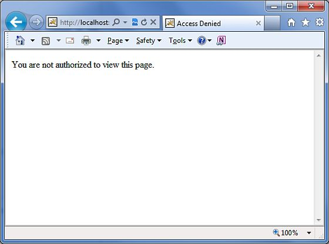

# Struts 2 - 快速指南

Struts 2 是基于 MVC 设计模式的流行和成熟的 web 应用程序框架。Struts 2 不仅仅是Struts 1 的下一个版本，它还是一个完整的 Struts 架构的重写。

网络系统框架是以 Struts 框架为基础起步的，它的目标是提供一个增强的和改进的基于 Struts 的框架，**为开发人员简化 web 开发**。

一段时间之后，网络系统框架和 Struts 社区携手合作，创建著名的Struts2框架。

## Struts 2 框架特性：

这里是一些 Struts 2 框架强大的特性，可以迫使你考虑使用 Struts 2：

- **POJO 形式和 POJO 操作** - Struts 2 所做的操作形式是 Struts 框架的一个组成部分。通过 Struts 2，您可以使用任何 POJO 来接收表单输入。同样，您现在可以看到任何 POJO 作为一个操作类。

- **支持标签** - Struts 2 改善了标签的形式，新的标签允许开发人员编写更少的代码。

- **支持 AJAX** - Struts 2 已经承认被 Web 2.0 技术所接管，并将 AJAX 支持整合到通过创建 AJAX 标签的产品中，这个功能与 标准的 Struts 2 标签非常相似。

- **易于集成** - 使用各种可用的集成与 Struts 2 进行集成，现在使得与其他框架的集成更容易，像 Spring、Tiles 和 SiteMesh 框架。

- **支持模板** - 支持使用模板生成的视图。

- **支持插件** - 通过使用插件，Struts 2  的核心行为可以得到加强。在 Struts 2 中许多插件都是可用的。

- **性能分析** - Struts 2 为调试和配置应用程序提供综合性能分析。此外，Struts 还在 调试工具的帮助下提供集成调试。

- **容易修改标签** - Struts 2 的标签标记可以使用 Freemarker 模板进行调整。这并不需要 JSP 或 java 的知识。基本的 HTML、 XML 和 CSS 知识足以修改标签。

- **促进更少的配置** - Struts 2 在使用不同设置的默认值的帮助下促进更少的配置。你不需要配置什么，除非它偏离了 Struts 2 设定的默认设置。

## Struts 2 的环境设置：

我们的第一个任务是运行一个最小的 Struts 2 应用程序。本章将指导您如何准备一个开发环境使用 Struts 2 来开始你的工作。我假设你已经在你的计算机上安装了 JDK（5+）、Tomcat 和 Eclipse。如果你没有安装这些组件，那么按照给定的步骤快速跟踪：

## 步骤1 - 安装 Java 开发工具包（JDK）：

你可以从 Oracle 的 Java 网站下载最新版本的 SDK ： [**Java SE 下载**](http://www.oracle.com/technetwork/java/javase/downloads/index.html)。你会在下载文件中发现安装 JDK 的说明，按照给定的说明来安装和配置设置。最后设置 PATH 和 JAVA_HOME 环境变量引用的目录，包括 java 和 javac，通常分别是 java_install_dir/bin 和 java_install_dir。

如果你运行的是 Windows 并且将 SDK 安装到 C:\jdk1.5.0_20，那么必须将下面几行的代码放到你的 C:\autoexec.bat 文件中。

```
set PATH=C:\jdk1.5.0_20\bin;%PATH%
set JAVA_HOME=C:\jdk1.5.0_20
```

另外，在 Windows NT/2000/XP 系统上，您也可以右键单击我的电脑，选择属性，然后高级，环境变量。然后你将更新 PATH 值，然后按下确定按钮。

在 Unix（Solaris，Linux，等等），如果将 SDK 安装在 /usr/local/jdk1.5.0_20 并且你使用的是 C shell，你可以将以下内容放到你的 .cshrc 文件中。

```
setenv PATH /usr/local/jdk1.5.0_20/bin:$PATH
setenv JAVA_HOME /usr/local/jdk1.5.0_20
```

或者，如果你使用的是一个集成开发环境（IDE），像 Borland JBuilder，Eclipse，IntelliJ IDEA，或者 Sun ONE Studio，编译和运行一个简单的程序来确认 IDE 知道你将 Java 安装的位置，否则为给定的 IDE 文档做合适的设置。

## 步骤2 - 安装 Apache Tomcat：

你可以从 [http://tomcat.apache.org/](http://tomcat.apache.org/) 下载最新版本的 Tomcat。一旦你下载了安装包，解压二进制发行版到一个方便的位置。例如，在 Windows 系统上放在 C:\ apache-tomcat-6.0.33，或者在 Linux/Unix 系统上放在 /usr/local/apache-tomcat-6.0.33，创建 CATALINA_HOME 环境变量指向这些位置。

可以在 windows 机器上通过执行下面的命令启动 Tomcat，或者你可以简单的双击 startup.bat 文件。

```
 %CATALINA_HOME%\bin\startup.bat
 or
 C:\apache-tomcat-6.0.33\bin\startup.bat
```

可以在 Unix（Solaris，Linux，等等） 机器上通过执行下面的命令启动 Tomcat：

```
$CATALINA_HOME/bin/startup.sh
or
/usr/local/apache-tomcat-6.0.33/bin/startup.sh
```

成功启动之后，默认的包含 Tomcat 的 web 应用程序可以通过访问 **http://localhost:8080**/ 查看运行结果。如果一切都正常的话，那么它将会输出以下结果：


关于配置和运行 Tomcat 的更多信息可以在这里的文档中找到，同样也可以在 Tomcat 官方网站 http://tomcat.apache.org 上获取。

在 windows 机器上可以通过执行以下命令使 Tomcat 停止运行：

```
%CATALINA_HOME%\bin\shutdown
or
C:\apache-tomcat-5.5.29\bin\shutdown
```

在 Unix（Solaris，Linux，等等） 机器上可以通过执行以下命令使 Tomcat 停止运行：

```
$CATALINA_HOME/bin/shutdown.sh
or
/usr/local/apache-tomcat-5.5.29/bin/shutdown.sh
```

## 步骤3 - 安装 Eclipse（IDE）

本教程中所有的例子都是使用 Eclipse IDE 编写的。所以我建议你在你的机器上下载安装最新版本的 Eclipse。

为了安装 Eclipse，从 [**http://www.eclipse.org/downloads**/](http://www.eclipse.org/downloads/) 下载最新版本的 Eclipse 二进制文件。一旦你下载了安装包，解压二进制发行版到一个方便的位置。例如，在 Windows 系统上放在 C:\eclipse，或者在 Linux/Unix 系统上放在 /usr/local/eclipse，最后设置合适的 PATH 变量。

可以在 windows 机器上通过执行下面的命令启动 Eclipse，或者你可以简单的双击 eclipse.exe 文件。

```
%C:\eclipse\eclipse.exe
```

可以在 Unix（Solaris，Linux，等等） 机器上通过执行下面的命令启动 Eclipse：

```
$/usr/local/eclipse/eclipse
```

成功启动之后，如果一切都正常的话，那么它将会输出以下结果：


## 步骤4 - 安装 Struts 2 函数库

现在，如果一切都正常的话，你可以继续设置你的 Struts 2 框架。下面是在你的计算机上下载并安装 Struts 2 的简单的步骤。

- 选择你想要在 Windows 系统还是 Unix 系统上安装 Hibernate，然后继续下一步的下载，在 windows 上下载 .zip 文件，在 Unix 上下载 .tz 文件。

- 从 [http://struts.apache.org/download.cgi](http://struts.apache.org/download.cgi) 下载最新版本的 Struts 2 的二进制文件。

- 在编写本教程的时候，我下载的是 **struts-2.0.14-all.zip**，当你解压下载的文件时，它将会在 C:\struts-2.2.3 提供给你如下的目录。


第二步是从任何位置提取压缩文件，在我的 Windows 7 机器的 **c:\** folder 文件夹下，我下载并且提取 **struts-2.2.3-all.zip** 文件，以便于我将所有的 jar 文件放到 **C:\struts-2.2.3\lib** 目录下。确保你设置了适当的 CLASSPATH 变量，否则在运行你的应用程序时你将会面临问题。

## Struts 2 体系结构：

从一个高层次来看，Struts 2 是一个 pull-MVC（或者MVC2）框架。Struts 2 的模型-视图-控制器是使用以下五个核心控件实现的：

- **Actions**

- **Interceptors**

- **Value Stack / OGNL**

- **Results / Result types**

- **view technologies**

Struts 2 和一个传统的 MVC 框架略有不同，操作起的是模型的作用而不是控制器，尽管有一些重叠。


上面的关系图描述了Struts 2 的高水平体系结构的 **M**odel、**V**iew 和 **C**ontroller。控制器的实现是使用一个和拦截器作用相同的 Struts 分派 servlet 过滤器，模型的实现是使用操作，视图作为结果类型和结果的集合。堆栈值和 OGNL 提供了共同的线程、链接和其他组件之间的集成。

除了上面的组件，还有大量的和配置相关的信息。配置 web 应用程序，就如同配置操作、拦截器、结果，等等。

这是 Struts 2 MVC 模式的体系结构概述。我们将在随后的章节中详细介绍每一个组件。

## 请求的生命周期：

基于上述的关系图，我们可以解释 Struts 2 中用户的请求的生命周期如下：

- 用户发送一个请求到服务器，请求一些资源（比如页面）。

- 过滤控制器查看请求并确定适当的操作。

- 配置的拦截器功能应用，比如验证、文件上传等。

- 执行已选择的操作，该操作是用来执行请求操作。

- 再次，如果有需要，配置的拦截器应用于做任何后续处理。

- 最后在视图中产生结果集，并将结果集返回给用户。

## Struts 2 的 Hello World 示例：

既然你学习了 Struts 2 的体系结构，当你在一个 Struts 2 web 应用程序中点击一个超链接或者提交一个 HTML 表单，控制器会收集输入的信息，并将其发送给一个成为 Actions 的 Java 类。动作执行之后，一个结果集会选择一个资源来呈现响应。这个资源通常是一个 JSP，但是它也可以是一个 PDF 文件、一个 Excel 电子表格，或者是一个 Java applet 窗口。

假设你已经建立起你的开发环境。现在，让我们继续创建我们第一个 **Hello World** Struts 2 项目。这个项目的目标是创建一个 web 应用程序，可以收集用户的名称和并在用户名称后面显示 “Hello World”。我们将不得不为任何一个 Struts 2 项目创建以下四个组件：

<table class="table table-bordered"> 
	<tr> 
	<th style="width:5">序号 </th> 
	<th>组件及描述</th> 
	</tr> 
	<tr> 
	<td>1</td> 
	<td><b>Action</b> 
	<p>创建一个操作类，包含完整的业务逻辑，控制用户之间的交互、模型，和视图。</p> 
	</td> 
	</tr> 
	<tr> 
	<td>2</td> 
	<td><b>Interceptors</b> 
	<p>如果有需要，创建一个拦截器，或者使用现有的拦截器。这是控制器的一部分。</p> 
	</td> 
	</tr> 
	<tr> 
	<td>3</td> 
	<td><b>View</b> 
	<p>创建一个与用户交流的 JSPs 来进行输入，然后显示最终的消息。</p> 
	</td> 
	</tr> 
	<tr> 
	<td>4</td> 
	<td><b>Configuration Files</b> 
	<p>创建配置文件来连接操作、视图和控制器。这些文件是 struts.xml， web.xml， struts.properties。</p> 
	</td> 
	</tr> 
	</table> 

我将使用 Eclipse IDE，所以所有必需的组件将在一个动态的 Web 项目下被创建。因此，让我们开始创建动态的 Web 项目吧。

## 创建一个动态的 Web 项目：

启动你的 Eclipse，然后使用 **File > New > Dynamic Web Project**，然后输入项目名称为 **HelloWorldStruts2**，设置其他选项如屏幕中给定的那样：


在下一个屏幕中选择所有的默认选项，最后检查**生成的 Web.xml 部署描述符选项**。这将在你的 Eclipse 中会创建一个动态的 web 应用程序。现在根据 **Windows > Show View > Project Explorer** 选择，你将会看到你的程序窗口中出现如下内容：


现在，从 Struts 2 lib 文件夹 **C:\struts-2.2.3\lib** 中复制下面的这些文件到你的项目文件夹 **WEB-INF\lib** 中。为了做到这一点，你可以简单的拖拽下面所有的文件到 WEB-INF\lib 文件夹下。

- commons-fileupload-x.y.z.jar

- commons-io-x.y.z.jar

- commons-lang-x.y.jar

- commons-logging-x.y.z.jar

- commons-logging-api-x.y.jar

- freemarker-x.y.z.jar

- javassist-.xy.z.GA

- ognl-x.y.z.jar

- struts2-core-x.y.z.jar

- xwork-core.x.y.z.jar

## 创建 Action 类：

Action 类是 Struts 2 应用程序的关键，我们在 Action 类中实现大部分的业务逻辑。因次，让我们在 **Java Resources > src** 的包名为 **com.tutorialspoint.struts2** 下创建一个 Java 文件 HelloWorldAction.java，文件内容如下。

当用户点击一个 URL 时，Action 类对用户的操作作出相应。该过程中一个或者多个 Action 类的方法被执行，并且返回一个字符串型的结果。基于结果值，可以呈现出一个特定的 JSP 页面。

```
package com.tutorialspoint.struts2;
public class HelloWorldAction{
   private String name;
   public String execute() throws Exception {
      return "success";
   }   
   public String getName() {
      return name;
   }
   public void setName(String name) {
      this.name = name;
   }
}
```

这是一个非常简单的带有名为 “name” 属性的类。我们有标准的获取和设置 “name” 属性的方法，执行一个方法将返回一个 “成功” 的字符串。

Struts 2 框架将创建一个 HelloWorldAction 类的对象，在对用户的操作的响应中调用可执行的方法。你把你的业务逻辑放进你可执行的方法中，最后返回一个字符串常量。为每一个 URL 简单的说，你必须实现一个 Action 类，或者你可以直接使用类名作为你的操作名，或者你可以使用 struts.xml 文件映射到其他名称，如下所示。

## 创建一个视图

我们需要一个 JSP 来显示最后的消息，这个页面将在一个预定义的动作发生时通过 Struts 2 框架调用，此映射将在 struts.xml file 文件中定义。下面让我们在你的 Eclipse 项目的 WebContent 文件夹下创建 jsp 文件 **HelloWorld.jsp**。要做到这一点，在项目资源管理器中右键单击 WebContent 文件夹，选择 **New >JSP File**。

<pre class="prettyprint notranslate">
&lt;%@ page contentType="text/html; charset=UTF-8" %&gt;
&lt;%@ taglib prefix="s" uri="/struts-tags" %&gt;
&lt;html&gt;
&lt;head&gt;
&lt;title&gt;Hello World&lt;/title&gt;
&lt;/head&gt;
&lt;body&gt;
   Hello World, &lt;s:property value="name"/&gt;
&lt;/body&gt;
&lt;/html&gt;
</pre>


Taglib 指令告诉 Servlet 容器这个页面将使用 Struts 2 标记，这些标记将通过 s 显示在前面。s:property 标签显示的是 action 类的 <name> 属性的值，该值是通过 HelloWorldAction 类的 **getName()** 方法返回的。

## 创建主页面：

我们还需要在 WebContent 文件夹下创建 **index.jsp** 文件。这个文件将作为初始的动作 URL，用户可以单击这个 URL 来告诉 Struts 2 框架来调用预定义的 HelloWorldAction 类的方法，并呈现 HelloWorld.jsp 视图。

<pre class="prettyprint notranslate">
&lt;%@ page language="java" contentType="text/html; charset=ISO-8859-1"
   pageEncoding="ISO-8859-1"%&gt;
&lt;%@ taglib prefix="s" uri="/struts-tags"%&gt;
   &lt;!DOCTYPE html PUBLIC "-//W3C//DTD HTML 4.01 Transitional//EN" 
"http://www.w3.org/TR/html4/loose.dtd"&gt;
&lt;html&gt;
&lt;head&gt;
&lt;title&gt;Hello World&lt;/title&gt;
&lt;/head&gt;
&lt;body&gt;
   &lt;h1&gt;Hello World From Struts2&lt;/h1&gt;
   &lt;form action="hello"&gt;
      &lt;label for="name"&gt;Please enter your name&lt;/label&gt;&lt;br/&gt;
      &lt;input type="text" name="name"/&gt;
      &lt;input type="submit" value="Say Hello"/&gt;
   &lt;/form&gt;
&lt;/body&gt;
&lt;/html&gt;
</pre>


在上面视图文件中定义的 **hello** 动作通过使用 struts.xml 文件将被影射到 HelloWorldAction 类和它的可执行的方法中。当用户单击提交按钮时，它将引发 Struts 2 框架运行这个在 HelloWorldAction 类中定义的可执行的方法，基于方法返回的值，将选择一个合适的视图并作为响应呈现出来。

## 配置文件

我们需要一个映射将 URL、HelloWorldAction 类（模型）、和 HelloWorld.jsp（视图）联系在一起。这个映射告诉 Struts 2 框架哪一个类将对用户的动作（URL）作出相应，类的哪一个方法将被执行，呈现出来的基于该方法返回的字符串结果的视图是什么样的。

因此，让我们创建一个名为 **struts.xml** 的文件。由于 Struts 2 需要 struts.xml 文件在类文件夹中显示，所以在 WebContent/WEB-INF/classes 文件夹下创建 struts.xml 文件。默认情况下，Eclipse 没有创建 “classes” 文件夹，所以你需要手动创建。要做到这一点，右键单击项目资源管理器里的 WEB-INF 文件夹，然后选择 **New > Folder**。你的 struts.xml 文件看起来如下所示：

<pre class="prettyprint notranslate">
&lt;?xml version="1.0" encoding="UTF-8"?&gt;
&lt;!DOCTYPE struts PUBLIC
   "-//Apache Software Foundation//DTD Struts Configuration 2.0//EN"
   "http://struts.apache.org/dtds/struts-2.0.dtd"&gt;
&lt;struts&gt;
&lt;constant name="struts.devMode" value="true" /&gt;
   &lt;package name="helloworld" extends="struts-default"&gt;
     
      &lt;action name="hello" 
            class="com.tutorialspoint.struts2.HelloWorldAction" 
            method="execute"&gt;
            &lt;result name="success"&gt;/HelloWorld.jsp&lt;/result&gt;
      &lt;/action&gt;
   &lt;/package&gt;
&lt;/struts&gt;
</pre>

关于上述配置文件的几句话。这里我们设置常量 **struts.devMode** 为**真**，因为我们在开发环境中工作，并且沃恩需要看到一些有用的日志消息。然后，我们定义一个名为 **helloworld** 的包。当你想要将你的操作组织在一起时，创建一个包是非常有用的。在我们的示例中，我们将我们的操作命名为 “hello”，这与 URL/**hello.action** 相对应，通过 **HelloWorldAction.class** 对其进行备份。**HelloWorldAction.class** 的 **execute** 方法在当 URL/**hello.action** 被调用时运行的。如果 **execute** 方法返回“成功”的结果，那么我们将用户放到 **HelloWorld.jsp** 文件中。

下面是创建一个 **web.xml** 文件，在文件是对 Struts 2 任何请求的入口点。Struts 2 应用程序的入口点将会是在部署描述符（web.xml）中定义的一个过滤器。因此，我们将在 web.xml 文件中定义 org.apache.struts2.dispatcher.FilterDispatche 类的一个入口。web.xml 需要在 WebContent 的 WEB-INF 文件夹下进行创建。在你创建工程的时候，Eclipse 已经为你创建了一个 web.xml 文件。所以，我们只需要按如下对其进行修改：

<pre class="prettyprint notranslate">
&lt;?xml version="1.0" encoding="UTF-8"?&gt;
&lt;web-app xmlns:xsi="http://www.w3.org/2001/XMLSchema-instance"
   xmlns="http://java.sun.com/xml/ns/javaee" 
   xmlns:web="http://java.sun.com/xml/ns/javaee/web-app_2_5.xsd"
   xsi:schemaLocation="http://java.sun.com/xml/ns/javaee 
   http://java.sun.com/xml/ns/javaee/web-app_3_0.xsd"
   id="WebApp_ID" version="3.0"&gt;
   
   &lt;display-name&gt;Struts 2&lt;/display-name&gt;
   &lt;welcome-file-list&gt;
      &lt;welcome-file&gt;index.jsp&lt;/welcome-file&gt;
   &lt;/welcome-file-list&gt;
   &lt;filter&gt;
      &lt;filter-name&gt;struts2&lt;/filter-name&gt;
      &lt;filter-class&gt;
         org.apache.struts2.dispatcher.FilterDispatcher
      &lt;/filter-class&gt;
   &lt;/filter&gt;

   &lt;filter-mapping&gt;
      &lt;filter-name&gt;struts2&lt;/filter-name&gt;
      &lt;url-pattern&gt;/*&lt;/url-pattern&gt;
   &lt;/filter-mapping&gt;
&lt;/web-app&gt;
</pre>


我们已经指定 index.jsp 为我们的欢迎页面。然后我们已经配置了所有在 URL （比如，任何模式匹配的 url）上运行的 Struts 2 过滤器。

## 启用详细的日志：

当你在 **WEB-INF/classes** 文件夹的 **creatinglogging.properties** 文件中使用 Struts 2 工作时，你可以启用完整的日志记录功能。在你的属性文件中保留下面两行代码：

```
org.apache.catalina.core.ContainerBase.[Catalina].level = INFO
org.apache.catalina.core.ContainerBase.[Catalina].handlers = \                              java.util.logging.ConsoleHandler
```

默认的 logging.properties 为路径记录指定一个控制台句柄到 stdout，也可以是一个文件句柄。一个处理程序的日志级别值可以使用 SEVERE， WARNING， INFO， CONFIG, FINE， FINER， FINEST 或者 ALL 来设置。

就是这样。我们已经准备好使用 Struts 2 框架运行我们的 Hello World 应用程序了。

## 执行应用程序

右键单击项目的名称，选择 **Export > WAR File** 来创建一个 War 文件。然后在 Tomcat 的 webapps 目录里对 War 文件进行部署。最后，启动 Tomcat 服务器并尝试访问 http://localhost:8080/HelloWorldStruts2/index.jsp 链接。屏幕中会显示如下所示的内容：


输入一个值 “Struts2”，并且提交页面。你将会看到下一个页面


注意你可以在 Struts.xml 文件中将 **index** 定义为一个动作，在那样的情况下你可以通过 http://localhost:8080/HelloWorldStruts2/index.action 调用 index 页面。检查下面你如何将 index 定义为一个动作：

<pre class="prettyprint notranslate">
&lt;?xml version="1.0" encoding="UTF-8"?&gt;
&lt;!DOCTYPE struts PUBLIC
   "-//Apache Software Foundation//DTD Struts Configuration 2.0//EN"
   "http://struts.apache.org/dtds/struts-2.0.dtd"&gt;
&lt;struts&gt;
&lt;constant name="struts.devMode" value="true" /&gt;
   &lt;package name="helloworld" extends="struts-default"&gt;

      &lt;action name="index"&gt;
            &lt;result &gt;/index.jsp&lt;/result&gt;
      &lt;/action&gt;

      &lt;action name="hello" 
            class="com.tutorialspoint.struts2.HelloWorldAction" 
            method="execute"&gt;
            &lt;result name="success"&gt;/HelloWorld.jsp&lt;/result&gt;
      &lt;/action&gt;

   &lt;/package&gt;
&lt;/struts&gt;
</pre>


## Struts 2 配置文件

本章将为你介绍一个 Struts 2 应用程序所需的基本配置。这里我们将看到在一些重要的配置文件中都配置些什么：**web.xml**，**struts.xml**，**struts-config.xml** 和 **struts.properties**。

老实说，你可以靠 web.xml and struts.xml 配置文件生存，你已经在前面的章节中看到我们的示例是使用这两个文件工作的，但是为了你的知识，让我们也解释一下其他的文件。

## web.xml 文件：

Web.xml 配置文件是一个 J2EE 配置文件，它可以决定 HTTP 请求的元素如何通过 servlet 容器被处理。它并不是一个严格的 Struts 2 配置文件，但是为了使用 Struts 2 工作，它是一个需要被配置的文件。

正如前面所讨论的那样，这个文件为任何 web 应用程序都会提供一个入口点。Struts 2 应用程序的入口点是由 部署描述符（web.xml）定义的一个过滤器。因此，我们将在 web.xml 文件中定义 FilterDispatcher 类的一个入口。web.xml 文件需要在 **WebContent/WEB-INF** 文件夹下进行创建。

如果你想要在没有一个模板或者工具（比如 Eclipse 或者 Maven2）的帮助下生成该文件，那么它将会是你需要配置的第一个配置文件。
下面是 web.xml 文件的内容，我们在最后一个示例中是使用的。

<pre class="prettyprint notranslate">
&lt;?xml version="1.0" encoding="UTF-8"?&gt;
&lt;web-app xmlns:xsi="http://www.w3.org/2001/XMLSchema-instance"
   xmlns="http://java.sun.com/xml/ns/javaee" 
   xmlns:web="http://java.sun.com/xml/ns/javaee/web-app_2_5.xsd"
   xsi:schemaLocation="http://java.sun.com/xml/ns/javaee 
   http://java.sun.com/xml/ns/javaee/web-app_3_0.xsd"
   id="WebApp_ID" version="3.0"&gt;
   
   &lt;display-name&gt;Struts 2&lt;/display-name&gt;
   &lt;welcome-file-list&gt;
      &lt;welcome-file&gt;index.jsp&lt;/welcome-file&gt;
   &lt;/welcome-file-list&gt;
   
   &lt;filter&gt;
      &lt;filter-name&gt;struts2&lt;/filter-name&gt;
      &lt;filter-class&gt;
         org.apache.struts2.dispatcher.FilterDispatcher
      &lt;/filter-class&gt;
   &lt;/filter&gt;

   &lt;filter-mapping&gt;
      &lt;filter-name&gt;struts2&lt;/filter-name&gt;
      &lt;url-pattern&gt;/*&lt;/url-pattern&gt;
   &lt;/filter-mapping&gt;

&lt;/web-app&gt;
</pre>


注意我们将 Struts 2 过滤器映射到 /*，而不是 /*.**action**，这意味着所有的 URL 都将被 Struts 过滤器解析。我们将在注释章节对它们进行解释。

## struts.xml 文件：

**struts.xml** 文件包含配置信息，这些信息会随着操作的进展被修改。这个文件可以用于覆盖一个应用程序的默认设置，例如，*struts.devMode = false* 和在属性文件中定义的其他设置。这个文件可以在 **WEB-INF/classes** 文件夹下创建。

让我们看一看在上面的章节里解释的 Hello World 示例中创建的 struts.xml 文件。

<pre class="prettyprint notranslate">
&lt;?xml version="1.0" encoding="UTF-8"?&gt;
&lt;!DOCTYPE struts PUBLIC
   "-//Apache Software Foundation//DTD Struts Configuration 2.0//EN"
   "http://struts.apache.org/dtds/struts-2.0.dtd"&gt;
&lt;struts&gt;
   &lt;constant name="struts.devMode" value="true" /&gt;
   &lt;package name="helloworld" extends="struts-default"&gt;
     
      &lt;action name="hello" 
            class="com.tutorialspoint.struts2.HelloWorldAction" 
            method="execute"&gt;
            &lt;result name="success"&gt;/HelloWorld.jsp&lt;/result&gt;
      &lt;/action&gt;
      &lt;-- more actions can be listed here --&gt;

   &lt;/package&gt;
   &lt;-- more packages can be listed here --&gt;

&lt;/struts&gt;
</pre>

要注意的第一件事就是 **DOCTYPE**。所有的 struts 配置文件都需要有正确的文档类型,就如我们的小示例中所示的那样。<struts> 是根标签元素,在它之下我们使用 <package> 标签声明不同的包。这里 <package> 允许配置的分离和模块化。当你有一个很大的项目，并且项目分为不同的模块时，这是非常有用的。

说，如果你的项目有三个领域 - 企业应用程序，客户应用程序，员工应用程序，你可以创建三个包，并在相应的包中存储相关的操作。包的标签具有以下属性：

<table class="table table-bordered"> 
	<tr> 
	<th style="width:25%">属性</th> 
	<th>描述</th> 
	</tr> 
	<tr> 
	<td>name (required)</td> 
	<td>包的唯一标识。</td> 
	</tr> 
	<tr> 
	<td>extends</td> 
	<td>这个包是从哪个包中扩展的？默认情况下，我们使用 struts-default 作为基础包。</td> 
	</tr> 
	<tr> 
	<td>abstract</td> 
	<td>如果标记为真，对于终端用户消费者来说，包是不可用的。</td> 
	</tr> 
	<tr> 
	<td>namesapce</td> 
	<td>操作的唯一命名空间。</td> 
	</tr> 
	</table> 

拥有名称和值属性的 **constant** 标签将被用于覆盖下面任何一个由 **default.properties** 定义的属性，就像我们设置的 **struts.devMode** 属性。设置 **struts.devMode** 属性允许我们在日志文件中看到更多的调试信息。

我们定义与每一个我们想要访问的 URL 相对应的动作标签，我们使用 execute() 方法定义一个类，无论何时我们访问响应的 URL，该类都会被访问。

结果集决定了一个动作执行之后会向浏览器返回什么。从动作命令返回的字符串应该是一个结果集的名称。结果集是如上所述的配置了的每一个动作，或者作为一个“全局”的结果集，对包中的每一个动作都是可用的。结果集有可选择的 **name** 和 **type** 属性。名称的默认值为“成功”。

Struts.xml 文件会随着时间的推移变得越来越大，所以通过打包的方式将它破坏是模块化的方法之一，但是 struts 提供了将 Struts.xml 文件 模块化的另一种方式。你可以把文件分成多个 xml 文件并且用下面的方式导入它们。

<pre class="prettyprint notranslate">
&lt;?xml version="1.0" encoding="UTF-8"?&gt;
&lt;!DOCTYPE struts PUBLIC
    "-//Apache Software Foundation//DTD Struts Configuration 2.0//EN"
    "http://struts.apache.org/dtds/struts-2.0.dtd"&gt;
&lt;struts&gt;
     &lt;include file="my-struts1.xml"/&gt;
     &lt;include file="my-struts2.xml"/&gt;
&lt;/struts&gt;
</pre>

我们没有涉及到的另一个配置文件是 struts-default.xml。这个文件包含 Struts 的标准配置设置，你项目的 99% 都不会去接触这些设置。出于这个原因，我们不会对这个文件进行详细的介绍。如果你有兴趣，你可以看一下 struts2-core-2.2.3.jar 文件中可用的 **default.properties** 文件。

## struts-config.xml 文件：

struts-config.xml 配置文件是在 Web 客户端中视图和模型组件之间的一个链接，但是你项目的 99% 都不会去接触这些设置。这个配置文件基本上包含以下主要元素：

<table class="table table-bordered"> 
	<tr> 
	<th style="width:5">序号 </th> 
	<th>拦截器及描述</th> 
	</tr> 
	<tr> 
	<td>1</td> 
	<td><b>struts-config</b> 
	<p>这是配置文件的根节点。</p> 
	</td> 
	</tr> 
	<tr> 
	<td>2</td> 
	<td><b>form-beans</b> 
	<p>这是你将你的 ActionForm 子类映射成一个名称的位置。在 struts-config.xml 文件的剩余部分中，甚至是在你的 JSP页面中，你使用这个名字作为你的  ActionForm 别名。</p> 
	</td> 
	</tr> 
	<tr> 
	<td>3</td> 
	<td><b>global forwards</b> 
	<p>该部分将你的webapp 的一个页面映射成一个名称。你可以使用这个名称来引用实际的页面。这可以避免在你的 web 页面中硬编写 URLs。
	</td> 
	</tr> 
	<tr> 
	<td>4</td> 
	<td><b>action-mappings</b> 
	<p>这是你声明表单处理程序的地方，它们也被成为 <b>action mappings</b>.</p> 
	</td> 
	</tr> 
	<tr> 
	<td>5</td> 
	<td><b>controller</b> 
	<p>该部分用于配置 Struts 内部，但是很少用于实际情况。</p> 
	</td> 
	</tr> 
	<tr> 
	<td>6</td> 
	<td><b>plug-in</b> 
	<p>该部分告诉 Struts 在哪可以找到你的属性文件，哪个文件中包含提示操作和错误消息。</p> 
	</td> 
	</tr> 
	</table> 

下面是 struts-config.xml 文件的示例：

<pre class="prettyprint notranslate">
&lt;?xml version="1.0" encoding="ISO-8859-1" ?&gt;
&lt;!DOCTYPE struts-config PUBLIC
"-//Apache Software Foundation//DTD Struts Configuration 1.0//EN"
"http://jakarta.apache.org/struts/dtds/struts-config_1_0.dtd"&gt;

&lt;struts-config&gt;

   &lt;!-- ========== Form Bean Definitions ============ --&gt;
   &lt;form-beans&gt;
      &lt;form-bean name="login" type="test.struts.LoginForm" /&gt;
   &lt;/form-beans&gt;

   &lt;!-- ========== Global Forward Definitions ========= --&gt;
   &lt;global-forwards&gt;
   &lt;/global-forwards&gt;

   &lt;!-- ========== Action Mapping Definitions ======== --&gt;
   &lt;action-mappings&gt;
      &lt;action
         path="/login"
         type="test.struts.LoginAction" &gt;

         &lt;forward name="valid" path="/jsp/MainMenu.jsp" /&gt;
         &lt;forward name="invalid" path="/jsp/LoginView.jsp" /&gt;
      &lt;/action&gt;
   &lt;/action-mappings&gt;

   &lt;!-- ========== Controller Definitions ======== --&gt;
   &lt;controller 
      contentType="text/html;charset=UTF-8"
      debug="3"
      maxFileSize="1.618M"
      locale="true"
      nocache="true"/&gt;

&lt;/struts-config&gt;
</pre>

想要了解更多关于 struts-config.xml 文件的细节，请查看你的 struts 文档。

## struts.properties 文件

配置文件提供了一种改变框架默认行为的机制。实际上，**struts.properties** 配置文件中包含的所有属性也可以在 **web.xml** 文件中使用 **init-param** 进行配置，同样在 **struts.xml** 配置文件中使用 *constant* 标签进行配置。如果你想要将这些配置和更多特定的 struts 保留下来，那么你可以下 **WEB-INF/classes** 文件夹创建该属性文件。

此文件配置的值将覆盖在 **default.properties** 文件中配置的默认值，该值包含在 struts2-core-x.y.z.jar 分布中。在使用 **struts.properties** 文件时，可能有几个属性你需要考虑改变以下：

<pre class="prettyprint notranslate">
### When set to true, Struts will act much more friendly for developers
struts.devMode = true

### Enables reloading of internationalization files
struts.i18n.reload = true

### Enables reloading of XML configuration files
struts.configuration.xml.reload = true

### Sets the port that the server is run on
struts.url.http.port = 8080
</pre>

此处，以散列（#）开始的任意行将被假定为一个注释，该行将被 Struts 2 忽略掉。

## Struts 2 操作：

操作是 Struts 2 框架的核心部分，就如同它们对任何 MVC（Model View Controller）框架一样。每一个 URL 都会被映射成一个特定的操作，这对处理逻辑处理来自用户的请求是很有必要的。

但是操作也会对其他两个重要的性能起作用。首先，操作在从请求到视图之间传输数据时起到了重要的作用，不管它是一个 JSP 或者其他类型的结果。第二，操作必须协助框架来确定哪些结果应该呈现在将响应返回给请求的视图中。

## 创建操作：

在 Struts 2 中 操作的唯一需求是必须有一个返回一个字符串或者结果集对象的无参方法，并且必须是一个 POJO。如果没有指定这个无参方法，那么默认行为将使用 execute() 方法。

或者你可以对 **ActionSupport** 类进行扩展，该类可以实现 6 个接口，包括 **Action** 接口。Action 接口如下所示：

```
public interface Action {
   public static final String SUCCESS = "success";
   public static final String NONE = "none";
   public static final String ERROR = "error";
   public static final String INPUT = "input";
   public static final String LOGIN = "login";
   public String execute() throws Exception;
}
```

让我们看一看在 Hello World 示例中的操作方法：

```
package com.tutorialspoint.struts2;
public class HelloWorldAction{
   private String name;
   public String execute() throws Exception {
      return "success";
   }  
   public String getName() {
      return name;
   }
   public void setName(String name) {
      this.name = name;
   }
}
```

为了说明操作方法控制视图的要点，让我们对 **execute** 方法作如下改变，并且对 ActionSupport 类进行如下扩展：

```
package com.tutorialspoint.struts2;
import com.opensymphony.xwork2.ActionSupport;
public class HelloWorldAction extends ActionSupport{
   private String name;
   public String execute() throws Exception {
      if ("SECRET".equals(name))
      {
         return SUCCESS;
      }else{
         return ERROR;  
      }
   }  
   public String getName() {
      return name;
   }
   public void setName(String name) {
      this.name = name;
   }
}
```

在这个示例中，我们在 execute 方法中有一些逻辑可以查看 name 属性。如果属性值为字符串 “SECRET”，那么我们返回 SUCCESS 作为结果，否则我们返回 ERROR 作为结果。由于我们已经对 ActionSupport 类进行了扩展，所以我们可以使用字符串常量 SUCCESS 和 ERROR。现在，让我们按如下所示修改我们的 struts.xml 文件：

<pre class="prettyprint notranslate">
&lt;?xml version="1.0" encoding="UTF-8"?&gt;
&lt;!DOCTYPE struts PUBLIC
   "-//Apache Software Foundation//DTD Struts Configuration 2.0//EN"
   "http://struts.apache.org/dtds/struts-2.0.dtd"&gt;
   &lt;struts&gt;
      &lt;constant name="struts.devMode" value="true" /&gt;
      &lt;package name="helloworld" extends="struts-default"&gt;
         &lt;action name="hello" 
            class="com.tutorialspoint.struts2.HelloWorldAction"
            method="execute"&gt;
            &lt;result name="success"&gt;/HelloWorld.jsp&lt;/result&gt;
            &lt;result name="error"&gt;/AccessDenied.jsp&lt;/result&gt;
         &lt;/action&gt;
      &lt;/package&gt;
&lt;/struts&gt;
</pre>

## 创建一个视图

让我们在你的 Eclipse 项目的 WebContent 文件夹下创建以下 jsp 文件 **HelloWorld.jsp**。要做到这一点，右键单击项目资源管理器中的 WebContent 文件夹，并且选择 **New >JSP File**。当返回结果为 SUCCESS 时这个文件会被调用，其中 SUCCESS 是一个在 Action 接口中定义的一个字符创常量 “success”：

<pre class="prettyprint notranslate">
&lt;%@ page contentType="text/html; charset=UTF-8" %&gt;
&lt;%@ taglib prefix="s" uri="/struts-tags" %&gt;
&lt;html&gt;
&lt;head&gt;
&lt;title&gt;Hello World&lt;/title&gt;
&lt;/head&gt;
&lt;body&gt;
   Hello World, &lt;s:property value="name"/&gt;
&lt;/body&gt;
&lt;/html&gt;
</pre>

以下文件会在操作返回结果为 ERROR 的情况下通过框架被调用，其中 ERROR 是一个字符串常量 “error”。以下是 **AccessDenied.jsp** 的内容：

<pre class="prettyprint notranslate">
&lt;%@ page contentType="text/html; charset=UTF-8" %&gt;
&lt;%@ taglib prefix="s" uri="/struts-tags" %&gt;
&lt;html&gt;
&lt;head&gt;
&lt;title&gt;Access Denied&lt;/title&gt;
&lt;/head&gt;
&lt;body&gt;
   You are not authorized to view this page.
&lt;/body&gt;
&lt;/html&gt;
</pre>

我们还需要在 WebContent 文件夹中创建 **index.jsp**。这个文件将会在初始化操作 URL 时起作用，用户可以单击这个 URL 来告诉 Struts 2 框架去调用 HelloWorldAction 类中的 **execute** 方法，并且呈现 HelloWorld.jsp 视图。

<pre class="prettyprint notranslate">
&lt;%@ page language="java" contentType="text/html; charset=ISO-8859-1"
   pageEncoding="ISO-8859-1"%&gt;
&lt;%@ taglib prefix="s" uri="/struts-tags"%&gt;
   &lt;!DOCTYPE html PUBLIC "-//W3C//DTD HTML 4.01 Transitional//EN" 
"http://www.w3.org/TR/html4/loose.dtd"&gt;
&lt;html&gt;
&lt;head&gt;
&lt;title&gt;Hello World&lt;/title&gt;
&lt;/head&gt;
&lt;body&gt;
   &lt;h1&gt;Hello World From Struts2&lt;/h1&gt;
   &lt;form action="hello"&gt;
      &lt;label for="name"&gt;Please enter your name&lt;/label&gt;&lt;br/&gt;
      &lt;input type="text" name="name"/&gt;
      &lt;input type="submit" value="Say Hello"/&gt;
   &lt;/form&gt;
&lt;/body&gt;
&lt;/html&gt;
</pre>

就是这样，不需要修改所需的 web.xml 文件，所以我们可以使用在示例章节中创建的 web.xml 文件。现在，我们已经准备好使用 Struts 2 框架运行我们的 Hello World 应用程序了。

## 执行应用程序

右键单击项目名称，并且选择 **Export > WAR File** 来创建一个 War 文件。然后在 Tomcat 的 webapps 目录中对这个文件进行部署。最后，启动 Tomcat 服务器并尝试访问 URL http://localhost:8080/HelloWorldStruts2/index.jsp。这将产生如屏幕显示的结果：


让我们输入一个单词 “SECRET”，你将会看到如下页面：


现在，输入另一个不是 “SECRET” 的单词，那么你将会看到下面的页面：



## 创建多个操作：

你将会频繁的定义多个操作来处理不同的请求，并且为用户提供不同的 URLs，因此你将定义不同的类，如下所示：

```
package com.tutorialspoint.struts2;
import com.opensymphony.xwork2.ActionSupport;
   class MyAction extends ActionSupport{
      public static String GOOD = SUCCESS;
      public static String BAD = ERROR;
   }
   public class HelloWorld extends ActionSupport{
      ...
      public String execute()
      {
         if ("SECRET".equals(name)) return MyAction.GOOD;
         return MyAction.BAD;
      }
      ...
   }
   public class SomeOtherClass extends ActionSupport{
      ...
      public String execute()
      {
         return MyAction.GOOD;
      }
      ...
   }
```

你将在 struts.xml 文件中配置这些操作如下所示：

<pre class="prettyprint notranslate">
&lt;?xml version="1.0" encoding="UTF-8"?&gt;
&lt;!DOCTYPE struts PUBLIC
    "-//Apache Software Foundation//DTD Struts Configuration 2.0//EN"
    "http://struts.apache.org/dtds/struts-2.0.dtd"&gt;
struts&gt;
 &lt;constant name="struts.devMode" value="true" /&gt;
   &lt;package name="helloworld" extends="struts-default"&gt;
      &lt;action name="hello" 
         class="com.tutorialspoint.struts2.HelloWorld" 
         method="execute"&gt;
         &lt;result name="success"&gt;/HelloWorld.jsp&lt;/result&gt;
         &lt;result name="error"&gt;/AccessDenied.jsp&lt;/result&gt;
      &lt;/action&gt;
      &lt;action name="something" 
         class="com.tutorialspoint.struts2.SomeOtherClass" 
         method="execute"&gt;
         &lt;result name="success"&gt;/Something.jsp&lt;/result&gt;
         &lt;result name="error"&gt;/AccessDenied.jsp&lt;/result&gt;
      &lt;/action&gt;
   &lt;/package&gt;
&lt;/struts&gt;
</pre>

正如你所看到的上面假设的示例，操作的结果 SUCCESS 和 ERROR 都是重复的。为了解决这个问题，建议你创建一个包含结果集输出的类。

## Struts 2 拦截器：

拦截器在概念上与 servlet 过滤器或者 JDKs 代理类是相同的。拦截器允许横切功能与操作或者框架分开实现。你可以使用拦截器实现如下功能：

- 在操作被调用之前提供处理逻辑。

- 在操作被调用之后提供处理逻辑。

- 捕获异常，以便于执行交替处理。

Struts 2 框架中提供的很多特性都是使用拦截器实现的；包括异常处理、文件加载、生命周期回调和验证等例子。实际上，尽管 Struts 2 的很多功能都依赖于拦截器，但是不可能有 7 或 8 个拦截器分配给每一个操作。

## Struts 2 框架的拦截器：

Struts 2 框架提供了一个已经配置好了的开箱即用的拦截器列表。下面列出了一些重要的拦截器：

<table class="table table-bordered"> 
	<tr> 
	<th style="width:5">序号</th> 
	<th>拦截器及描述</th> 
	</tr> 
	<tr> 
	<td>1</td> 
	<td><b>alias</b> 
	<p>允许参数在不同的请求之间有不同的别名。</p> 
	</td> 
	</tr> 
	<tr> 
	<td>2</td> 
	<td><b>checkbox</b> 
	<p>通过为没有选择过的复选框添加一个参数值-假，来协助管理复选框。</p> 
	</td> 
	</tr> 
	<tr> 
	<td>3</td> 
	<td><b>conversionError</b> 
	<p>将字符串转换为参数类型时，在 action 的错误字段放置一个错误信息。</p> 
	</td> 
	</tr> 
	<tr> 
	<td>4</td> 
	<td><b>createSession</b> 
	<p>如果不存在 HTTP 会话，自动创建一个。</p> 
	</td> 
	</tr> 
	<tr><td>5</td><td><b>debugging</b> 
	<p>为开发人员提供几个不同的调试窗口。</p> 
	</td> 
	</tr> 
	<tr> 
	<td>6</td> 
	<td><b>execAndWait</b> 
	<p>当操作在后台执行时，给用户发送一个中间等待页面。</p> 
	</td> 
	</tr> 
	<tr> 
	<td>7</td> 
	<td><b>exception</b> 
	<p>映射从一个操作向一个结果抛出的异常，允许通过自定向进行自动异常处理。</p> 
	</td> 
	</tr> 
	<tr> 
	<td>8</td> 
	<td><b>fileUpload</b> 
	<p>帮助上传简单的文件上传。</p> 
	</td> 
	</tr> 
	<tr> 
	<td>9</td> 
	<td><b>i18n</b> 
	<p>在一个用户的会话期间跟踪选定的语言环境。</p> 
	</td> 
	</tr> 
	<tr> 
	<td>10</td> 
	<td><b>logger</b> 
	<p>通过输出被执行的操作的名称来提供简单的日志记录。</p> 
	</td> 
	</tr> 
	<tr> 
	<td>11</td> 
	<td><b>params</b> 
	<p>在操作中设置请求参数。</p> 
	</td> 
	</tr> 
	<tr> 
	<td>12</td> 
	<td><b>prepare</b> 
	<p>这通常是用来做预处理工作，例如安装数据库连接。</p> 
	</td> 
	</tr> 
	<tr> 
	<td>13</td> 
	<td><b>profile</b> 
	<p>允许为操作记录简单的分析信息。</p> 
	</td> 
	</tr> 
	<tr> 
	<td>14</td> 
	<td><b>scope</b> 
	<p>在会话或者应用程序范围存储和检索操作的状态。</p> 
	</td> 
	</tr> 
	<tr> 
	<td>15</td> 
	<td><b>ServletConfig</b> 
	<p>提供可以访问各种基于 servlet 信息的操作。</p> 
	</td> 
	</tr> 
	<tr> 
	<td>16</td> 
	<td><b>timer</b> 
	<p>在操作需要执行的时间表单中提供简单的分析信息。</p> 
	</td> 
	</tr> 
	<tr> 
	<td>17</td> 
	<td><b>token</b> 
	<p>用一个有效的令牌检查操作来避免重复的表单提交。</p> 
	</td> 
	</tr> 
	<tr> 
	<td>18</td> 
	<td><b>validation</b> 
	<p>为操作提供验证支持。</p> 
	</td> 
	</tr> 
	</table> 

想要了解关于上面提到的拦截器的完成的详细信息，请查看 Struts 2 文档。但是我将为你展示一般在你的 Struts 应用程序中如何使用一个拦截器。

## 如何使用拦截器？

让我们看一看如何在我们的 “Hello World” 程序中使用一个现有的拦截器。我们将使用 **timer** 拦截器，它的目的是衡量执行之歌操作所需要的时间。同时我也在使用 **params** 拦截器，它的目的是向操作发送请求参数。你可以在不使用这个拦截器的情况下尝试一下你的示例，你将会发现 **name** 属性没有被设置，因为参数无法达到操作中。

我们将保留 HelloWorldAction.java， web.xml， HelloWorld.jsp， 和 index.jsp 文件，就如同在示例章节中创建的那样，但是我们需要通过添加一个拦截器来修改 **struts.xml** 文件，如下所示：

<pre class="prettyprint notranslate"> 
&lt;?xml version="1.0" encoding="UTF-8"?&gt;
&lt;!DOCTYPE struts PUBLIC
   "-//Apache Software Foundation//DTD Struts Configuration 2.0//EN"
   "http://struts.apache.org/dtds/struts-2.0.dtd"&gt;
&lt;struts&gt;
   &lt;constant name="struts.devMode" value="true" /&gt;
   &lt;package name="helloworld" extends="struts-default"&gt;
      &lt;action name="hello" 
         class="com.tutorialspoint.struts2.HelloWorldAction"
         method="execute"&gt;
         &lt;interceptor-ref name="params"/&gt;
         &lt;interceptor-ref name="timer" /&gt;
         &lt;result name="success"&gt;/HelloWorld.jsp&lt;/result&gt;
      &lt;/action&gt;
   &lt;/package&gt;
&lt;/struts&gt;
</pre> 

右键单击项目名称并且选择 **Export > WAR File** 来创建一个 War 文件。然后在 Tomcat 的 webapps 目录中对这个文件进行部署。最后，启动 Tomcat 服务器并尝试访问 URL http://localhost:8080/HelloWorldStruts2/index.jsp。这将产生如屏幕显示的结果：


现在，在给定的文本框中输入一个单词，然后单击 Say Hello 按钮来执行定义的操作。现在如果你检查生成的日志，你将会发现如下所示的文本：

```
INFO: Server startup in 3539 ms
27/08/2011 8:40:53 PM 
com.opensymphony.xwork2.util.logging.commons.CommonsLogger info
INFO: Executed action [//hello!execute] took 109 ms.
```

此处，最后一行是由于 **timer** 拦截器而生成的，它可以告诉我们该操作一共被执行了 109ms。

## 创建自定义的拦截器

在你的应用程序中使用自定义的拦截器来提供横切应用程序功能是一种简洁的方式。创建一个自定义的拦截器是很容易的；**Interceptor** 接口是需要扩展的接口，如下所示：

```
public interface Interceptor extends Serializable{
   void destroy();
   void init();
   String intercept(ActionInvocation invocation)
   throws Exception;
}
```

就如那些名称中显示的那样，init() 方法提供了一种初始化拦截器的方式，destroy() 方法为清除拦截器提供了一种便利。与操作不同，拦截器可以在请求之间被重用，并且需要是线程安全的，尤其是 intercept() 方法。

**ActionInvocation** 对象提供了对运行环境的访问权。它允许访问操作本身和操作调用的方法以及确定哪一个操作已经被调用过。

如果你不需要初始化或者清除的代码，**AbstractInterceptor** 类可以被扩展。这为 init() 方法和 destroy() 方法提供了一种无操作实现。

## 创建拦截器类：

让我们在 **Java Resources > src** 文件夹中创建如下所示的 **MyInterceptor.java** 文件：

```
package com.tutorialspoint.struts2;
import java.util.*;
import com.opensymphony.xwork2.ActionInvocation;
import com.opensymphony.xwork2.interceptor.AbstractInterceptor;
public class MyInterceptor extends AbstractInterceptor {
   public String intercept(ActionInvocation invocation)throws Exception{
      /* let us do some pre-processing */
      String output = "Pre-Processing"; 
      System.out.println(output);
      /* let us call action or next interceptor */
      String result = invocation.invoke();
      /* let us do some post-processing */
      output = "Post-Processing"; 
      System.out.println(output);
      return result;
   }
}
```

正如你所注意的那样，真正的操作是使用拦截器通过 **invocation.invoke()** 调用执行的。所以你可以根据你的需求做一些预处理和后处理。

框架本身是通过使用对 ActionInvocation 对象的 invoke() 方法的第一次调用来启动程序的。每一次调用 **invoke()** 方法，ActionInvocation 都会查询它的状态并且执行接下来的任何一个拦截器。当所有配置的拦截器都被调用了，invoke() 方法将会引发执行操作本身的动作。下面的关系通过一个请求流图显示了相同的概念：


## 创建操作类：

让我们在 **Java Resources > src** 文件夹下的名为 **com.tutorialspoint.struts2** 的包中创建一个 java 文件 HelloWorldAction.java，其内容给定如下所示。

```
package com.tutorialspoint.struts2;
import com.opensymphony.xwork2.ActionSupport;
public class HelloWorldAction extends ActionSupport{
   private String name;
   public String execute() throws Exception {
      System.out.println("Inside action....");
      return "success";
   }  
   public String getName() {
      return name;
   }
   public void setName(String name) {
      this.name = name;
   }
}
```

这是和我们在前面的示例中看到的相同的类。我们有标准的获取和设置 “name” 属性的方法，可执行的方法返回的是 “success” 字符串。

## 创建一个视图

让我们在你的 Eclipse 项目的 WebContent 文件夹中创建如下的 jsp 文件 **HelloWorld.jsp**。

<pre class="prettyprint notranslate">
&lt;%@ page contentType="text/html; charset=UTF-8" %&gt;
&lt;%@ taglib prefix="s" uri="/struts-tags" %&gt;
&lt;html&gt;
&lt;head&gt;
&lt;title&gt;Hello World&lt;/title&gt;
&lt;/head&gt;
&lt;body&gt;
   Hello World, &lt;s:property value="name"/&gt;
&lt;/body&gt;
&lt;/html&gt;
</pre>

## 创建主页面：

我们还需要在 WebContent 文件夹中创建 **index.jsp** 文件。这个文件将在初始化操作 URL 时起作用，用户可以单击这个 URL 来告诉 Struts 2 框架去调用在 HelloWorldAction 类中定义的方法，并且呈现 HelloWorld.jsp 视图。

<pre class="prettyprint notranslate">
&lt;%@ page language="java" contentType="text/html; charset=ISO-8859-1"
   pageEncoding="ISO-8859-1"%&gt;
&lt;%@ taglib prefix="s" uri="/struts-tags"%&gt;
   &lt;!DOCTYPE html PUBLIC "-//W3C//DTD HTML 4.01 Transitional//EN" 
"http://www.w3.org/TR/html4/loose.dtd"&gt;
&lt;html&gt;
&lt;head&gt;
&lt;title&gt;Hello World&lt;/title&gt;
&lt;/head&gt;
&lt;body&gt;
   &lt;h1&gt;Hello World From Struts2&lt;/h1&gt;
   &lt;form action="hello"&gt;
      &lt;label for="name"&gt;Please enter your name&lt;/label&gt;&lt;br/&gt;
      &lt;input type="text" name="name"/&gt;
      &lt;input type="submit" value="Say Hello"/&gt;
   &lt;/form&gt;
&lt;/body&gt;
&lt;/html&gt;
</pre>

在上面视图文件中定义的 **hello** 操作将使用 struts.xml 文件被映射到 HelloWorldAction 类和它的可执行方法中。

## 配置文件

现在我们需要注册我们的拦截器，然后调用它就如同在前面的示例中调用默认的拦截器一样。为了注册一个新定义的拦截器，<interceptors> ... </interceptors> 标签可以直接放置在 **struts.xml** 文件的 <package> 标签下。对于一个默认拦截器你可以跳过这个步骤，就如同我们前面的示例中那样。但是在这里，我们需要注册和使用它，如下所示：

<pre class="prettyprint notranslate"> 
&lt;?xml version="1.0" encoding="UTF-8"?&gt;
&lt;!DOCTYPE struts PUBLIC
    "-//Apache Software Foundation//DTD Struts Configuration 2.0//EN"
    "http://struts.apache.org/dtds/struts-2.0.dtd"&gt;

&lt;struts&gt;
   &lt;constant name="struts.devMode" value="true" /&gt;
   &lt;package name="helloworld" extends="struts-default"&gt;

      &lt;interceptors&gt;
         &lt;interceptor name="myinterceptor"
            class="com.tutorialspoint.struts2.MyInterceptor" /&gt;
      &lt;/interceptors&gt;

      &lt;action name="hello" 
         class="com.tutorialspoint.struts2.HelloWorldAction" 
         method="execute"&gt;
         &lt;interceptor-ref name="params"/&gt;
         &lt;interceptor-ref name="myinterceptor" /&gt;
         &lt;result name="success"&gt;/HelloWorld.jsp&lt;/result&gt;
      &lt;/action&gt;

   &lt;/package&gt;
&lt;/struts&gt;
</pre> 

需要注意的是你可以在 **<package>** 标签中注册多个拦截器，同时你可以在 **<action>** 标签中调用多个拦截器。你可以使用不同的操作来调用同一个拦截器。

Web.xml 文件需要在 WebContent 的 WEB-INF 文件夹下进行创建，如下所示：

<pre class="prettyprint notranslate">
&lt;?xml version="1.0" encoding="UTF-8"?&gt;
&lt;web-app xmlns:xsi="http://www.w3.org/2001/XMLSchema-instance"
   xmlns="http://java.sun.com/xml/ns/javaee" 
   xmlns:web="http://java.sun.com/xml/ns/javaee/web-app_2_5.xsd"
   xsi:schemaLocation="http://java.sun.com/xml/ns/javaee 
   http://java.sun.com/xml/ns/javaee/web-app_3_0.xsd"
   id="WebApp_ID" version="3.0"&gt;
   
   &lt;display-name&gt;Struts 2&lt;/display-name&gt;
   &lt;welcome-file-list&gt;
      &lt;welcome-file&gt;index.jsp&lt;/welcome-file&gt;
   &lt;/welcome-file-list&gt;
   &lt;filter&gt;
      &lt;filter-name&gt;struts2&lt;/filter-name&gt;
      &lt;filter-class&gt;
         org.apache.struts2.dispatcher.FilterDispatcher
      &lt;/filter-class&gt;
   &lt;/filter&gt;

   &lt;filter-mapping&gt;
      &lt;filter-name&gt;struts2&lt;/filter-name&gt;
      &lt;url-pattern&gt;/*&lt;/url-pattern&gt;
   &lt;/filter-mapping&gt;
&lt;/web-app&gt;
</pre>

右键单击项目名称并且选择 **Export > WAR File** 来创建一个 War 文件。然后在 Tomcat 的 webapps 目录中对这个文件进行部署。最后，启动 Tomcat 服务器并尝试访问 URL http://localhost:8080/HelloWorldStruts2/index.jsp。这将产生如屏幕显示的结果：


现在，在给定的文本框中输入一个单词，然后单击 Say Hello 按钮来执行定义的操作。现在如果你检查生成的日志，你将会发现如下所示的文本：

```
Pre-Processing
Inside action....
Post-Processing
```

## 堆积多个拦截器

正如你可以想象的那样，为每一个操作配置多个拦截器将变得非常难以管理。出于这个原因，使用拦截器堆栈对其进行管理。这里是取自 struts-default.xml 文件的一个示例：

```
<interceptor-stack name="basicStack">
   <interceptor-ref name="exception"/>
   <interceptor-ref name="servlet-config"/>
   <interceptor-ref name="prepare"/>
   <interceptor-ref name="checkbox"/>
   <interceptor-ref name="params"/>
   <interceptor-ref name="conversionError"/>
</interceptor-stack>
```

上述堆栈被称为 **basicStack**，可以用于如下所示的配置中。配置代码被放置在 <package .../> 节点下。每一个 <interceptor-ref .../> 标签引用的是是一个拦截器或者是一个在当前拦截器堆栈之前已经配置好的拦截器堆栈。因此，在配置初始的拦截器和拦截器堆栈时，确保在所有拦截器和拦截器之间的名称是唯一的非常重要。

我们已经看到如何将拦截器应用到操作中，对拦截器堆栈的应用也没什么不同之处。实际上，我们使用的是相同的标签：

```
<action name="hello" class="com.tutorialspoint.struts2.MyAction">
   <interceptor-ref name="basicStack"/>
   <result>view.jsp</result>
</action>
```

上面 “basicStack” 的注册表将注册所有使用 hello 操作的 6 个拦截器的完整的堆栈。应该注意的是拦截器是按照它们被配置的序执行的。例如，在上述的情况下，首先执行的是异常操作，第二个执行的是 servlet-config 操作等等。

## Struts 2 结果集和结果集类型

正如上面提到的那样， **<results>** 标签在 Struts 2 MVC 框架的视图中起到很重要的作用。该操作负责执行业务逻辑。执行完业务逻辑之后的下一步就是使用 **<results>** 标签显示视图。

通常结果集会有一些导航规则。例如，如果操作方法是用来验证用户，那么会有三种可能的结果。（a）成功登陆 （b）登陆失败-错误的用户名或密码 （c）帐户锁定。

在这种情况下，操作方法将在呈现的结果中被配置三种可能的输出字符串和三种不同的视图。这些我们在前面的示例中都已经看到了。

但是，Struts 2 并没有绑定你使用 JSP 作为视图技术。毕竟 MVC 范式的整体目的是保持所有的层是独立的并且是高度可配置的。例如，对于一个 Web 2.0 的客户端，你可能想要返回 XML 或者 JSON 作为输出。在这种情况下，你可以为 XML 或者 JSON 创建一个信息的结果集类型并且实现它。

Struts 附带一些预定义的**结果集类型**，不管我们看到的是什么，它都是默认的结果集类型**dispatch**，它可以用来调度 JSP 页面。Struts 允许你在视图技术上应用其他的标记语言来呈现结果集，大众的选择包括 **Velocity**， **Freemaker**， **XSLT** 和 **Tiles**。

## 结果集类型 dispatch：

**dispatch** 结果集类型是默认的类型，如果没有指定其他结果集类型的话，就会使用它。在服务器上，它被用于转发一个 servlet、JSP、HTML 页面，等等。它使用的是 *RequestDispatcher.forward()* 方法。

我们在前面的示例中看到过“速记”版本，在这个版本中我们可以提供一个 JSP 路径作为 result 标签的正文。

```
<result name="success">
   /HelloWorld.jsp
</result>
```

我们还可以在 <result ...> 元素内部使用一个 <param name=”location”> 标签指定一个 JSP 文件，如下所示：

```
<result name="success" type="dispatcher">
   <param name="location">
      /HelloWorld.jsp
   </param >
</result>
```

我们还可以提供一个 **parse** 参数，它的默认值是真。这个 parse 参数确定位置参数是否在 OGNL 表达式中被转换。

## 结果集类型 FreeMaker：

在这个示例中我们将看到我们如何使用 **FreeMaker** 作为视图技术。FreeMaker 是一个流行的模板引擎，通过使用预定义的模板，它可以生成输出结果。让我们创建一个名为 **hello.fm** 的 FreeMaker 模板文件，其内容如下：

```
Hello World ${name}
```

以上文件是一个模板，其中 **name** 是一个参数，它可以使用定义的操作从外部传递进来。你将在你的 CLASSPATH 中保留这个文件。下一步，让我们按如下操作修改 **struts.xml** 文件来指定结果集：

<pre class="prettyprint notranslate">
&lt;?xml version="1.0" encoding="UTF-8"?&gt;
&lt;!DOCTYPE struts PUBLIC
"-//Apache Software Foundation//DTD Struts Configuration 2.0//EN"
"http://struts.apache.org/dtds/struts-2.0.dtd"&gt;

&lt;struts&gt;
   &lt;constant name="struts.devMode" value="true" /&gt;
   &lt;package name="helloworld" extends="struts-default"&gt;

      &lt;action name="hello" 
         class="com.tutorialspoint.struts2.HelloWorldAction"
         method="execute"&gt;
         &lt;result name="success" type="freemarker"&gt;
            &lt;param name="location"&gt;/hello.fm&lt;/param&gt;
         &lt;/result&gt;
      &lt;/action&gt;
      
   &lt;/package&gt;

&lt;/struts&gt;
</pre>

让我们保留 HelloWorldAction.java， HelloWorldAction.jsp 和 index.jsp 文件，就和我们在示例章节中创建的那样。现在右键单击项目名称并且选择 **Export > WAR File** 来创建一个 War 文件。然后在 Tomcat 的 webapps 目录中对这个文件进行部署。最后，启动 Tomcat 服务器并尝试访问 URL http://localhost:8080/HelloWorldStruts2/index.jsp。这将产生如屏幕显示的结果：


输入一个值 “Struts2”，提交页面。你将看到下面的页面：


就如你看到的那样，除了我们没有绑定使用 JSP 作为视图技术，其他是与 JSP 视图相同的。我们在示例中已经使用了 FreeMaker。

## 结果集类型 redirect：

结果集类型 **redirect** 调用标准的 *response.sendRedirect()* 方法，引发浏览器对给定的位置创建一个新的请求。

我们可以在 <result ...> 元素的正文中提供位置，或者将位置作为一个 <param name=”location”> 元素。Redirect 还支持 **parse** 参数。下面是一个使用 XML 配置的示例：

```
<action name="hello" 
   class="com.tutorialspoint.struts2.HelloWorldAction"
   method="execute">
   <result name="success" type="redirect">
       <param name="location">
         /NewWorld.jsp
      </param >
   </result>
</action>
```

所以只要修改你的 struts.xml 文件来定义 redirect 类型，就像上面提到的那样，创建一个新的文件 NewWorld.jpg，无论何时 hello 操作返回 成功结果，在这个文件中你都需要重定向。

## Struts2 值堆栈/OGNL
## 值堆栈：

值堆栈是几个对象的一个集合，它可以将下面的对象保持在给定的顺序中：

<table class="table table-bordered"> 
	<tr> 
	<th style="width:5">序号 </th> 
	<th>对象及描述</th> 
	</tr> 
	<tr> 
	<td>1</td> 
	<td><b>Temporary Objects</b> 
	<p>有各种各样的临时对象，这些对象是在一个页面执行的过程中创建的。例如，在一个页面的一个集合中循环使用的当前的迭代值。</p> 
	</td> 
	</tr> 
	<tr> 
	<td>2</td> 
	<td><b>The Model Object</b> 
	<p>如果你在你的 struts 应用程序中正在使用模型对象，那么当前的模型对象在值堆栈中会被放置在操作前。</p> 
	</td> 
	</tr> 
	<tr> 
	<td>3</td> 
	<td><b>The Action Object</b> 
	<p>当前的操作对象，并且正在被执行。</p> 
	</td> 
	</tr> 
	<tr> 
	<td>4</td> 
	<td><b>Named Objects</b> 
	<p>这些对象包括 #application， #session， #request， #attr 和 #parameters，参考相应的 servlet scopes。</p> 
	</td> 
	</tr> 
	</table> 

值堆栈可以通过 JSP 、Velocity 或者 FreeMaker 提供的标签进行访问。有各种各样的标签用于获取和设置 struts 2.0 值堆栈，这些标签我们会在独立的章节中学习。你可以在你的操作中获取 valueStack 对象，如下所示：

```
ActionContext.getContext().getValueStack()
```

一旦你有了一个 ValueStack 对象，那么你可以使用下面的方法对这个对象进行操作：

<table class="table table-bordered"> 
	<tr> 
	<th style="width:5">序号 </th> 
	<th>值堆栈的方法及描述</th> 
	</tr> 
	<tr> 
	<td>1</td> 
	<td><b>Object findValue(String expr)</b> 
	<p>在堆栈的默认搜索顺序中通过计算给定的表达式来找到一个值。</p> 
	</td> 
	</tr> 
	<tr> 
	<td>2</td> 
	<td><b>CompoundRoot getRoot()</b> 
	<p>获取持有对象的 CompoundRoot，并压入堆栈。</p> 
	</td> 
	</tr> 
	<tr> 
	<td>3</td> 
	<td><b>Object peek()</b> 
	<p>在不改变堆栈的情况下获取堆栈顶部的对象。</p> 
	</td> 
	</tr> 
	<tr> 
	<td>4</td> 
	<td><b>Object pop()</b> 
	<p>获取栈顶对象，并将它从堆栈中删除。</p> 
	</td> 
	</tr> 
	<tr> 
	<td>5</td> 
	<td><b>void push(Object o)</b> 
	<p>将对象压入堆栈。.</p> 
	</td> 
	</tr> 
	<tr> 
	<td>6</td> 
	<td><b>void set(String key, Object o)</b> 
	<p>利用一个给定的值来设置堆栈中的对象，该值可以通过 findValue(key,...) 获取。</p> 
	</td> 
	</tr> 
	<tr> 
	<td>7</td> 
	<td><b>void setDefaultType(Class defaultType)</b> 
	<p>当获取的值没有指定类型时，设置默认的转换类型。</p> 
	</td> 
	</tr> 
	<tr> 
	<td>8</td> 
	<td><b>void setValue(String expr, Object value)</b> 
	<p在默认的搜索顺序下，利用一个给定的表达式试图为栈中的一个 bean 设置一个属性。</p> 
	</td> 
	</tr> 
	<tr> 
	<td>9</td> 
	<td><b>int size()</b> 
	<p>获取堆栈中对象的数量。</p> 
	</td> 
	</tr> 
	</table> 

## OGNL：

**对象图导航语言**（OGNL）是一个强大的表达式语言，用于参考和操作值堆栈中的数据。OGNL 还有助于数据传递和类型转换。

OGNL 与 JSP 表达式语言非常相似。OGNL 是基于在上下文中有一个根或者默认对象的想法。这个默认或者根对象的属性可以使用标记符号引用，该符号是英镑符号。

正如前面所提到的，OGNL 是基于上下文的，Struts 利用 OGNL 创建一个 ActionContent 映射来使用。ActionContent 映射是由以下内容组成：

- **应用程序** - 应用程序作用域的变量

- **会话** - 会话作用域的变量

- **根/值堆栈** - 所有你存储在这里的操作变量

- **请求** - 请求作用域的变量

- **参数** - 请求参数

- **属性** - 页面、请求、会话和应用程序作用域中存储的属性

Action 对象在值堆栈中总是可用的，明白这一点很重要。所以，如果你的 Action 对象有 x 和 y 属性，那么有现成的可用资源供你使用。

在 ActionContext 中的对象通过使用英镑符号引用，然而，值堆栈中的对象可以直接被引用，例如，如果 **employee** 是一个操作类的属性，那么它可以通过下面方式被引用：

```
<s:property value="name"/>
```

而不是

```
<s:property value="#name"/>
```

如果你在会话汇总有一个名为 “login” 的属性，你可以按如下方式获取：

```
<s:property value="#session.login"/>
```

OGNL 还支持集合处理 — 也就是 Map、List 和 Set。例如显示一个颜色的下拉列表，你可以这样做：

```
<s:select name="color" list="{'red','yellow','green'}" />
```

OGNL 表达式可以很明智的将 “red”、“yellow”、“green” 解释成颜色，并且基于它们创建一个列表。

OGNL 表达式在下一个章节中在我们学习不同的标签时被广泛的使用。所以让我们在表单标签、控制标签、数据标签和 Ajax 标签部分使用一些示例去了解它，而不是将它们孤立出来。

## 值堆栈/OGNL 的示例：
### 创建操作：

让我们考虑下面的操作类，我们可以通过这些类去访问值堆栈，然后设置几个我们将在视图文件（如 JSP 页面）中使用 OGNL 进行访问的关键字。

```
package com.tutorialspoint.struts2;
import java.util.*; 
import com.opensymphony.xwork2.util.ValueStack;
import com.opensymphony.xwork2.ActionContext;
import com.opensymphony.xwork2.ActionSupport;
public class HelloWorldAction extends ActionSupport{
   private String name;
   public String execute() throws Exception {
      ValueStack stack = ActionContext.getContext().getValueStack();
      Map<String, Object> context = new HashMap<String, Object>();
      context.put("key1", new String("This is key1")); 
      context.put("key2", new String("This is key2"));
      stack.push(context);
      System.out.println("Size of the valueStack: " + stack.size());
      return "success";
   }  
   public String getName() {
      return name;
   }
   public void setName(String name) {
      this.name = name;
   }
}
```

实际上，当操作被执行的时候， Struts 2 会将其添加到值堆栈的栈顶。所以，将元素压入堆栈常用的方法是在你的 Action 类中为值添加 getters/setters，然后使用 <s:property> 标签访问这个值。但是，我现在正为你展示 ActionContext 和 ValueStack 在 Struts 中是如何真正工作的。

### 创建视图

让我们在你的 Eclipse 项目的 WebContent 文件夹下创建如下 jsp 文件 **HelloWorld.jsp**。这个视图将在操作返回成功结果的情况下显示：

<pre class="prettyprint notranslate">
&lt;%@ page contentType="text/html; charset=UTF-8" %&gt;
&lt;%@ taglib prefix="s" uri="/struts-tags" %&gt;
&lt;html&gt;
&lt;head&gt;
&lt;title&gt;Hello World&lt;/title&gt;
&lt;/head&gt;
&lt;body&gt;
   Entered value : &lt;s:property value="name"/&gt;&lt;br/&gt;
   Value of key 1 : &lt;s:property value="key1" /&gt;&lt;br/&gt;
   Value of key 2 : &lt;s:property value="key2" /&gt; &lt;br/&gt;
&lt;/body&gt;
&lt;/html&gt;
</pre>

我们还需要在 WebContent 文件夹下创建 **index.jsp** 文件，它的内容如下：

<pre class="prettyprint notranslate">
&lt;%@ page language="java" contentType="text/html; charset=ISO-8859-1"
   pageEncoding="ISO-8859-1"%&gt;
&lt;%@ taglib prefix="s" uri="/struts-tags"%&gt;
   &lt;!DOCTYPE html PUBLIC "-//W3C//DTD HTML 4.01 Transitional//EN" 
"http://www.w3.org/TR/html4/loose.dtd"&gt;
&lt;html&gt;
&lt;head&gt;
&lt;title&gt;Hello World&lt;/title&gt;
&lt;/head&gt;
&lt;body&gt;
   &lt;h1&gt;Hello World From Struts2&lt;/h1&gt;
   &lt;form action="hello"&gt;
      &lt;label for="name"&gt;Please enter your name&lt;/label&gt;&lt;br/&gt;
      &lt;input type="text" name="name"/&gt;
      &lt;input type="submit" value="Say Hello"/&gt;
   &lt;/form&gt;
&lt;/body&gt;
&lt;/html&gt;
</pre>

### 配置文件：

下面是 **struts.xml** 文件的内容：

<pre class="prettyprint notranslate"> 
&lt;?xml version="1.0" encoding="UTF-8"?&gt;
&lt;!DOCTYPE struts PUBLIC
    "-//Apache Software Foundation//DTD Struts Configuration 2.0//EN"
    "http://struts.apache.org/dtds/struts-2.0.dtd"&gt;

&lt;struts&gt;
   &lt;constant name="struts.devMode" value="true" /&gt;
   &lt;package name="helloworld" extends="struts-default"&gt;

      &lt;action name="hello" 
         class="com.tutorialspoint.struts2.HelloWorldAction" 
         method="execute"&gt;
         &lt;result name="success"&gt;/HelloWorld.jsp&lt;/result&gt;
      &lt;/action&gt;

   &lt;/package&gt;
&lt;/struts&gt;
</pre> 

下面是 **web.xml** 文件的内容：

<pre class="prettyprint notranslate">
&lt;?xml version="1.0" encoding="UTF-8"?&gt;
&lt;web-app xmlns:xsi="http://www.w3.org/2001/XMLSchema-instance"
   xmlns="http://java.sun.com/xml/ns/javaee" 
   xmlns:web="http://java.sun.com/xml/ns/javaee/web-app_2_5.xsd"
   xsi:schemaLocation="http://java.sun.com/xml/ns/javaee 
   http://java.sun.com/xml/ns/javaee/web-app_3_0.xsd"
   id="WebApp_ID" version="3.0"&gt;
   
   &lt;display-name&gt;Struts 2&lt;/display-name&gt;
   &lt;welcome-file-list&gt;
      &lt;welcome-file&gt;index.jsp&lt;/welcome-file&gt;
   &lt;/welcome-file-list&gt;
   &lt;filter&gt;
      &lt;filter-name&gt;struts2&lt;/filter-name&gt;
      &lt;filter-class&gt;
         org.apache.struts2.dispatcher.FilterDispatcher
      &lt;/filter-class&gt;
   &lt;/filter&gt;

   &lt;filter-mapping&gt;
      &lt;filter-name&gt;struts2&lt;/filter-name&gt;
      &lt;url-pattern&gt;/*&lt;/url-pattern&gt;
   &lt;/filter-mapping&gt;
&lt;/web-app&gt;
</pre>

右键单击项目名称并且选择 **Export > WAR File** 来创建一个 War 文件。然后在 Tomcat 的 webapps 目录中对这个文件进行部署。最后，启动 Tomcat 服务器并尝试访问 URL http://localhost:8080/HelloWorldStruts2/index.jsp。这将产生如屏幕显示的结果：


现在在给定的文本框中输入一个单词，然后点击 “Say Hello” 按钮来执行定义的操作。现在如果你要检查生成的日志，你将会文件底部发现下面的文本：

```
Size of the valueStack: 3
```

这将显示在下一个屏幕上，无论你输入放入到值堆栈中的任何值，key1 和 key2，它都会显示出来。


## 结论：

希望你对 Struts 2 概念有一个很好的掌握。如果你想要了解更多的细节和更多的示例，像文件上传、发送电子邮件、表单验证等等，那么你可以参考完整的教程。