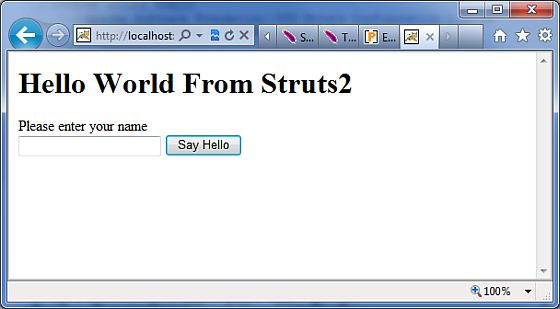
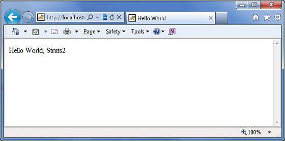

# Struts 2 - 结果和结果类型

正如前面提到的，**<results>** 标签在 Struts2 的 MVC 框架中担当 **视图**的角色。动作是负责执行业务逻辑。在执行业务逻辑之后，下一步是使用 **<results>** 标签显示视图。

经常有一些附带结果的导航规则。例如，如果一个动作方法是对用户进行验证，那么有三种可能的结果。（a）成功的登录；（b）不成功的登录-用户名或密码错误（c）帐户被锁定。

在这种情况下，这个动作方法将使用三种可能的结果字符串被配置，并且有三个不同的视图呈现的结果。我们已经在前面的例子中看到了这个。

但是，Struts2 没有阻碍你使用 JSP 作为视图技术。毕竟 MVC 范例的整个目的是保持层是独立和高度可配置的。例如，对于一个 Web2.0 的客户端，你可能想要返回 XML 或 JSON 作为输出。在这种情况下，你可以为 XML 或 JSON 创建一个新的结果类型，并且实现它。

Struts 自带一些预定义的**结果类型**，无论什么我们已经看到的都是默认的结果类型 **dispatcher**，它是用来调度 JSP 页面的。Struts 允许你为了视图技术使用其它标记语言来呈现结果和流行的选择，包括 **Velocity**，**Freemaker**，**XSLT** 和 **Tiles**。

## 调度结果类型

**调度** 结果类型是默认的类型，如果没有其他的结果类型被指定，则使用它。它被用来在服务器上转发到一个 servlet，JSP，HTML 页面，等等。它使用 *RequestDispatcher.forward()* 方法。

在我们前面的例子中，我们看到了 “shorthand” 版本，其中我们提供了 JSP 路径作为结果标签的主体。

```
<result name="success">
   /HelloWorld.jsp
</result>
```

我们也可以在 <result...> 元素内使用一个 <param name="location"> 标签来指定 JSP 文件，如下所示：

```
<result name="success" type="dispatcher">
   <param name="location">
      /HelloWorld.jsp
   </param >
</result>
```

我们也可以提供一个 **parse** 参数，默认为 true。解析参数决定位置参数是否将被解析为 OGNL 表达式。

## FreeMaker 结果类型

在这个例子中，我们将看到如何使用 **FreeMaker** 作为视图技术。Freemaker 是一种流行的模板引擎，用于使用预定义的模板来生成输出。让我们创建一个称为 **hello.fm** 的 Freemaker 模板一个文件，它的内容如下所示：

```
Hello World ${name}
```

在这里，上述文件是一个模板，其中 **name** 是使用已定义的动作从外部传递的一个参数。你将会在 CLASSPATH 中保留这个文件。接下来，让我们修改 **struts.xml** 来指定结果，如下所示：

```
<?xml version="1.0" encoding="UTF-8"?>
<!DOCTYPE struts PUBLIC
"-//Apache Software Foundation//DTD Struts Configuration 2.0//EN"
"http://struts.apache.org/dtds/struts-2.0.dtd">
<struts>
   <constant name="struts.devMode" value="true" />
   <package name="helloworld" extends="struts-default">
      <action name="hello"          class="com.tutorialspoint.struts2.HelloWorldAction"
         method="execute">
         <result name="success" type="freemarker">
            <param name="location">/hello.fm</param>
         </result>
      </action>      
   </package>
</struts>
```

让我们保留 HelloWorldAction.java，HelloWorldAction.jsp 和 index.jsp 文件，因为我们在 examples 章节中已经创建了他们。现在，在项目名称上点击右键，并且单击 **Export > WAR File** 来创建一个  War 文件。然后在 Tomcat 的 webapps 目录下部署这个 WAR。最后，启动 Tomcat 服务器和尝试访问 URL http://localhost:8080/HelloWorldStruts2/index.jsp。将会给出下面的画面：



输入一个值 “Struts2”，并提交该页面，你应该看到下一个页面：



正如你所看到的，这是与 JSP 视图完全一样的，除了我们不依赖于使用 JSP 作为视图技术。在这个例子中，我们已经使用 Freemaker。

## 重定向结果类型

**重定向**的结果类型调用标准的 *response.sendRedirect()* 方法，使浏览器给指定的位置创建一个新的请求。

我们可以在 <result...> 元素的元素体中或作为一个 <param name="location"> 元素来提供位置。重定向也支持 **parse** 参数。这儿是一个使用 XML 配置的例子：

```
<action name="hello" 
   class="com.tutorialspoint.struts2.HelloWorldAction"
   method="execute">
   <result name="success" type="redirect">
       <param name="location">
         /NewWorld.jsp
      </param >
   </result>
</action>
```

因此，仅仅修改你的 struts.xml 文件来定义如上所提及的重定向类型，并且创建一个新的文件 NewWorld.jpg，无论何时 hello 动作返回 success，你将会重定向到那里。为了更好的理解，你可以查看[**Struts 2 - Redirect Action**](http://www.tutorialspoint.com/struts_2/struts_redirect_action.htm)。