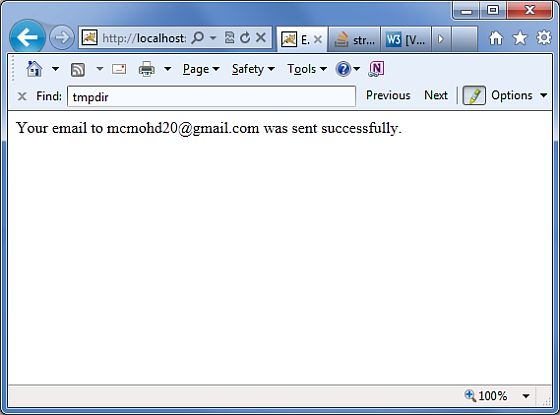

# Struts 2 - 发送邮件

本章将教你如何使用 Struts 2 的应用程序发送电子邮件。为了这个练习，你需要从 [**JavaMail API 1.4.4**](http://www.oracle.com/technetwork/java/javasebusiness/downloads/java-archive-downloads-eeplat-419426.html#javamail-1.4.4-oth-JPR) 下载并安装 **mail.jar**，并将 mail.jar 文件放置在你的 WEB-INF\lib 文件夹下，然后继续按照创建动作，视图和配置文件的标准步骤进行。

## 创建动作

下一步是创建一个发送电子邮件的动作方法。让我们创建一个新类，称为  **Emailer.java**，它的内容如下。

```
package com.tutorialspoint.struts2;
import java.util.Properties;
import javax.mail.Message;
import javax.mail.PasswordAuthentication;
import javax.mail.Session;
import javax.mail.Transport;
import javax.mail.internet.InternetAddress;
import javax.mail.internet.MimeMessage;
import com.opensymphony.xwork2.ActionSupport;
public class Emailer extends ActionSupport {
   private String from;
   private String password;
   private String to;
   private String subject;
   private String body;
   static Properties properties = new Properties();
   static
   {
      properties.put("mail.smtp.host", "smtp.gmail.com");
      properties.put("mail.smtp.socketFactory.port", "465");
      properties.put("mail.smtp.socketFactory.class",
                     "javax.net.ssl.SSLSocketFactory");
      properties.put("mail.smtp.auth", "true");
      properties.put("mail.smtp.port", "465");
   }
   public String execute() 
   {
      String ret = SUCCESS;
      try
      {
         Session session = Session.getDefaultInstance(properties,  
            new javax.mail.Authenticator() {
            protected PasswordAuthentication 
            getPasswordAuthentication() {
            return new 
            PasswordAuthentication(from, password);
            }});
         Message message = new MimeMessage(session);
         message.setFrom(new InternetAddress(from));
         message.setRecipients(Message.RecipientType.TO, 
            InternetAddress.parse(to));
         message.setSubject(subject);
         message.setText(body);
         Transport.send(message);
      }
      catch(Exception e)
      {
         ret = ERROR;
         e.printStackTrace();
      }
      return ret;
   }
   public String getFrom() {
      return from;
   }
   public void setFrom(String from) {
      this.from = from;
   }
   public String getPassword() {
      return password;
   }
   public void setPassword(String password) {
      this.password = password;
   }
   public String getTo() {
      return to;
   }
   public void setTo(String to) {
      this.to = to;
   }
   public String getSubject() {
      return subject;
   }
   public void setSubject(String subject) {
      this.subject = subject;
   }
   public String getBody() {
      return body;
   }
   public void setBody(String body) {
      this.body = body;
   }
   public static Properties getProperties() {
      return properties;
   }
   public static void setProperties(Properties properties) {
      Emailer.properties = properties;
   }
}
```

正如上面的源代码中看到的，**Emailer.java** 有对应于下面给出的email.jsp页面中的表单属性的属性。这些属性是：

- **from** - 发件人的电子邮件地址。由于我们使用的是谷歌的 SMTP，因此我们需要一个有效的 gtalk id。
- **password** - 上述帐户的密码
- **to** - 给谁发送电子邮件？
- **Subject** - 电子邮件的主题
- **body** - 实际的电子邮件消息

我们有没有考虑过上述属性的任何验证，验证将会在下一章中添加。现在让我们看看 execute() 方法。execute() 方法通过使用提供的参数用 javax 邮件库发送一封电子邮件。如果邮件发送成功，动作返回 SUCCESS，否则它返回 ERROR。

## 创建主页面

让我们编写主页 JSP 文件 **index.jsp**，它将被用来收集电子邮件中上面提到的相关信息：

<pre class="prettyprint notranslate">
&lt;%@ page language="java" contentType="text/html; charset=ISO-8859-1"
   pageEncoding="ISO-8859-1"%&gt;
&lt;%@ taglib prefix="s" uri="/struts-tags"%&gt;
&lt;!DOCTYPE html PUBLIC "-//W3C//DTD HTML 4.01 Transitional//EN" 
"http://www.w3.org/TR/html4/loose.dtd"&gt;
&lt;html&gt;
&lt;head&gt;
&lt;title&gt;Email Form&lt;/title&gt;
&lt;/head&gt;
&lt;body&gt;
   &lt;em&gt;The form below uses Google's SMTP server. 
   So you need to enter a gmail username and password
   &lt;/em&gt;
   &lt;form action="emailer" method="post"&gt;
   &lt;label for="from"&gt;From&lt;/label&gt;&lt;br/&gt;
   &lt;input type="text" name="from"/&gt;&lt;br/&gt;
   &lt;label for="password"&gt;Password&lt;/label&gt;&lt;br/&gt;
   &lt;input type="password" name="password"/&gt;&lt;br/&gt;
   &lt;label for="to"&gt;To&lt;/label&gt;&lt;br/&gt;
   &lt;input type="text" name="to"/&gt;&lt;br/&gt;
   &lt;label for="subject"&gt;Subject&lt;/label&gt;&lt;br/&gt;
   &lt;input type="text" name="subject"/&gt;&lt;br/&gt;
   &lt;label for="body"&gt;Body&lt;/label&gt;&lt;br/&gt;
   &lt;input type="text" name="body"/&gt;&lt;br/&gt;
   &lt;input type="submit" value="Send Email"/&gt;
   &lt;/form&gt;
&lt;/body&gt;
&lt;/html&gt;
</pre>

## 创建视图

我们将使用 JSP 文件 **success.jsp**，假如动作返回 SUCCESS，它将被调用，但假如动作返回 ERROR，我们将有另一个视图。

<pre class="prettyprint notranslate">
&lt;%@ page language="java" contentType="text/html; charset=ISO-8859-1"
	pageEncoding="ISO-8859-1"%&gt;
&lt;%@ taglib prefix="s" uri="/struts-tags"%&gt;
&lt;!DOCTYPE html PUBLIC "-//W3C//DTD HTML 4.01 Transitional//EN" 
"http://www.w3.org/TR/html4/loose.dtd"&gt;
&lt;html&gt;
&lt;head&gt;
&lt;title&gt;Email Success&lt;/title&gt;
&lt;/head&gt;
&lt;body&gt;
   Your email to &lt;s:property value="to"/&gt; was sent successfully.
&lt;/body&gt;
&lt;/html&gt;
</pre>

下面将是一个视图文件 **error.jsp**，假如动作返回 ERROR。

<pre class="prettyprint notranslate">
&lt;%@ page language="java" contentType="text/html; charset=ISO-8859-1"
	pageEncoding="ISO-8859-1"%&gt;
&lt;%@ taglib prefix="s" uri="/struts-tags"%&gt;
&lt;!DOCTYPE html PUBLIC "-//W3C//DTD HTML 4.01 Transitional//EN" 
"http://www.w3.org/TR/html4/loose.dtd"&gt;
&lt;html&gt;
&lt;head&gt;
&lt;title&gt;Email Error&lt;/title&gt;
&lt;/head&gt;
&lt;body&gt;
   There is a problem sending your email to &lt;s:property value="to"/&gt;.
&lt;/body&gt;
&lt;/html&gt;
</pre>

## 配置文件

最后，让我们使用 struts.xml 配置文件把一切都综合起来，如下所示：

```
<?xml version="1.0" encoding="UTF-8"?>
<!DOCTYPE struts PUBLIC
   "-//Apache Software Foundation//DTD Struts Configuration 2.0//EN"
   "http://struts.apache.org/dtds/struts-2.0.dtd">
<struts>
   <constant name="struts.devMode" value="true" />
   <package name="helloworld" extends="struts-default">
      <action name="emailer" 
         class="com.tutorialspoint.struts2.Emailer"
         method="execute">
         <result name="success">/success.jsp</result>
         <result name="error">/error.jsp</result>
      </action>
   </package>
</struts>
```

下面是 **web.xml** 文件的内容：

```
<?xml version="1.0" encoding="UTF-8"?>
<web-app xmlns:xsi="http://www.w3.org/2001/XMLSchema-instance"
   xmlns="http://java.sun.com/xml/ns/javaee" 
   xmlns:web="http://java.sun.com/xml/ns/javaee/web-app_2_5.xsd"
   xsi:schemaLocation="http://java.sun.com/xml/ns/javaee 
   http://java.sun.com/xml/ns/javaee/web-app_3_0.xsd"
   id="WebApp_ID" version="3.0"> 
   <display-name>Struts 2</display-name>
   <welcome-file-list>
      <welcome-file>index.jsp</welcome-file>
   </welcome-file-list>
   <filter>
      <filter-name>struts2</filter-name>
      <filter-class>
         org.apache.struts2.dispatcher.FilterDispatcher
      </filter-class>
   </filter>
   <filter-mapping>
      <filter-name>struts2</filter-name>
      <url-pattern>/*</url-pattern>
   </filter-mapping>
</web-app>
```

现在，在项目名称上点击右键，并且单击 **Export > WAR File** 来创建一个 War 文件。然后在 Tomcat 的 webapps 目录下部署这个 WAR。最后，启动 Tomcat 服务器和尝试访问 URL http://localhost:8080/HelloWorldStruts2/index.jsp。将会给出下面的画面：


输入所需的信息，并单击 **Send Email** 按钮。如果一切正常，那么你应该看到下面的页面：

