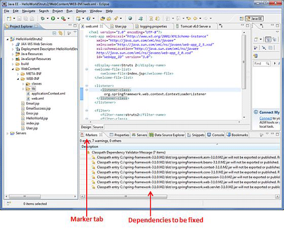

# Struts 2 & Spring 集成

Spring 是一个流行的 web 框架，提供了与大量普通 web 任务的简单集成。所以问题是，当我们已经有了 Struts2 时，为什么还需要 Spring？好吧，Spring 不仅仅是一个 MVC 框架——它还提供了许多在 Struts 中不可用的东西。例如：对任何框架都有用的依赖注入。在本章中，我们将通过一个简单的示例来展示如何集成 Spring 和 Struts2。

首先，你需要将如下所示的文件添加到 Spring 安装的项目的构建路径中。你可以从 [**http://www.springsource.org/download**](http://www.springsource.org/download) 下载并安装最新的 Spring 框架版本。

- org.springframework.asm-x.y.z.M(a).jar

- org.springframework.beans-x.y.z.M(a).jar

- org.springframework.context-x.y.z.M(a).jar

- org.springframework.core-x.y.z.M(a).jar

- org.springframework.expression-x.y.z.M(a).jar

- org.springframework.web-x.y.z.M(a).jar

- org.springframework.web.servlet-x.y.z.M(a).jar

最后，将 **struts2-spring-plugin-x.y.z.jar** 添加到你的 struts lib 目录 WEB-INF/lib 中。如果你使用的是 Eclipse，那么你可能会面临一个异常 *java.lang.ClassNotFoundException: org.springframework.web.context.ContextLoaderListener*。为了修复这个问题，进入 **Marker** 标签，然后一个接一个的右键单击类依赖，并且进行快速修复来发布/导出所有的依赖。最后，确保在 marker 标签下没有可用的依赖冲突。



现在让我们为 Struts-Spring 集成配置 **web.xml** 文件，如下所示：

``` 
<?xml version="1.0" encoding="UTF-8"?>
<web-app xmlns:xsi="http://www.w3.org/2001/XMLSchema-instance"
	xmlns="http://java.sun.com/xml/ns/javaee" 
	xmlns:web="http://java.sun.com/xml/ns/javaee/web-app_2_5.xsd"
	xsi:schemaLocation="http://java.sun.com/xml/ns/javaee 
	http://java.sun.com/xml/ns/javaee/web-app_3_0.xsd"
	id="WebApp_ID" version="3.0">
   <display-name>Struts 2</display-name>
   <welcome-file-list>
      <welcome-file>index.jsp</welcome-file>
   </welcome-file-list>
   <listener>
      <listener-class>
         org.springframework.web.context.ContextLoaderListener
      </listener-class>
   </listener>
   <filter>
      <filter-name>struts2</filter-name>
      <filter-class>
         org.apache.struts2.dispatcher.FilterDispatcher
      </filter-class>
   </filter>
   <filter-mapping>
      <filter-name>struts2</filter-name>
      <url-pattern>/*</url-pattern>
   </filter-mapping>
</web-app>
```

在这里需要注意的一个重要的点是我们已经配置的监听器。加载 spring 上下文文件需要 **ContextLoaderListener**。Spring 的配置文件称为 **applicationContext.xml**，且它必须要放置在和 **web.xml** 文件同级的位置。

让我们创建一个简单的操作类，命名为 **User.java**，带有两个属性——firstName 和 lastName。

``` 
package com.tutorialspoint.struts2;
public class User {
   private String firstName;
   private String lastName;
   public String execute()
   {
      return "success";
   }
   public String getFirstName() {
      return firstName;
   }
   public void setFirstName(String firstName) {
      this.firstName = firstName;
   }
   public String getLastName() {
      return lastName;
   }
   public void setLastName(String lastName) {
      this.lastName = lastName;
   }
}
```

现在让我们创建 **applicationContext.xml** spring 配置文件并实例化 **User.java** 类。正如先前提到的一样，这个文件应该在 WEB-INF 文件夹下：

``` 
<?xml version="1.0" encoding="UTF-8"?>
<!DOCTYPE beans PUBLIC "-//SPRING//DTD BEAN//EN" 
"http://www.springframework.org/dtd/spring-beans.dtd">
   <beans>
      <bean id="userClass" class="com.tutorialspoint.struts2.User">
      <property name="firstName" value="Michael" />
      <property name="lastName" value="Jackson" />
   </bean>
</beans>
```

正如我们在上面看见的一样，我们已经配置了 user bean 并且已经将值 **Michael** 和 **Jackson** 注入到 bean 中。我们还将这个 bean 命名为 "userClass"，这样我们就可以在任何地方重用它。接下来，我们在 WebContent 文件夹中创建 **User.jsp**：

<pre class="prettyprint notranslate">
&lt;%@ page language="java" contentType="text/html; charset=ISO-8859-1"
	pageEncoding="ISO-8859-1"%&gt;
&lt;%@ taglib prefix="s" uri="/struts-tags"%&gt;
&lt;!DOCTYPE html PUBLIC "-//W3C//DTD HTML 4.01 Transitional//EN" 
"http://www.w3.org/TR/html4/loose.dtd"&gt;

&lt;html&gt;
&lt;head&gt;
&lt;title&gt;Hello World&lt;/title&gt;
&lt;/head&gt;
&lt;body&gt;

   &lt;h1&gt;Hello World From Struts2 - Spring integration&lt;/h1&gt;

   &lt;s:form&gt;
      &lt;s:textfield name="firstName" label="First Name"/&gt;&lt;br/&gt;
      &lt;s:textfield name="lastName" label="Last Name"/&gt;&lt;br/&gt;
   &lt;/s:form&gt;
	
&lt;/body&gt;
&lt;/html&gt;
</pre>

**User.jsp** 文件非常简单。它只用于一个目的——显示用户对象的 firstname 和 lastname 的值。最后，让我们将在 **struts.xml** 文件中用到的条目放到一起。

``` 
<?xml version="1.0" encoding="UTF-8"?>
<!DOCTYPE struts PUBLIC
"-//Apache Software Foundation//DTD Struts Configuration 2.0//EN"
"http://struts.apache.org/dtds/struts-2.0.dtd">
<struts>
   <constant name="struts.devMode" value="true" />
   <package name="helloworld" extends="struts-default">
      <action name="user" class="userClass" 
         method="execute">
         <result name="success">/User.jsp</result>
      </action>
   </package>
</struts>
```

需要注意的重要的一点是我们用 id **userClass** 来代表类。这意味着我们使用的是 spring 来为 User 类进行依赖注入。

现在鼠标右键单击项目名，然后单击 **Export > WAR File** 来创建一个 War 文件。然后将这个 WAR 文件部署到 Tomcat 的 web 应用程序目录中。最后，启动 Tomcat 服务器并尝试访问 URL http://localhost:8080/HelloWorldStruts2/User.jsp。这将呈现如下所示的画面：


现在我们已经了解了如何将这两个好的框架集成到一起。这包括 Struts - Spring 集成这一章。


