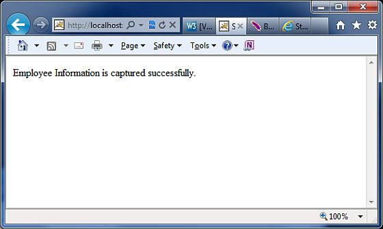

# Struts 2 - 验证框架

现在我们将观察 Struts 验证框架如何。在 Struts 的核心中，我们有验证框架，它能在动作方法执行之前协助应用程序运行规则来执行验证。

客户端验证通常是使用 Javascript 来实现的。但是不应该单独依赖于客户端验证。最佳的实践建议验证应该引入到应用程序框架的各个层中。现在，让我们来看看两种在我们的 Struts 项目中添加验证的方式。

这里我们将举一个 **Employee** 的例子，使用一个简单的页面来捕获它们的姓名和年龄，我们提出两个验证用来确保总是输入一个名字而且年龄应该是在 28 和 65 之间。所以，让我们从例子的主 JSP 页面开始。

## 创建主页面

让我们编写主页面 JSP 文件 **index.jsp**，它将被用来收集 Employee 上面提到的相关信息。

<pre class="prettyprint notranslate">
&lt;%@ page language="java" contentType="text/html; charset=ISO-8859-1"
   pageEncoding="ISO-8859-1"%&gt;
&lt;%@ taglib prefix="s" uri="/struts-tags"%&gt;
&lt;!DOCTYPE html PUBLIC "-//W3C//DTD HTML 4.01 Transitional//EN" 
"http://www.w3.org/TR/html4/loose.dtd"&gt;
&lt;html&gt;
&lt;head&gt;
&lt;title&gt;Employee Form&lt;/title&gt;
&lt;/head&gt;

&lt;body&gt;
   &lt;s:form action="empinfo" method="post"&gt;
      &lt;s:textfield name="name" label="Name" size="20" /&gt;
      &lt;s:textfield name="age" label="Age" size="20" /&gt;
      &lt;s:submit name="submit" label="Submit" align="center" /&gt;
   &lt;/s:form&gt;
&lt;/body&gt;
&lt;/html&gt;
</pre>

index.jsp 使用我们还没有涉及的 Struts 的标签，但是我们将在标签相关的章节学习它们。此时此刻，假设 s:textfield 标签打印一个输入字段，s:submit 打印一个提交按钮。我们已经为每个标签使用 label 属性，而且每个标签都建立了 label。 

## 创建视图

我们将使用 JSP 文件 **success.jsp**，假如动作返回 SUCCESS，该文件将被调用。

<pre class="prettyprint notranslate">
&lt;%@ page language="java" contentType="text/html; charset=ISO-8859-1"
	pageEncoding="ISO-8859-1"%&gt;
&lt;%@ taglib prefix="s" uri="/struts-tags"%&gt;
&lt;!DOCTYPE html PUBLIC "-//W3C//DTD HTML 4.01 Transitional//EN" 
"http://www.w3.org/TR/html4/loose.dtd"&gt;
&lt;html&gt;
&lt;head&gt;
&lt;title&gt;Success&lt;/title&gt;
&lt;/head&gt;
&lt;body&gt;
   Employee Information is captured successfully.
&lt;/body&gt;
&lt;/html&gt;
</pre>

## 创建动作

因此让我们定义一个小的动作类 **Employee**，然后如下所示在 **Employee.java** 文件中添加一个方法，称为 **validate()**。确保你的动作类扩展了 **ActionSupport** 类，否则你的 validate 方法将不会被执行。

```
package com.tutorialspoint.struts2;
import com.opensymphony.xwork2.ActionSupport;
public class Employee extends ActionSupport{
   private String name;
   private int age;  
   public String execute() 
   {
       return SUCCESS;
   }
   public String getName() {
       return name;
   }
   public void setName(String name) {
       this.name = name;
   }
   public int getAge() {
       return age;
   }
   public void setAge(int age) {
       this.age = age;
   }
   public void validate()
   {
      if (name == null || name.trim().equals(""))
      {
         addFieldError("name","The name is required");
      }
      if (age < 28 || age > 65)
      {
         addFieldError("age","Age must be in between 28 and 65");
      }
   }
}
```

如在上面的例子所示，验证方法检查 “Name” 字段是否有一个值。如果没有值被提供，我们为 “Name” 字段添加一个带有自定义错误信息的字段错误。其次，我们检查 “Age” 字段的输入值是否在 28 和 65 之间，如果这个条件不符合，我们添加一个上述验证字段错误。

## 配置文件

最后，让我们使用 **struts.xml** 配置文件把一切都综合起来，如下所示：

```
<?xml version="1.0" encoding="UTF-8"?>
<!DOCTYPE struts PUBLIC
   "-//Apache Software Foundation//DTD Struts Configuration 2.0//EN"
   "http://struts.apache.org/dtds/struts-2.0.dtd">
<struts>
   <constant name="struts.devMode" value="true" />
   <package name="helloworld" extends="struts-default">
      <action name="empinfo" 
         class="com.tutorialspoint.struts2.Employee"
         method="execute">
         <result name="input">/index.jsp</result>
         <result name="success">/success.jsp</result>
      </action>
   </package>
</struts>
```

下面是 **web.xml** 文件的内容：

```
<?xml version="1.0" encoding="UTF-8"?>
<web-app xmlns:xsi="http://www.w3.org/2001/XMLSchema-instance"
   xmlns="http://java.sun.com/xml/ns/javaee"
   xmlns:web="http://java.sun.com/xml/ns/javaee/web-app_2_5.xsd"
   xsi:schemaLocation="http://java.sun.com/xml/ns/javaee
   http://java.sun.com/xml/ns/javaee/web-app_3_0.xsd"
   id="WebApp_ID" version="3.0">
   <display-name>Struts 2</display-name>
   <welcome-file-list>
      <welcome-file>index.jsp</welcome-file>
   </welcome-file-list>
   <filter>
      <filter-name>struts2</filter-name>
      <filter-class>
         org.apache.struts2.dispatcher.FilterDispatcher
      </filter-class>
   </filter>
   <filter-mapping>
      <filter-name>struts2</filter-name>
      <url-pattern>/*</url-pattern>
   </filter-mapping>
</web-app>
```

现在，右键点击项目名称，并单击 **Export > WAR File** 创建一个 WAR 文件。然后在 Tomcat 的 webapps 目录下部署此 WAR 。最后，启动 Tomcat 服务器和尝试访问 URL http://localhost:8080/HelloWorldStruts2/index.jsp。这会给出以下画面：


现在不输入任何必需的信息，只需要单击 **Submit** 按钮。你将看到下面的结果：


输入必需的信息，但是输入了错误的 From 字段，假如说 name 为 “test” 和年龄为 30，最后单击 **Submit** 按钮。你将看到下面的结果：



## 验证是如何工作的？

当用户按下提交按钮时，Struts2 会自动执行验证方法，如果任何列出的 if 语句内部的方法都是 true，那么 Struts 2 调用它的 addFieldError 方法。如果已添加任何错误，那么 Struts 2 将不会继续调用 execute 方法。而 Struts 2 框架将返回**输入**作为调用这个行动的结果。

所以当验证失败和 Struts2 返回**输入**时，Struts 2 框架将重新显示 index.jsp 文件。由于我们使用了 Struts 2 的表单标签，Struts2 将会自动添加只是上述表单字段的错误信息。

这些错误信息是我们在 addFieldError 方法调用中指定的。addFieldError 方法有两个参数。第一个参数是错误应用的**表单**字段名，第二个参数是显示上述表单字段的错误信息。

```
addFieldError("name","The name is required");
```

为了处理**输入**的返回值，我们需要在 **struts.xml** 添加下面的结果到我们的动作节点。

```
<result name="input">/index.jsp</result>
```

## 基于XML的验证

验证的第二个方法是通过把一个 xml 文件紧挨着动作类放置。Struts2 基于 XML 验证提供了更多的验证选择，如电子邮件验证，整数范围验证，表单验证字段，表达式验证，正则表达式验证，请求验证，请求字符串验证，字符串长度的验证，等等。

XML 文件需要被命名为 **'[action-class]'-validation.xml**。所以，在我们的例子中，我们创建一个文件，名为 **Employee-validation.xml**，它的内容如下所示：

```
<!DOCTYPE validators PUBLIC 
"-//OpenSymphony Group//XWork Validator 1.0.2//EN"
"http://www.opensymphony.com/xwork/xwork-validator-1.0.2.dtd">
<validators>
   <field name="name">
      <field-validator type="required">
         <message>
            The name is required.
         </message>
      </field-validator>
   </field>
   <field name="age">
     <field-validator type="int">
         <param name="min">29</param>
         <param name="max">64</param>
         <message>
            Age must be in between 28 and 65
         </message>
      </field-validator>
   </field>
</validators>
```

理想的情况下，上面的 XML 文件会和类文件一起保存在 CLASSPATH 中。让我们有不包含 validate() 方法的 Employee 动作类，如下所示：

```
package com.tutorialspoint.struts2;
import com.opensymphony.xwork2.ActionSupport;
public class Employee extends ActionSupport{
   private String name;
   private int age;  
   public String execute() 
   {
       return SUCCESS;
   }
   public String getName() {
       return name;
   }
   public void setName(String name) {
       this.name = name;
   }
   public int getAge() {
       return age;
   }
   public void setAge(int age) {
       this.age = age;
   }
}
```

其余的设置将保持，因为它是前面的例子，现在如果你运行这个应用程序，它将会产生相同的结果，我们在前面的例子获得的。

用 xml 文件来存储配置的优点是允许验证从应用程序代码中分离。你可以让开发人员编写代码和业务分析来创建验证 xml 文件。需要注意的另一件事情是默认验证类型是可用的。默认情况下，有大量使用 Struts 的验证器。常见的验证器包括日期验证器，正则表达式验证器和字符串长度验证器。为了获得更多详细信息，查看下面的链接 [**Struts - XML Based Validators**](http://www.tutorialspoint.com/struts_2/xml_based_validators.htm)。