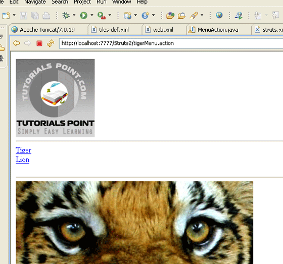

# Struts 2 & Tiles 集成

在本章中，让我们浏览用 Struts2 集成 Tiles 框架的步骤。Apache Tiles 是模板框架，用于简化 web 应用程序用户接口开发的。

首先，我们需要从 [**Apache Tiles**](http://tiles.apache.org/) 网站下载 tiles jar 文件。你需要将下列 jar 文件添加到项目的类路径中。

- tiles-api-x.y.z.jar

- tiles-compat-x.y.z.jar

- tiles-core-x.y.z.jar

- tiles-jsp-x.y.z.jar

- tiles-servlet-x.y.z.jar

除了上述文件，我么还需要将下列来自 struts2 的 jar 文件复制到你的 **WEB-INF/lib** 中。

- commons-beanutils-x.y.zjar

- commons-digester-x.y.jar

- struts2-tiles-plugin-x.y.z.jar

现在让我们为 Struts-Tiles 集成配置 **web.xml** 文件，如下所示。这里有两个重要的点需要注意。首先，我们需要告诉 tiles 在哪里可以找到 tiles 配合文件 **tiles.xml**。在我们的例子中，它位于 **/WEB-INF** 文件夹下。接下来，我们需要初始化来自 Struts2 下载的 Tiles 监听器。

``` 
<?xml version="1.0" encoding="UTF-8"?>
<web-app xmlns:xsi="http://www.w3.org/2001/XMLSchema-instance"
   xmlns="http://java.sun.com/xml/ns/javaee" 
   xmlns:web="http://java.sun.com/xml/ns/javaee/web-app_2_5.xsd"
   xsi:schemaLocation="http://java.sun.com/xml/ns/javaee 
   http://java.sun.com/xml/ns/javaee/web-app_2_5.xsd"
   id="WebApp_ID" version="2.5">
   <display-name>Struts2Example15</display-name>	
   <context-param>
   <param-name>
      org.apache.tiles.impl.BasicTilesContainer.DEFINITIONS_CONFIG
   </param-name>
   <param-value>
      /WEB-INF/tiles.xml
   </param-value>
   </context-param>
   <listener>
   <listener-class>
      org.apache.struts2.tiles.StrutsTilesListener
   </listener-class>
   </listener>
   <filter>
   <filter-name>struts2</filter-name>
   <filter-class>
   org.apache.struts2.dispatcher.ng.filter.StrutsPrepareAndExecuteFilter
   </filter-class>
   </filter>
   <filter-mapping>
      <filter-name>struts2</filter-name>
      <url-pattern>/*</url-pattern>
   </filter-mapping>
   <welcome-file-list>
      <welcome-file>index.jsp</welcome-file>
   </welcome-file-list>
</web-app>
```

接下来，让我们在 /WEB-INF 文件夹下创建 **tiles.xml**，其内容如下所示：

``` 
<?xml version="1.0" encoding="UTF-8" ?>
<!DOCTYPE tiles-definitions PUBLIC
   "-//Apache Software Foundation//DTD Tiles Configuration 2.0//EN"
   "http://tiles.apache.org/dtds/tiles-config_2_0.dtd">
<tiles-definitions>
   <definition name="baseLayout" template="/baseLayout.jsp">
      <put-attribute name="title"  value="Template"/>
      <put-attribute name="banner" value="/banner.jsp"/>
      <put-attribute name="menu"   value="/menu.jsp"/>
      <put-attribute name="body"   value="/body.jsp"/>
      <put-attribute name="footer"   value="/footer.jsp"/>
   </definition>
   <definition name="tiger" extends="baseLayout">
      <put-attribute name="title"  value="Tiger"/>
      <put-attribute name="body"   value="/tiger.jsp"/>      
   </definition>
   <definition name="lion" extends="baseLayout">
      <put-attribute name="title"  value="Lion"/>
      <put-attribute name="body"   value="/lion.jsp"/>      
   </definition> 
</tiles-definitions>
```

接下来，我们在 **baseLayout.jsp** 文件中定义一个基本框架布局。它有五个可重用的/可覆盖的域。即 **title, banner, menu, body** 和 **footer**。我们为这个基本布局提供了默认值，然后创建了从默认值中扩展的两个自定义值。tiger 布局与基本布局类似，除了它使用 **tiger.jsp** 作为它的主体，文本 "Tiger" 作为标题。类似的，lion 布局也与基本布局相似，除了它使用 **lion.jsp** 作为它的主体，文本 "Lion" 作为标题。

让我们看看单独的 jsp 文件。以下是 **baseLayout.jsp** 文件的内容：

<pre class="prettyprint notranslate">
&lt;%@ taglib uri="http://tiles.apache.org/tags-tiles" prefix="tiles"%&gt;
&lt;!DOCTYPE HTML PUBLIC "-//W3C//DTD HTML 4.01 Transitional//EN"
   "http://www.w3.org/TR/html4/loose.dtd"&gt;
&lt;html&gt;

&lt;head&gt;
&lt;meta http-equiv="Content-Type" content="text/html; charset=UTF-8"&gt;
&lt;title&gt;&lt;tiles:insertAttribute name="title" ignore="true" /&gt;
&lt;/title&gt;
&lt;/head&gt;

&lt;body&gt;
   &lt;tiles:insertAttribute name="banner" /&gt;&lt;br/&gt;
   &lt;hr/&gt;
   &lt;tiles:insertAttribute name="menu" /&gt;&lt;br/&gt;
   &lt;hr/&gt;
   &lt;tiles:insertAttribute name="body" /&gt;&lt;br/&gt;
   &lt;hr/&gt;
   &lt;tiles:insertAttribute name="footer" /&gt;&lt;br/&gt;
&lt;/body&gt;
&lt;/html&gt;
</pre>

这里我们将有 tiles 属性的 HTML 页面放到一起。我们将 tiles 属性放到我们需要的位置。接下来，让我们创建 **banner.jsp** 文件，其内容如下所示：

<pre class="prettyprint notranslate">
&lt;img src="http://www.tutorialspoint.com/images/tp-logo.gif"/&gt;
</pre>

**menu.jsp** 文件有如下所示的行，能够链接到 TigerMenu.action 和 LionMenu.action struts 操作。

<pre class="prettyprint notranslate">
&lt;%@taglib uri="/struts-tags" prefix="s"%&gt;

&lt;a href="&lt;s:url action="tigerMenu"/&gt;" Tiger&lt;/a&gt;&lt;br&gt;
&lt;a href="&lt;s:url action="lionMenu"/&gt;" Lion&lt;/a&gt;&lt;br&gt;
</pre>

**lion.jsp** 文件有如下所示的内容：

<pre class="prettyprint notranslate">
&lt;img src="http://upload.wikimedia.org/wikipedia/commons/d/d2/Lion.jpg"/&gt;
The lion
</pre>

**tiger.jsp** 文件有如下所示的内容：

<pre class="prettyprint notranslate">
&lt;img src="http://www.freewebs.com/tigerofdarts/tiger.jpg"/&gt;
The tiger
</pre>

接下来，让我们创建操作类文件 **MenuAction.java**，其内容如下所示：

``` 
package com.tutorialspoint.struts2;
import com.opensymphony.xwork2.ActionSupport;
public class MenuAction extends ActionSupport {
   public String tiger() { return "tiger"; }
   public String lion() { return "lion"; }	
}
```

这是一个非常简单的额类。我们声明两种方法 tiger() 和 lion() 来分别返回输出 tiger 和 lion。让我们把它们都放到 **struts.xml** 文件中：

``` 
<!DOCTYPE struts PUBLIC
"-//Apache Software Foundation//DTD Struts Configuration 2.0//EN"
"http://struts.apache.org/dtds/struts-2.0.dtd">
<struts>
   <package name="default" extends="struts-default">
      <result-types>
         <result-type name="tiles" 
         class="org.apache.struts2.views.tiles.TilesResult" />
      </result-types>
      <action name="*Menu" method="{1}" 
         class="com.tutorialspoint.struts2.MenuAction">
         <result name="tiger" type="tiles">tiger</result>
         <result name="lion" type="tiles">lion</result>
      </action>
   </package>
</struts>
```
检查在上述文件中做的工作。首先，我们为视图技术声明了一个命名为 "tiles" 的新的结果类型，而不是简单的 jsp，作为我们正在使用的 tiles。Struts2 有 Tiles 视图结果类型支持，所以我们创建的结果类型 "tiles" 会成为 "org.apache.struts2.view.tiles.TilesResult" 类。

接下来，如果说请求是为 /tigerMenu.action 的，那么将用户带到 tiger tiles 页面，如果请求是为  /lionMenu.action 的，那么将用户带到 lion tiles 页面。

我们通过使用一些常规表达式来实现这点。在我们的操作定义中，我们说匹配模式 "*Menu" 将由这个操作处理。匹配方法包括在 MenuAction 类中。也就是，tigerMenu.action 会包括 tiger() 且 lionMenu.action 会包括 lion()。然后我们需要将产生的结果映射到适当的 tiles 页面中。

现在鼠标右键单击项目名，然后单击 Export > WAR 文件来创建一个 War 文件。然后在 Tomcat 的应用程序目录中部署该 WAR 文件。最后，启动 Tomcat 服务器并尝试访问 URL http://localhost:8080/HelloWorldStruts2/tigerMenu.jsp. 这会呈现如下所示的画面：



同样的，如果你进入 lionMenu.action 页面，那么你将会看到 lion 页面，它使用的相同的 tiles 布局。
