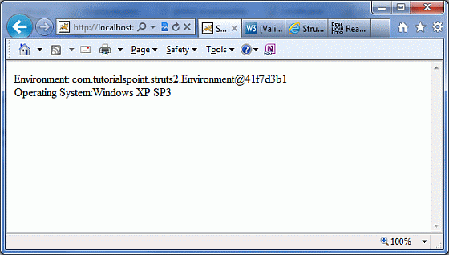
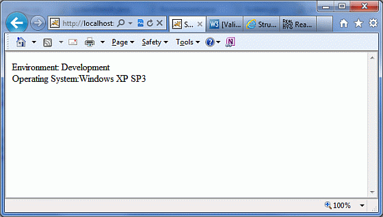

# 类型转换

所有 HTTP 请求都被视为一个 **String** 的协议。它包括数字，布尔值，整数，日期，小数和其他的一切。根据 HTTP，将所有类型都看成一个字符串。然而，在 Struts 类中，你会有任何数据类型的属性。Struts 是如何自动装配的属性？

Struts 在幕后使用了多种类型转换器用来做繁重的工作。例如，如果在动作类中你有一个整数的属性，那么你不用做任何事情，Struts 就会自动转换请求参数到整数属性。默认情况下，Struts 附带了一些类型转换器。下面列出了它们中的一些，如果你正在使用它们中的一个，那么你就没有什么可担心的：

- Integer，Float，Double，Decimal

- Date 和 Datetime

- Arrays 和 Collections

- Enumerations

- Boolean

- BigDecimal

有时候，当你使用自己的数据类型时，它需要添加自己的转换来使 Struts 知道如何在显示之前转换这些值。考虑下面的 POJO 类 **Environment.java**。

```
package com.tutorialspoint.struts2;
public class Environment {
   private String name;
   public  Environment(String name)
   {
      this.name = name;
   }
   public String getName() {
      return name;
   }
   public void setName(String name) {
      this.name = name;
   }
}
```

这是一个非常简单的类，它有一个名为 **name** 的属性，所以这个类并没有什么特别之处。让我们创建另一个类，它包含关于系统 - **SystemDetails.java** 的信息。为了这个练习，我有硬编码环境 “Development” 和操作系统 “Windows XP SP3”。在实际项目中，你会从系统配置中得到这个信息。所以，让我们有下面的动作类：

```
package com.tutorialspoint.struts2;
import com.opensymphony.xwork2.ActionSupport;
public class SystemDetails extends ActionSupport {
   private Environment environment = new Environment("Development");
   private String operatingSystem = "Windows XP SP3";
   public String execute()
   {
      return SUCCESS;
   }
   public Environment getEnvironment() {
      return environment;
   }
   public void setEnvironment(Environment environment) {
      this.environment = environment;
   }
   public String getOperatingSystem() {
      return operatingSystem;
   }
   public void setOperatingSystem(String operatingSystem) {
      this.operatingSystem = operatingSystem;
   }
}
```

接下来让我们创建一个简单的 JSP 文件 **System.jsp** 来显示环境和操作系统信息。

<pre class="prettyprint notranslate">
&lt;%@ page language="java" contentType="text/html; charset=ISO-8859-1"
pageEncoding="ISO-8859-1"%&gt;
&lt;%@ taglib prefix="s" uri="/struts-tags"%&gt;
&lt;!DOCTYPE html PUBLIC "-//W3C//DTD HTML 4.01 Transitional//EN" 
"http://www.w3.org/TR/html4/loose.dtd"&gt;
&lt;html&gt;
&lt;head&gt;
&lt;title&gt;System Details&lt;/title&gt;
&lt;/head&gt;
&lt;body&gt;
   Environment: &lt;s:property value="environment"/&gt;&lt;br/&gt;
   Operating System:&lt;s:property value="operatingSystem"/&gt;
&lt;/body&gt;
&lt;/html&gt;
</pre>

让我们用 **struts.xml** 来同时编写 **system.jsp** 和 **SystemDetails.java** 类。SystemDetails 类有一个简单的 execute() 方法，它返回字符串 “SUCCESS”。

```
<?xml version="1.0" encoding="UTF-8"?>
<!DOCTYPE struts PUBLIC
    "-//Apache Software Foundation//DTD Struts Configuration 2.0//EN"
    "http://struts.apache.org/dtds/struts-2.0.dtd">
<struts>
   <constant name="struts.devMode" value="true" />
   <package name="helloworld" extends="struts-default">
      <action name="system"            class="com.tutorialspoint.struts2.SystemDetails" 
            method="execute">
         <result name="success">/System.jsp</result>
      </action>
   </package>
</struts>
```

在项目名称上点击右键，并且单击 **Export > WAR File** 来创建一个 War 文件。然后在 Tomcat 的 webapps 目录下部署这个 WAR。最后，启动 Tomcat 服务器和尝试访问 URL http://localhost:8080/HelloWorldStruts2/system.action。将会给出下面的画面：



上面的输出有什么错？Struts 知道如何显示和转换字符串 “Windows XP SP3” 和其他内置数据类型，但是它不知道如何处理**环境**类型的属性。所以，它仅仅被称为类中的 **toString()** 方法。为了解决这个问题，现在，让我们为环境类创建并注册一个简单的 **TypeConverter**。创建一个类，名为 **EnvironmentConverter.java**，内容如下所示。

```
package com.tutorialspoint.struts2;
import java.util.Map;
import org.apache.struts2.util.StrutsTypeConverter;
   public class EnvironmentConverter extends StrutsTypeConverter {
      @Override
      public Object convertFromString(Map context, String[] values, 
                                     Class clazz) {
      Environment env = new Environment(values[0]);
      return env;
   }
   @Override
   public String convertToString(Map context, Object value) {
      Environment env  = (Environment) value;
      return env == null ? null : env.getName();
   }	
}
```

**EnvironmentConverter** 扩展了 **StrutsTypeConverter** 类，告诉 Struts 如何通过重写两个方法 **convertFromString()** 和 **convertToString()** 把环境转换为一个字符串，反之亦然。现在，让我们在应用程序中使用这个转换器之前注册它。有两种注册转换器的方法。如果转换器将只用于一个特定的动作中，那么你将需要创建一个属性文件，它需要被命名为 **'[action-class]'-converstion.properties**，所以，在我们的例子中，我们创建一个带有下面的注册入口的文件，名为 **SystemDetails-converstion.properties**：

```
environment=com.tutorialspoint.struts2.EnvironmentConverter
```

在上面的例子中，“environment” 是 **SystemDetails.java** 类中一个属性的名字，我们告诉 Struts 为了来回转换这个属性要使用 **EnvironmentConverter**。然而，我们不会这样做，相反，我们会在全局范围内注册这个转换器，以便它可以在整个应用程序中使用。为了做到这个，在 **WEB-INF/classes** 文件夹下创建一个带有下面句子的属性文件，名为 **xwork-conversion.properties**：

```
com.tutorialspoint.struts2.Environment = \            com.tutorialspoint.struts2.EnvironmentConverter
```

它简单地在全局范围内注册转换器，为此每次 Struts 遇到一个**环境**类型的对象，就可以自动做转换。现在，如果你重新编译并重新运行该程序，你将会得到更好的输出，如下所示：



显然，现在的结果更好，这意味着我们的 Struts 转换器工作正常。这就是你可以按你的需求创建多个转换器，并且注册它们后使用。