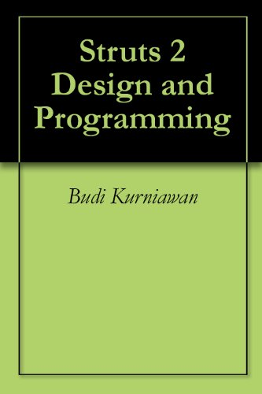
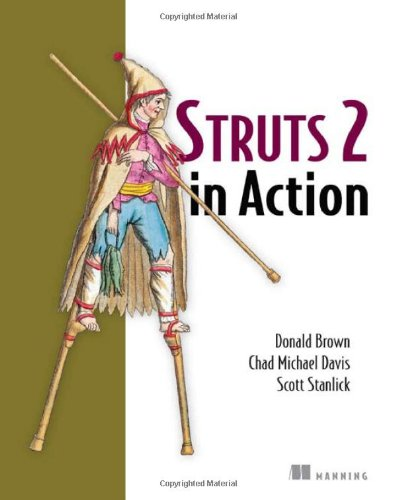
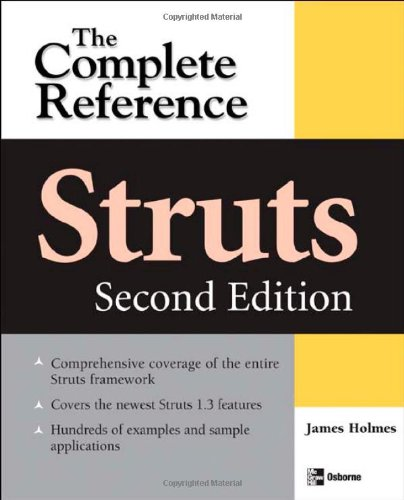
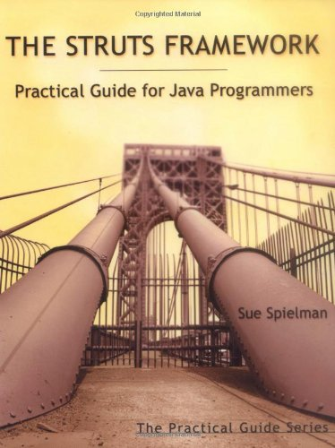
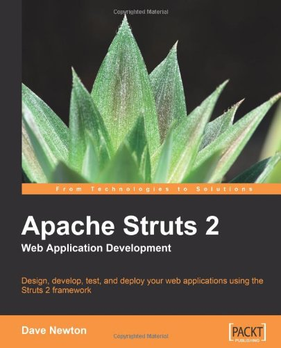
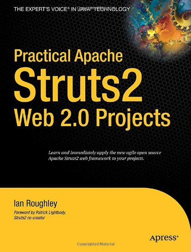

# Strut 2 - 可用的资源

以下资源包含关于 Strut 2 的附加说明。请使用它们来获得更多的对这一主题的深入了解。

## Strut 2 中可用的链接

- [Apache Struts 项目](http://struts.apache.org/) - 提供关于 Struts 材料的 Apache 的官方网站。
- [关于 JSP 的 Sun 网站](http://java.sun.com/products/jsp/) - 提供关于 JSP 材料的 Sun 的官方网站。
- [关于 Servlets 的 Sun 网站](http://java.sun.com/products/servlet/) - 提供关于 Servlets 材料的 Sun 的官方网站。
- [JSP 引擎 - Tomcat](http://tomcat.apache.org/) - Apache Tomcat是一个开放源码软件，可以实现Java Servlet 和 JavaServer Pages 技术。
- [MySQL Connector/J](http://dev.mysql.com/downloads/connector/j/5.1.html) - MySQL Connector/J 是 MySQL 的官方 JDBC 服务器。
- [JavaTM 教程](http://java.sun.com/docs/books/tutorial/index.html) - Java 教程对于想要使用 Java 编程语言创建应用程序的程序员来说是实用指南。
- [JavaTM 2 SDK，标准版本](http://java.sun.com/j2se/1.4.2/docs/index.html) - JavaTM 2 SDK，标准版本的官方网站。
- [免费下载 Java](http://www.java.com/en/download/) - 现在为你的计算机现在 Java 吧！
- [Sun 开发人员社区](http://java.sun.com/reference/docs/) - Sun 微系统的官方网站，列出了所有的 API 文档、最新的 Java 技术、书籍和其他资源。

## 关于 Java 和 Struts 可用的书籍

<ul id="books">
<li></li>
<li></li>
<li></li>
<li></li>
<li></li>
<li></li></li>
</ul>

要想在这个页面上支持你的网站，请给 **contact@tutorialspoint.com** 写邮件。