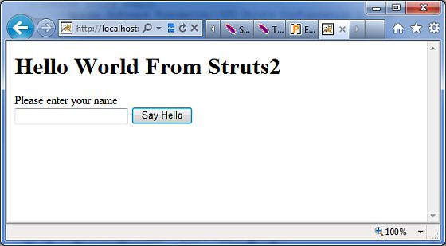

# 值栈/OGNL

## 值栈

值栈是一个几个对象的集合，根据提供的顺序保持下列的对象：

<table class="table table-bordered"> 
<tr>
<th style="width:5">序号 </th>
<th>对象及描述</th>
</tr>
<tr>
<td>1</td>
<td><b>Temporary Objects</b>
<p>在页面执行期间，有各种各样的临时对象被创建。例如，在一个 JSP 标签中集合中循环的当前迭代值。</p>
</td>
</tr> 
<tr>
<td>2</td>
<td><b>The Model Object</b>
<p>如果你在struts应用程序中使用模型对象，在动作之前当前模型对象被放置到值栈中。</p>
</td>
</tr> 
<tr>
<td>3</td>
<td><b>The Action Object</b>
<p>它是被执行的当前动作对象。</p>
</td>
</tr> 
<tr>
<td>4</td>
<td><b>Named Objects</b>
<p>这些对象包括 #application，#session，#request，#attr 和 #parameters，并且适用于相应的 servlet 范围。</p>
</td>
</tr>
</table>

值栈可以通过 JSP，Velocity 或者 Freemarker 提供的标签来访问。我们在单独章节学到的各种各样的标签被用来获取和设置 Struts 2.0 的值栈。你可以在你的动作中得到值栈对象，如下所示：

```
ActionContext.getContext().getValueStack()
```

一旦你有了值栈对象，就可以用下面的方法来操作这个对象：

<table class="table table-bordered"> 
<tr>
<th style="width:5">序号 </th>
<th>值栈方法及描述</th>
</tr>
<tr>
<td>1</td>
<td><b>Object findValue(String expr)</b>
<p>通过用默认的搜索顺序对堆栈计算给定的表达式找到一个值。</p>
</td>
</tr>
<tr>
<td>2</td>
<td><b>CompoundRoot getRoot()</b>
<p>获取 CompoundRoot，它保存压入堆栈中的对象。</p>
</td>
</tr> 
<tr>
<td>3</td>
<td><b>Object peek()</b>
<p>在不改变栈的情况下，获取栈顶的对象。</p>
</td>
</tr>
<tr><td>4</td>
<td><b>Object pop()</b>
<p>获取栈顶的对象，并且把它从栈顶移除。</p>
</td>
</tr> 
<tr><td>5</td><td><b>void push(Object o)</b>
<p>把这个对象放进栈顶中。</p>
</td>
</tr> 
<tr>
<td>6</td>
<td><b>void set(String key, Object o)</b>
<p>如果一个对象被 findValue(key,...) 检索，则在堆栈上使用给定的键设置它。</p>
</td>
</tr> 
<tr>
<td>7</td>
<td><b>void setDefaultType(Class defaultType)</b>
<p>当获得值时，如果没有提供任何类型，则设置默认的类型转换。</p>
</td>
</tr> 
<tr>
<td>8</td>
<td><b>void setValue(String expr, Object value)</b>
<p>试图根据默认的搜索顺序在堆栈上使用给定的表达式设置一个 bean 的属性。</p>
</td>
</tr> 
<tr>
<td>9</td>
<td><b>int size()</b>
<p>获取堆栈中对象的数量。</p>
</td>
</tr> 
</table>

## OGNL

**对象图形导航语言**（OGNL）是一个强大的表达式语言，它是用来在值栈上参考和操作数据。OGNL 也有助于数据传输和类型转换。

OGNL 与 JSP 表达式语言非常类似。OGNL 是以在上下文中有跟对象或默认对象的概念为基础的。默认对象或根对象的属性可以使用的标记符号英镑来引用。

正如前面所提到的，OGNL 是基于上下文的，而 Struts 使用 OGNL 来构建 ActionContext 映射。ActionContext 映射由以下组成：

- **application** - 应用范围的变量

- **session** - 会话范围的变量

- **root / value stack** - 所有的动作变量都保存在这里

- **request** - 请求范围的变量

- **parameters** - 请求参数

- **atributes** – 在页面，请求，会话和应用范围内存储属性

理解这一点很重要，即动作对象在值栈中始终是可用的。所以，因此如果你的动作对象有 x 和 y 属性，那么它们是随时可供你使用的。

ActionContext 中的对象使用英镑符号来引用，然而，值栈中的对象可以被直接引用，例如如果 **employee** 是一个动作类的属性，那么它就可以被引用，如下所示：

```
<s:property value="name"/>
```

代替

```
<s:property value="#name"/>
```

如果在会话中有一个名为 “login” 的属性，你就可以检索它，如下所示：

```
<s:property value="#session.login"/>
```

OGNL 还支持处理集合,即 Map，List 和 Set。例如，为了显示颜色的下拉列表，你可以这样做：

```
<s:select name="color" list="{'red','yellow','green'}" />
```

OGNL 表达式巧妙地解释 “red”，“yellow”，“green” 为颜色，并且在它的基础上建立一个列表。 

当我们学习不同的标签时，OGNL 表达式将被广泛使用在接下来的章节中。因此，让我们在 Form 标签 / 控制标签 / 数据标签和 Ajax 标签中使用一些例子来看它，而不是孤立地看他们。

## 值栈/OGNL例子

### 创建动作

让我们考虑我们访问值栈的下面的动作类，然后设置在视图即 JSP 页面上使用 OGNL 访问的几个键。

```
package com.tutorialspoint.struts2;
import java.util.*; 
import com.opensymphony.xwork2.util.ValueStack;
import com.opensymphony.xwork2.ActionContext;
import com.opensymphony.xwork2.ActionSupport;
public class HelloWorldAction extends ActionSupport{
   private String name;
   public String execute() throws Exception {
      ValueStack stack = ActionContext.getContext().getValueStack();
      Map<String, Object> context = new HashMap<String, Object>();
      context.put("key1", new String("This is key1")); 
      context.put("key2", new String("This is key2"));
      stack.push(context);
      System.out.println("Size of the valueStack: " + stack.size());
      return "success";
   }  
   public String getName() {
      return name;
   }
   public void setName(String name) {
      this.name = name;
   }
}
```

实际上，当动作执行时，Struts 2 将它添加到值栈的顶部。所以，把东西放在值栈中通常的方法是为你的动作类的值添加 getter/setter 方法，然后使用 <s:property> 标签来访问值。但是，我将给你展示在 struts 中 ActionContext 和 ValueStack 如何正确地工作。

### 创建视图

让我们在 eclipse 项目的 WebContent 文件夹下创建下面的 jsp 文件 **HelloWorld.jsp**。在动作返回 success 的情况下，这个视图将被显示：

<pre class="prettyprint notranslate">
&lt;%@ page contentType="text/html; charset=UTF-8" %&gt;
&lt;%@ taglib prefix="s" uri="/struts-tags" %&gt;
&lt;html&gt;
&lt;head&gt;
&lt;title&gt;Hello World&lt;/title&gt;
&lt;/head&gt;
&lt;body&gt;
   Entered value : &lt;s:property value="name"/&gt;&lt;br/&gt;
   Value of key 1 : &lt;s:property value="key1" /&gt;&lt;br/&gt;
   Value of key 2 : &lt;s:property value="key2" /&gt; &lt;br/&gt;
&lt;/body&gt;
&lt;/html&gt;
</pre>

我们还需要在 WebContent 文件夹下创建的 **index.jsp**，其内容如下所示：

<pre class="prettyprint notranslate">
&lt;%@ page language="java" contentType="text/html; charset=ISO-8859-1"
   pageEncoding="ISO-8859-1"%&gt;
&lt;%@ taglib prefix="s" uri="/struts-tags"%&gt;
   &lt;!DOCTYPE html PUBLIC "-//W3C//DTD HTML 4.01 Transitional//EN" 
"http://www.w3.org/TR/html4/loose.dtd"&gt;
&lt;html&gt;
&lt;head&gt;
&lt;title&gt;Hello World&lt;/title&gt;
&lt;/head&gt;
&lt;body&gt;
   &lt;h1&gt;Hello World From Struts2&lt;/h1&gt;
   &lt;form action="hello"&gt;
      &lt;label for="name"&gt;Please enter your name&lt;/label&gt;&lt;br/&gt;
      &lt;input type="text" name="name"/&gt;
      &lt;input type="submit" value="Say Hello"/&gt;
   &lt;/form&gt;
&lt;/body&gt;
&lt;/html&gt;
</pre>

### 配置文件

下面是 **struts.xml** 文件的内容：

```
<?xml version="1.0" encoding="UTF-8"?>
<!DOCTYPE struts PUBLIC
    "-//Apache Software Foundation//DTD Struts Configuration 2.0//EN"
    "http://struts.apache.org/dtds/struts-2.0.dtd">
<struts>
   <constant name="struts.devMode" value="true" />
   <package name="helloworld" extends="struts-default">
      <action name="hello"         class="com.tutorialspoint.struts2.HelloWorldAction" 
         method="execute">
         <result name="success">/HelloWorld.jsp</result>
      </action>
   </package>
</struts>
```

下面是 **web.xml** 文件的内容：

```
<?xml version="1.0" encoding="UTF-8"?>
<web-app xmlns:xsi="http://www.w3.org/2001/XMLSchema-instance"
   xmlns="http://java.sun.com/xml/ns/javaee" 
   xmlns:web="http://java.sun.com/xml/ns/javaee/web-app_2_5.xsd"
   xsi:schemaLocation="http://java.sun.com/xml/ns/javaee 
   http://java.sun.com/xml/ns/javaee/web-app_3_0.xsd"
   id="WebApp_ID" version="3.0">  
   <display-name>Struts 2</display-name>
   <welcome-file-list>
      <welcome-file>index.jsp</welcome-file>
   </welcome-file-list>
   <filter>
      <filter-name>struts2</filter-name>
      <filter-class>
         org.apache.struts2.dispatcher.FilterDispatcher
      </filter-class>
   </filter>
   <filter-mapping>
      <filter-name>struts2</filter-name>
      <url-pattern>/*</url-pattern>
   </filter-mapping>
</web-app>
```

在项目名称上点击右键，并且单击 **Export > WAR File** 来创建一个 War 文件。然后在 Tomcat 的 webapps 目录下部署这个 WAR。最后，启动 Tomcat 服务器和尝试访问 URL http://localhost:8080/HelloWorldStruts2/index.jsp. 将会给出下面的画面：



现在，在给定的文本框中输入任何单词，并且单击 “Say Hello” 按钮执行已经定义的动作。现在，如果你查看生成的日志，就会在底部发现下面的文字：

```
Size of the valueStack: 3
```

无论你输入什么值，它都将显示下面的画面，我们已经把 key1 和 key2 的值放入了值栈中。